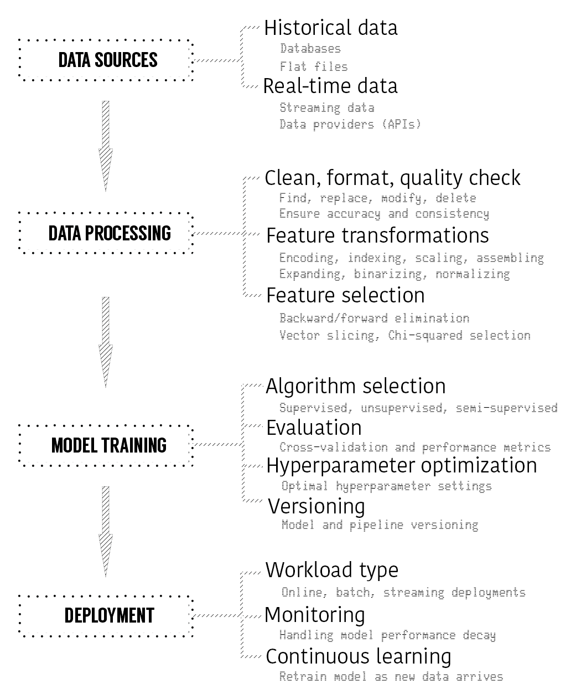
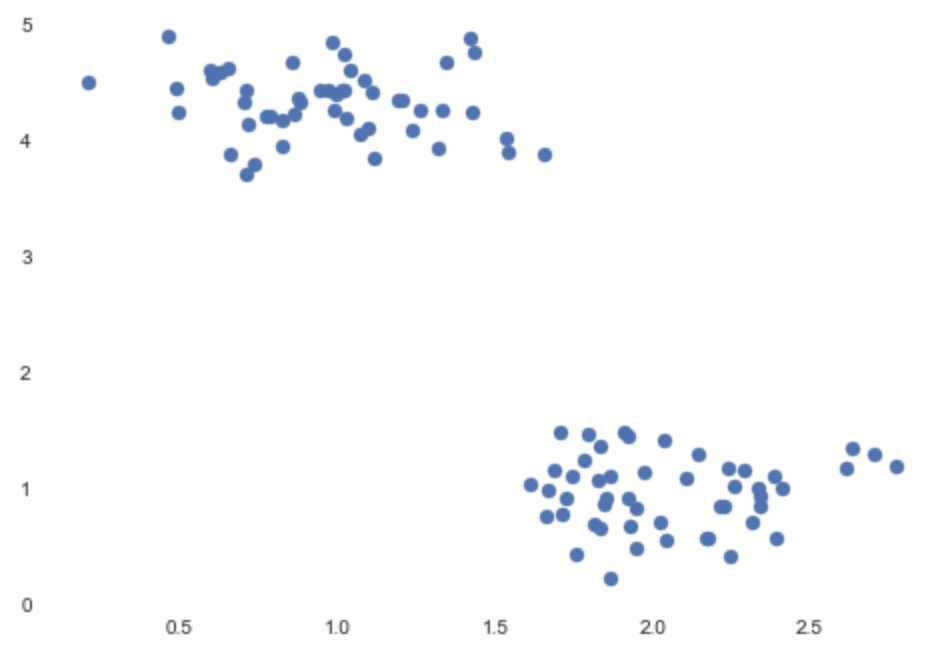
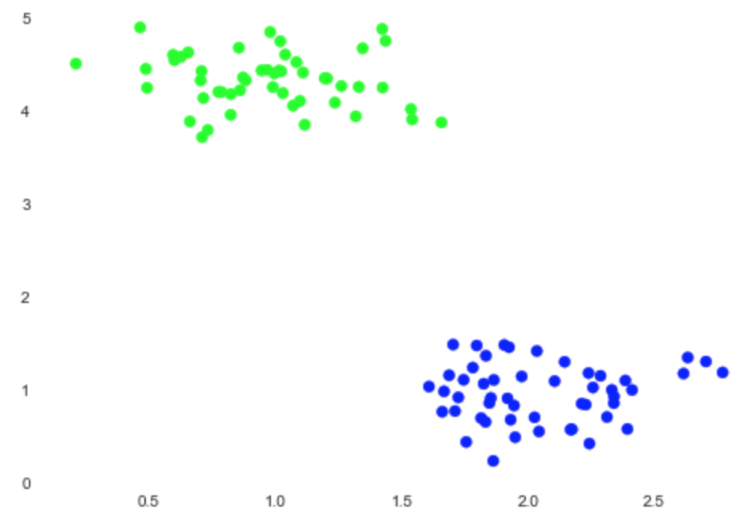
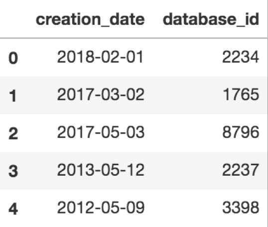
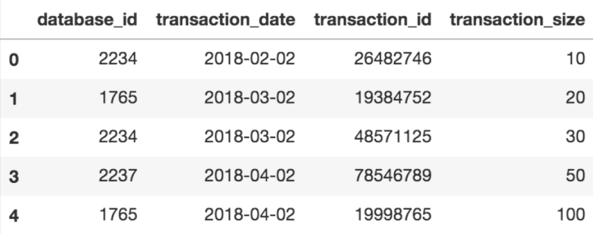
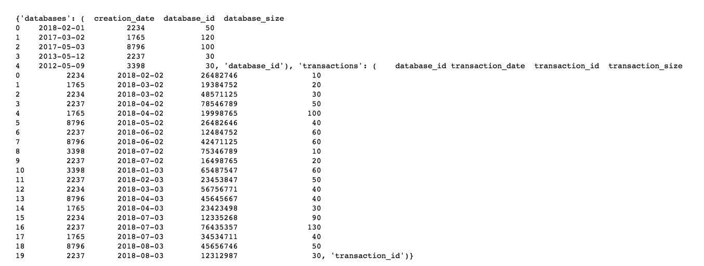

Introduction to AutoML
======================

The last decade, if nothing else, has been a thrilling adventure in
science and technology. The first iPhone was released in 2007, and back
then all of its competitors had a physical integrated keyboard. The idea
of touchscreen wasn\'t new as Apple had similar prototypes before and
IBM came up with Simon Personal Communicator in 1994. Apple\'s idea was
to have a device full of multimedia entertainment, such as listening to
music and streaming videos, while having all the useful functionalities,
such as web and GPS navigation. Of course, all of this was possible with
access to affordable computing power at the time that Apple released the
first generation iPhone. If you really think about the struggles that
these great companies have had in the last 20 years, you can see how
quickly technology came to where it is today. To put things into
perspective, 10 years after the release of first generation iPhones,
today your iPhone, along with others, can track faces and recognize
objects such as animals, vehicles, and food. It can understand natural
language and converse with you.

What about 3D printers that can print organs, self-driving cars, swarms
of drones that fly together in harmony, gene editing, reusable rockets,
and a robot that can do a backflip? These are not stories that you read
in science fiction books anymore, and it\'s happening as you read these
lines. You could only imagine this in the past, but today, science
fiction is becoming a reality. People have started talking about the
threat of **artificial intelligence** (**AI**). Many leading scientists,
such as Stephen Hawking, are warning officials about the possible end of
humankind, which could be caused by AI-based life forms.

AI and **machine learning** (**ML**) reached their peak in the last
couple of years and are totally stealing the show. The chances are
pretty good that you have already heard about the success of ML
algorithms and great advancements in the field over the last decade. The
recent success of Google\'s AlphaGo showed how far this technology can
go when it beat Ke Jie, the best human Go player on Earth. This wasn\'t
the first time that ML algorithms beat humans in particular tasks such
as image recognition. When it comes to fine-grained details, such as
recognizing different species of animals, these algorithms have often
performed better than their human competitors.

These advancements have created a huge interest in the business world.
As much as it sounds like an academic field of research, these
technologies have huge business implications and can directly impact
your organizations financials.

Enterprises from different industries want to utilize the power of these
algorithms and try to adapt to the changing technology scene. Everybody
is aware that people who figure out how to integrate these technologies
into their businesses will lead the space, and the rest are going to
have a hard time catching up.

We will explore more of such examples in the course. In this course, we will
be covering the following topics:

-   Scope of machine learning
-   What AutoML is
-   Why use AutoML and how it helps
-   When to use AutoML
-   Overview of AutoML libraries


Scope of machine learning
=========================

Machine learning and predictive analytics now help companies to focus on
important areas, anticipating problems before they happen, reducing
costs, and increasing revenue. This was a natural evolution after
working with **business intelligence** (**BI**) solutions. BI
applications were helping companies to make better decisions by
monitoring their business processes in an organized manner, usually
using dashboards that have various **key performance indicators**
(**KPIs**) and performance metrics.

BI tools allow you to dig deeper into your organizations historical
data, uncover trends, understand seasonality, find out irregular events,
and so on. They can also provide real-time analytics where you can set
up some warnings and alerts to manage particular events better. All of
these things are quite useful, but today businesses need more than that.
What does that mean? BI tools allow you to work with historical and near
real-time data, but they do not provide you with answers about the
future and don\'t answer questions such as the following:

-   Which machine in your production line is likely to fail?
-   Which of your customers will probably switch to your competitor?
-   Which company\'s stock price is going up tomorrow?

Businesses want to answer these kinds of questions nowadays, and it
pushes them to search for suitable tools and technologies, which brings
them to ML and predictive analytics.

You need to be careful though! When you are working with BI tools, you
are more confident about the results that you are going to have, but
when you are working with ML models, there\'s no such guarantee and the
ground is slippery. There is definitely a huge buzz about AI and ML
nowadays, and people are making outrageous claims about the capabilities
of upcoming AI products. After all, computer scientists have long sought
to create intelligent machines and occasionally suffered along the way
due to unreal expectations. You can have a quick Google search about *AI
winter* and learn more about that period. Although the advancements are
beyond imagination and the field is moving quickly, you should navigate
through the noise and see what the actual use cases are that ML really
shines in and they can help you to create a value for your research or
business in measurable terms.

In order to do that, you need to start with small pilot projects where:

-   You have a relatively easier decision making processes
-   You know your assumptions well
-   You know your data well

The key here is to have a well-defined project scope and steps that you
are going to execute. Collaboration between different teams is really
helpful in this process, that\'s why you should break silos inside your
organization. Also, starting small doesn\'t mean that your vision should
be small too. You should always think about scalability in the future
and slowly gear up to harness the big data sources.

There are a variety of ML algorithms that you can experiment with, each
designed to solve a specific problem with their own pros and cons. There
is a growing body of research in this area and practitioners are coming
up with new methods and pushing the limits of this field everyday.
Hence, one might get easily lost with all the information available out
there, especially when developing ML applications since there are many
available tools and techniques for every stage of the model building
process. To ease building ML models, you need to decompose a whole
process into small pieces. **Automated ML** (**AutoML**) pipelines have
many moving parts such as feature preprocessing, feature selection,
model selection, and hyperparameter optimization. Each of these parts
needs to be handled with special care to deliver successful projects.

You will hear a lot about ML concepts throughout the course, but let\'s
step back and understand why you need to pay special attention to
AutoML.

As you have more tools and technologies in your arsenal to attack your
problems, having too many options usually becomes a problem itself and
it requires considerable amount of time to research and understand the
right approach for a given problem. When you are dealing with ML
problems, it\'s a similar story. Building high-performing ML models
contains several carefully-crafted small steps. Each step leads you to
another and if you do not drop the balls on your way, you will have your
ML pipeline functioning properly and generalize well when you deploy
your pipeline in a production environment.

The number of steps involved in your pipeline could be large and the
process could be really lengthy. At every step, there are many methods
available, and, once you think about the possible number of different
combinations, you will quickly realize that you need a systematic way of
experimenting with all these components in your ML pipelines.

This brings us to the topic of AutoML!


What is AutoML?
===============

AutoML aims to ease the process of building ML models by automating
commonly-used steps, such as feature preprocessing, model selection, and
hyperparameters tuning. You will see each of these steps in detail in
coming labs and you will actually build an AutoML system to have a
deeper understanding of the available tools and libraries for AutoML.

Without getting into the details, it\'s useful to review what an ML
model is and how you train one.

ML algorithms will work on your data to find certain patterns, and this
learning process is called **model training**. As a result of model
training, you will have an ML model that supposedly will give you
insights/answers about the data without requiring you to write explicit
rules.

When you are using ML models in practice, you will throw a bunch of
numerical data as input for training the algorithm. The output of the
training process is a ML model that you can use to make predictions.
Predictions can help you to decide whether your server should be
maintained in the next four hours based on its current state, or whether
a customer of yours is going to switch to your competitor or not.

Sometimes the problem you are solving will not be well-defined and you
will not even know what kind of answers you are looking for. In such
cases, ML models will help you to explore your dataset, such as
identifying a cluster of customers that are similar to each other in
terms of behavior or finding the hierarchical structure of stocks based
on their correlations.

What do you do when your model comes up with clusters of customers?
Well, you at least know this: customers that belong to the same cluster
are similar to each other in terms of their features, such as their age,
profession, marital status, gender, product preferences,
daily/weekly/monthly spending habits, total amount spent, and so on.
Customers who belong to different clusters are dissimilar to each other.
With such an insight, you can utilize this information to create
different ad campaigns for each cluster.

To put things into a more technical perspective, let\'s understand this
process in simple mathematical terms. There is a dataset *X*, which
contains *n* examples. These examples could represent customers or
different species of animals. Each example is usually a set of real
numbers, which are called **features**, for example if we have a female,
35 year old customer who spent \$12000 at your store, you can represent
this customer with the following vector (0.0, 35.0, 12000.0). Note that
the gender is represented with *0.0*, this means that a male customer
would have *1.0* for that feature. The size of the vector represents the
dimensionality. Since this is a vector of size three, which we usually
denote by *m*, this is a three-dimensional dataset.

Depending on the problem type, you might need to have a label for each
example. For example, if this is a supervised learning problem such as
binary classification, you could label your examples with 1.0 or 0.0 and
this new variable is called **label** or **target** variable. The target
variable is usually referred to as *y*.

Having *x* and *y*, an ML model is simply a function, *f*, with weights,
*w* (model parameters):


Model parameters are learned during the training process, but there are
also other parameters that you might need to set before training starts,
and these parameters are called **hyperparameters**, which will be
explained shortly.

Features in your dataset usually should be preprocessed before being
used in model training. For example, some of the ML models implicitly
assume that features are distributed normally. In many real-life
scenarios this is not the case, and you can benefit from applying
feature transformations such as log transformation to have them normally
distributed.

Once feature processing is done and model hyperparameters are set, model
training starts. At the end of model training, model parameters will be
learned and we can predict the target variable for new data that the
model has not seen before. Prediction made by the model is usually
referred to as
:


What really happens during training? Since we know the labels for the
dataset we used for training, we can iteratively update our model
parameters based on the comparison of what our current model predicts
and what the original label was.

This comparison is based on a function called **loss function** (or cost
function),
.
Loss function represents the inaccuracy of predictions. Some of the
common loss functions you may have heard of are square loss, hinge loss,
logistic loss, and cross-entropy loss.

Once model training is done, you will test the performance of your ML
model on [test] data, which is the dataset that has not been used
in the training process, to see how well your model generalizes. You can
use different performance metrics to assess the performance; based on
the results, you should go back to previous steps and do multiple
adjustments to achieve better performance.

At this point, you should have an overall idea of what training an ML
model looks like under the hood.

What is AutoML then? When we are talking about AutoML, we mostly refer
to automated data preparation (namely feature preprocessing, generation,
and selection) and model training (model selection and hyperparameter
optimization). The number of possible options for each step of this
process can vary vastly depending on the problem type.

AutoML allows researchers and practitioners to automatically build ML
pipelines out of these possible options for every step to find
high-performing ML models for a given problem.

The following figure shows a typical ML model life cycle with a couple
of examples for every step:





Data can be ingested from various sources such as flat files, databases,
and APIs. Once you are able to ingest the data, you should process it to
make it ready for ML and there are typical operations such as cleaning
and formatting, feature transformation, and feature selection. After
data processing, your final dataset should be ready for ML and you will
shortlist candidate algorithms to work. Shortlisted algorithms should be
validated and tuned through techniques such as cross-validation and
hyperparameter optimization. Your final model will be ready to be
operationalized with suitable workload type such as online, batch and
streaming deployment. Once model is in production, you need to monitor
its performance and take necessary action if needed such as re-training,
re-evaluation, and re-deployment.

Once you are faced with building ML models, you will first do research
on the domain you are working on and identify your objective. There are
many steps involved in the process which should be planned and
documented in advance before you actually start working on it. To learn
more about the whole process of project management, you can refer to
CRISP-DM model
(<https://en.wikipedia.org/wiki/Cross-industry_standard_process_for_data_mining>),
project management is crucially important to deliver a successful
application, however, it\'s beyond the scope of this course.

In terms of building ML pipelines, you will usually have multiple data
sources, such as relational databases or flat files, where you can get
historical data. You can also have streaming data flowing into your
systems from various resources.

You will work on these data sources to understand which of them could be
useful for your particular task, then you will proceed to the data
processing step where you will do lots of cleaning, formatting, and data
quality checks followed by feature transformations and selection.

When you decide that your dataset is ready to be fed into ML models, you
will need to think about working with one or more suitable ML models.
You will train multiple models, evaluate them, and search for optimal
hyperparameter settings. Versioning at this point will help you to keep
track of changes. As a result of your experimentation, you will have a
performance ML pipeline with every step optimized for performance. The
best performing ML pipeline will be the one you would like to test drive
in a production environment and that\'s the point where you would like
to operationalize it in the deployment step.

Operationalizing an ML pipeline means that you need to choose a
deployment type. Some of the workloads will be for batch processing the
data you have in databases, and in that case you need batch deployment.
Others could be for processing real-time data provided by various data
providers, where you will need streaming deployment.

If you carefully examine each of these steps, especially the options in
data processing and training steps are vast. First you need to select
appropriate methods and algorithms, then you should also fine-tune
hyperparameters for selected methods and algorithms for them to best
perform for your given problem.

Just to give a simple example, let\'s assume that you are done with the
steps up to model training step, you need to select a set of ML models
to experiment. To make things simpler, let\'s say the only algorithm you
would like to experiment with is k-means, it\'s just about tuning its
parameters.

A k-means algorithm helps to cluster similar data points together. The
following code snippet uses the scikit-learn library and you can install
it using pip (<http://scikit-learn.org/stable/install.html>), don\'t
worry if you don\'t understand every line:


``` {.language-markup}
# Sklearn has convenient modules to create sample data.
# make_blobs will help us to create a sample data set suitable for clustering
from sklearn.datasets import make_blobs

X, y = make_blobs(n_samples=100, centers=2, cluster_std=0.30, random_state=0)

# Let's visualize what we have first
import matplotlib.pyplot as plt
import seaborn as sns

plt.scatter(X[:, 0], X[:, 1], s=50)
```


The output of the preceding code snippet is as follows:





You can easily see that we have two clusters on the plot:


``` {.language-markup}
# We will import KMeans model from clustering model family of Sklearn
from sklearn.cluster import KMeans

k_means = KMeans(n_clusters=2)
k_means.fit(X)
predictions = k_means.predict(X)

# Let's plot the predictions
plt.scatter(X[:, 0], X[:, 1], c=predictions, cmap='brg')
```


The output of the preceding code snippet is as follows:





Nice! Our algorithm worked as we expected. Astute readers may have
noticed that there was an argument named [n\_clusters] for the
k-means model. When you provide this value to the k-means algorithm, it
will try to split this dataset into two clusters. As you can guess,
k-means\'s hyperparameter in this case is the number of clusters. The
k-means model needs to know this parameter before training.

Different algorithms have different hyperparameters such as depth of
tree for decision trees, number of hidden layers, learning rate for
neural networks, alpha parameter for Lasso or C, kernel, and gamma for
**Support Vector Machines** (**SVMs**).

Let\'s see how many arguments the k-means model has by using the
[get\_params] method:


``` {.language-markup}
k_means.get_params()
```


The output will be the list of all parameters that you can optimize:


``` {.language-markup}
{'algorithm': 'auto',
 'copy_x': True,
 'init': 'k-means++',
 'max_iter': 300,
 'n_clusters': 2,
 'n_init': 10,
 'n_jobs': 1,
 'precompute_distances': 'auto',
 'random_state': None,
 'tol': 0.0001,
 'verbose': 0}
```


In most real-life use cases, you will neither have resources nor time
for trying each possible combination with the options of all steps
considered.

AutoML libraries come to your aid at this point by carefully setting up
experiments for various ML pipelines, which covers all the steps from
data ingestion, data processing, modeling, and scoring.


Why use AutoML and how does it help?
====================================

There are a lot of ML tutorials on the internet, and usually the sample
datasets are clean, formatted, and ready to be used with algorithms
because the aim of many tutorials is to show the capability of certain
tools, libraries, or **Software as a Service** (**SaaS**) offerings.

In reality, datasets come in different types and sizes. A recent
industry survey done by Kaggle in 2017, titled *The State of Data
Science and Machine Learning,* with over 16,000 responses, shows that
the top-three commonly-used datatypes are relational data, text data,
and image data.

Moreover, messy data is at the top of the list of problems that people
have to deal with, again based on the Kaggle survey. When a dataset is
messy and needs a lot of special treatment to be used by ML models, you
spend a considerable amount of time on data cleaning, manipulation, and
hand-crafting features to get it in the right shape. This is the most
time-consuming part of any data science project.

What about selection of performant ML models, hyperparameter
optimization of models in training, validation, and testing phases?
These are also crucially-important steps that can be executed in many
ways.

When the combination of right components come together to process and
model your dataset, that combination represents a ML pipeline, and the
number of pipelines to be experimented could grow very quickly.

For building high-performing ML pipelines successfully, you should
systematically go through all the available options for every step by
considering your limits in terms of time and hardware/software
resources.


AutoML systems help you to define robust approaches to automatically
constructing ML pipelines for a given problem and effectively execute
them in order to find performant models.


When do you automate ML?
========================

Once you are confident with building ML pipelines, you will realize that
there are many mundane routines that you have to perform to prepare
features and tuning hyperparameters. You also will feel more confident
with certain methods, and you will have a pretty good idea of what the
techniques are that would work well together with different parameter
settings.

In between different projects, you gain more experience by performing
multiple experiments to evaluate your processing and modeling pipelines,
optimizing the whole workflow in an iterative fashion. Managing this
whole process can quickly get very ugly if you are not organized from
the beginning.


Necessity of AutoML arises out of these difficult situations, when you
are dealing with many moving parts and a great number of parameters.
These are the situations where AutoML can help you focus on the design
and implementation details in a structured manner.


What will you learn?
====================

Throughout this course, you will learn both theoretical and practical
aspects of AutoML systems. More importantly, you will practice your
skills by developing an AutoML system from scratch.


Core components of AutoML systems
=================================

In this section, you will review the following core components of AutoML
systems:

-   Automated feature preprocessing

```{=html}

```
-   Automated algorithm selection
-   Hyperparameter optimization

Having a better understanding of core components will help you to create
your mental map of AutoML systems.


Automated feature preprocessing
===============================

When you are dealing with ML problems, you usually have a relational
dataset that has various types of data, and you should properly treat
each of them before training ML algorithms.

For example, if you are dealing with numerical data, you may scale it by
applying methods such as min-max scaling or variance scaling.

For textual data, you may want to remove stop-words such as *a*, *an*,
and *the*, and perform operations such as stemming, parsing, and
tokenization.

For categorical data, you may need to encode it using methods such as
one-hot encoding, dummy coding, and feature hashing.

How about having a very high number of features? For example, when you
have thousands of features, how many of them would actually be useful?
Would it be better to reduce dimensionality by using methods such as
**Principal Component Analysis** (**PCA**)?

What if you have different formats of data, such as video, audio, and
image? How do you process each of them?

For example, for image data, you may apply some transformations such as
rescaling the images to common shape and segmentation to separate
certain regions.


There is an abundance of feature preprocessing methods, and ML
algorithms will perform better with some set of transformations. Having
a flexible AutoML system in your arsenal will allow you to experiment
with different combinations in a smart way, which will save you much
needed time and money in your projects.


Automated algorithm selection
=============================

Once you are done with feature processing, you need to find a suitable
set of algorithms for training and evaluation.

Every ML algorithm has an ability to solve certain problems. Let\'s
consider clustering algorithms such as k-means, hierarchical clustering,
spectral clustering, and DBSCAN. We are familiar with k-means, but what
about the others? Each of these algorithms has application areas and
each might perform better than others based on the distributional
properties of a dataset.

AutoML pipelines can help you to choose the right algorithm from a set
of suitable algorithms for a given problem.


Hyperparameter optimization
===========================

Every ML algorithm has one or many hyperparameters and you are already
familiar with k-means. But it is not only ML algorithms that have
hyperparameters, feature processing methods also have their
hyperparameters and those also need fine-tuning.

Tuning hyperparameters is crucially important to a model\'s success and
AutoML pipeline will help you to define a range of hyperparameters that
you would like to experiment with, resulting in the best performing ML
pipeline.


Building prototype subsystems for each component
================================================

Throughout the course, you will be building each core component of AutoML
systems from scratch and seeing how each part interacts with each other.

Having skills to build such systems from scratch will give you a deeper
understanding of the process and also inner workings of popular AutoML
libraries.


Putting it all together as an end--to--end AutoML system
========================================================

Once you have gone through all the labs, you will have a good
understanding of the components and how they work together to create ML
pipelines. You will then use your knowledge to write AutoML pipelines
from scratch and tweak them in any way that would work for a set of
problems that you are aiming to solve.


Overview of AutoML libraries
============================

There are many popular AutoML libraries, and in this section you will
have an overview of commonly used ones in the data science community.


Featuretools
============

Featuretools (<https://www.featuretools.com/>) is a good library for
automatically engineering features from relational and transactional
data. The library introduces the concept called **Deep Feature
Synthesis** (**DFS**). If you have multiple datasets with relationships
defined among them such as parent-child based on columns that you use as
unique identifiers for examples, DFS will create new features based on
certain calculations, such as summation, count, mean, mode, standard
deviation, and so on. Let\'s go through a small example where you will
have two tables, one showing the database information and the other
showing the database transactions for each database:


``` {.language-markup}
import pandas as pd

# First dataset contains the basic information for databases.
databases_df = pd.DataFrame({"database_id": [2234, 1765, 8796, 2237, 3398], 
"creation_date": ["2018-02-01", "2017-03-02", "2017-05-03", "2013-05-12", "2012-05-09"]})

databases_df.head()
```


You get the following output:





The following is the code for the database transaction:


``` {.language-markup}
# Second dataset contains the information of transaction for each database id
db_transactions_df = pd.DataFrame({"transaction_id": [26482746, 19384752, 48571125, 78546789, 19998765, 26482646, 12484752, 42471125, 75346789, 16498765, 65487547, 23453847, 56756771, 45645667, 23423498, 12335268, 76435357, 34534711, 45656746, 12312987], 
                "database_id": [2234, 1765, 2234, 2237, 1765, 8796, 2237, 8796, 3398, 2237, 3398, 2237, 2234, 8796, 1765, 2234, 2237, 1765, 8796, 2237], 
                "transaction_size": [10, 20, 30, 50, 100, 40, 60, 60, 10, 20, 60, 50, 40, 40, 30, 90, 130, 40, 50, 30],
                "transaction_date": ["2018-02-02", "2018-03-02", "2018-03-02", "2018-04-02", "2018-04-02", "2018-05-02", "2018-06-02", "2018-06-02", "2018-07-02", "2018-07-02", "2018-01-03", "2018-02-03", "2018-03-03", "2018-04-03", "2018-04-03", "2018-07-03", "2018-07-03", "2018-07-03", "2018-08-03", "2018-08-03"]})

db_transactions_df.head()
```


You get the following output:





The code for the entities is as follows:


``` {.language-markup}
# Entities for each of datasets should be defined
entities = {
"databases" : (databases_df, "database_id"),
"transactions" : (db_transactions_df, "transaction_id")
}

# Relationships between tables should also be defined as below
relationships = [("databases", "database_id", "transactions", "database_id")]

print(entities)


```


You get the following output for the preceding code:





TPOT
====

**Tree-Based Pipeline Optimization Tool** (**TPOT**) is using genetic
programming to find the best performing ML pipelines, and it is built on
top of scikit-learn.

Once your dataset is cleaned and ready to be used, TPOT will help you
with the following steps of your ML pipeline:

-   Feature preprocessing
-   Feature construction and selection
-   Model selection
-   Hyperparameter optimization

Once TPOT is done with its experimentation, it will provide you with the
best performing pipeline.

TPOT is very user-friendly as it\'s similar to using scikit-learn\'s
API:


``` {.language-markup}
from tpot import TPOTClassifier
from sklearn.datasets import load_digits
from sklearn.model_selection import train_test_split

# Digits dataset that you have used in Auto-sklearn example
digits = load_digits()
X_train, X_test, y_train, y_test = train_test_split(digits.data, digits.target,
                                                    train_size=0.75, test_size=0.25)

# You will create your TPOT classifier with commonly used arguments
tpot = TPOTClassifier(generations=10, population_size=30, verbosity=2)

# When you invoke fit method, TPOT will create generations of populations, seeking best set of parameters. Arguments you have used to create TPOTClassifier such as generations and population_size will affect the search space and resulting pipeline.
tpot.fit(X_train, y_train)

print(tpot.score(X_test, y_test))
# 0.9834
tpot.export('my_pipeline.py')
```


Once you have exported your pipeline in the Python
[my\_pipeline.py] file, you will see the selected pipeline
components:


``` {.language-markup}
import numpy as np
import pandas as pd
from sklearn.model_selection import train_test_split
from sklearn.neighbors import KNeighborsClassifier

# NOTE: Make sure that the class is labeled 'target' in the data file
tpot_data = pd.read_csv('PATH/TO/DATA/FILE', sep='COLUMN_SEPARATOR', dtype=np.float64)
features = tpot_data.drop('target', axis=1).values
training_features, testing_features, training_target, testing_target =\
            train_test_split(features, tpot_data['target'].values, random_state=42)


exported_pipeline = KNeighborsClassifier(n_neighbors=6, 
   weights="distance")

exported_pipeline.fit(training_features, training_target)
results = exported_pipeline.predict(testing_features)


```


This is it!


Summary
=======

By now, you should have an overall idea of what automated ML is and why
you need to be familiar with ML pipelines.

You have reviewed the core components of AutoML systems and also
practiced your skills using popular AutoML libraries.

This is definitely not the whole list, and AutoML is an active area of
research. You should check out other libraries such as Auto-WEKA, which
also uses the latest innovations in Bayesian optimization, and Xcessive,
which is a user-friendly tool for creating stacked ensembles.

