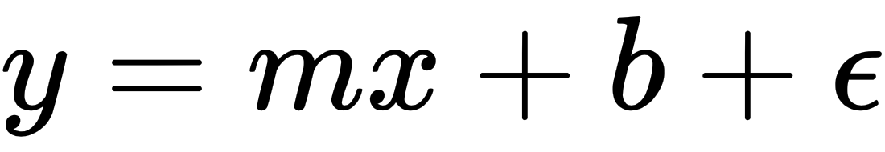
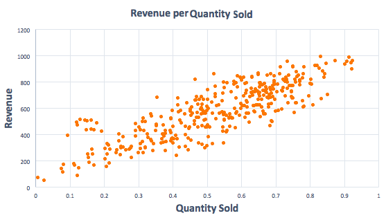
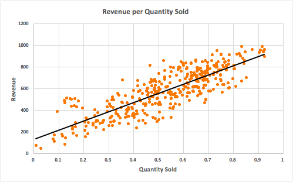
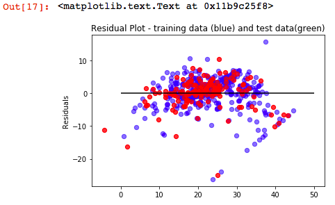
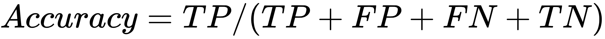
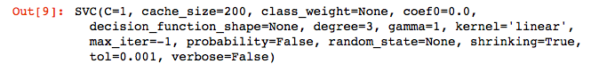
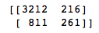

Introduction to Machine Learning Using Python
=============================================

The last lab introduced you to the world of **machine learning**
(**ML**). In this lab, we will develop the ML foundations that are
required for building and using **Automated ML** (**AutoML**) platforms.
It is not always clear how ML is best applied or what it takes to
implement it. However, ML tools are getting more straightforward to use,
and AutoML platforms are making it more accessible to a broader
audience. In the future there will undoubtedly be a higher collaboration
between man and machine.

The future of ML may require people to prepare data for its consumption
and identify use cases for implementation. More importantly, people are
needed to interpret the results and audit the ML system---whether they
are following the right and best approaches to solving a problem. The
future looks pretty amazing, but we need to build that future; that\'s
what we are going to do in this course. In this lab, we will walk you
through the following topics:

-   Machine learning process and its different types
-   Supervised learning---regression and classification
-   Unsupervised learning---clustering
-   Ensembles---bagging, boosting, and stacking
-   Inferring tasks based on data
-   Task-specific evaluation metrics

The objective of this lab is to
provide you with an overview of the different ML techniques and discuss
some of its essential aspects that are necessary to work on the
subsequent labs.

So, machines are excited to learn. Are you ready to help them? Hold on
tight. Let\'s first look at what machine learning is!


Technical requirements
======================

All the code examples can be found in the [Lab 02] folder in
GitHub.


Machine learning
================

Machine learning dates back to centuries. It was born from the theory
that computers can learn without being programmed to perform specific
tasks. The iterative aspect of ML is essential as the machines need to
adapt themselves to new data always. They need to learn from the
historical data, optimize for better computations, and also generalize
themselves to provide proper results.

We all are aware of rule-based systems, where we have a set of
predefined conditions for a machine to execute and provide the results.
How great will it be when machines learn these patterns by themselves,
deliver the results, and explain the rules that it discovered; this is
ML. It is a broader term used for various methods and algorithms that
are used by machines to learn from the data. As a branch of **artificial
intelligence** (**AI**), the ML algorithms are quite often used to
discover hidden patterns, establish a relationship, and also to predict
something.

Machine learning relies on some formatted inputs, and it provides a
result based on the task. The input format is specific to the type of ML
technique used and also to the algorithm considered. This specific
representation of input data is termed **features** or **predictors**.


Machine learning process
========================

How do we learn? When we were studying in school or university, we were
taught by our teachers. We learned from their teachings (training). At
the end of the term, we needed to take a test (testing), which was
basically to validate our knowledge. The scores we obtained decided our
fate (evaluation). Usually, the evaluation was carried out by
considering a threshold to pass (baseline). The scores determined
whether we needed to retake the subject or were ready to move to the
next level (deployment).

This is exactly how a machine learns as well. The words in the brackets
are the terminology used by ML professionals. However, this is just one
of the ways through which we, and the machines, learn. This is a typical
supervised learning method. People sometimes learn from experience as
well, and this is unsupervised learning. Let\'s study some more details
about these learning methods.


Broadly we have two categories of ML algorithms as described
earlier---supervised and unsupervised learning. There are a few other
types, such as reinforcement learning, transfer learning, and
semi-supervised learning, which are less often used and so are not in
the scope of this course.


Supervised learning
===================

As the name suggests, the learning process is supervised based on a
specified target/outcome.


The objective of supervised ML models is to learn and discover the
patterns that can correctly predict the outcome. In case of supervised
learning, there is always a labeled historical dataset with a target
attribute. All attributes other than the target are termed as
**predictors**/**features**.


The target can be a continuous numeric attribute, a binary attribute
indicating yes/no decisions, or a multi-class attribute with more than
two outcomes. Based on the target, the model identifies a pattern,
establishes a relationship between the predictors, and then uses the
derived recipe to predict unknown targets in a new independent dataset.

Many ML algorithms fall into this class of learning methods, such as
linear and logistics regression, decision trees, random forest, and
**Support Vector Machines** (**SVMs**), to name a few.


To identify and select the most suited algorithm for a job is the most
critical task in an ML project. This is also an essential section that
requires significant attention while creating an AutoML system. There
are various factors that govern this selection process and they will be
covered at length in this course.


Unsupervised learning
=====================

Similarly, in the case of unsupervised learning, there is no target
attribute. The objective of unsupervised learning is to identify
patterns by deducing structures and the relations of the features in the
input dataset. It can be used to discover rules that collectively define
a group, such as topic generation, partitioning---such as customer
segmentation or determining the internal structure of the data such as
gene clustering. Examples of unsupervised learning algorithms include
association rule mining and clustering algorithms.

It is quite essential to know about different learning algorithms before
creating an AutoML system. Before using an algorithm, it is critical to
understand its triple **W**---**What** it is, **Where** is it used, and
by **What** method it can be implemented.

In the following sections, we will question different algorithms for
their triple W, which will aid in creating a robust AutoML system.


Linear regression
=================

Let\'s begin our triple W session with linear regression first.


What is linear regression?
==========================

It is the traditional and most-used regression analysis. It is studied
rigorously and used widely for practical purposes. Linear regression is
a method for determining the relationship between a dependent variable
(*y*) and one or more independent variables (*x*). This derived
relationship can be used to predict an unexplained *y* from observed
*x*\'s. Mathematically, if *x* is an independent variable (commonly
known as the predictor) and *y* is a dependent variable (also known as
the target), the relationship is expressed as follows:





Where *m* is the slope of line, *b* is the intercept of the best-fit
regression line, and ε is the error term that is a deviation of the
actual and predicted values.

This is the equation for simple linear regression, as it involves only
one predictor (*x*) and one target (*y*). When there are multiple
predictors involved to predict a target, it is known as **multiple
linear regression**. The term *linear* suggests there is a fundamental
assumption that the underlying data exhibits a linear relationship.

Let\'s create a scatter plot between two variables: **Quantity Sold**
and **Revenue** of a product. We can infer from the plot that there is
some positive relationship between these two variables, that is when the
quantity of the products sold surged, the revenue went up. However, we
can\'t establish a relationship between them to predict revenue from the
quantity sold:





If we extend our previous scatter plot and add a trend line to it, we
see the line of best fit. Any data points that lie on this line are
flawlessly predicted values. As we move away from this line, the
reliability of the prediction decreases:





So, how do we find the best fit line? The most common and widely used
technique is the **ordinary least square** (**OLS**) estimate.


Working of OLS regression
=========================

The OLS [LinearRegression] method is the most straightforward
approach to fit a function to the data. It finds the best-fit line by
minimizing the **sum of squared errors** (**SSE**) of the data. The SSE
is the sum of the deviations of actual values from the mean. However, as
always, the simplicity comes with a price. The price to pay for an
excellent OLS method is adhering to its several fundamental assumptions.


Assumptions of OLS
==================

All of these assumptions about the data should hold true to reap the
benefits of the OLS regression techniques:

-   **Linearity**: The true underlying relationship between *X* and *Y*
    is linear.
-   **Homoscedastic**: The variance of residuals must be constant. The
    residual is the difference between the observed value and predictive
    value of the target.
-   **Normality**: The residuals/errors should be normally distributed.
-   **No or little multicollinearity**: The residuals/errors must be
    independent.

OLS is also affected by the presence of outliers in the data. Outlier
treatment is necessary before one proceeds with linear regression
modeling using OLS linear regression.


Where is linear regression used?
================================

Linear regression has many practical use cases, and most of them fall
into one of the following two broad kinds:

-   If the goal is either a prediction or forecasting, it can be used to
    build a predictive model to a recognized dataset of dependent and
    independent values
-   If the goal is to determine the strength of a relationship between
    the target and predictor variables, it can be applied to quantify
    the change in *Y* for a given value of *X*


By which method can linear regression be implemented?
=====================================================

We can create a linear regression model in Python by using
scikit-learn\'s [LinearRegression] method. As this is the first
instance where we are going to discuss implementing a model using
Python, we will take a detour from our discussion of the algorithm and
learn some essential packages that are required to create a model in
Python:

-   [numpy]: It is a numeric Python module used for mathematical
    functions. It provides robust data structures for effective
    computation of multi-dimensional arrays and matrices.

```{=html}

```
-   [pandas]: It provides the DataFrame object for data
    manipulation. A DataFrame can hold different types of values and
    arrays. It is used to read, write, and manipulate data in Python.
-   [scikit-learn]: It is an ML library in Python. It includes
    various ML algorithms and is a widely used library for creating ML
    models in Python. Apart from ML algorithms, it also provides various
    other functions that are required to develop models, such as
    [train\_test\_split], model evaluation metrics, and
    optimization metrics.

We need to first import these required libraries into the Python
environment before creating a model. If you are running your code in a
Jupyter notebook, it is necessary to declare [%matplotlib inline]
to view the graph inline in the interface. We need to import the
[numpy] and [pandas] packages for easy data manipulation and
numerical calculations. The plan for this exercise is to create a linear
regression model, so we need to also import the [LinearRegression]
method from the scikit-learn package. We will use scikit-learn\'s
example [Boston] dataset for the task:


``` {.language-markup}
%matplotlib inline
import numpy as np
import pandas as pd
from sklearn.linear_model import LinearRegression
import matplotlib.pyplot as plt
from sklearn.datasets import load_boston
```


Next, we need to load the [Boston] dataset using the following
command. It is a dictionary, and we can examine its keys to view its
content:


``` {.language-markup}
boston_data = load_boston()
boston_data.keys()
```


The output of the preceding code is as follows:


The [boston\_data] has four keys that are self-explanatory on the
kinds of values they point. We can retrieve the data and the target
values from the keys [data] and [target]. The
[feature\_names] key holds the names of the attribute and
[DESCR] has the description of each attribute.

It is always good practice to look at the data size first before
processing the data. This helps to decide whether to go with the full
data or use a sample of it, and also to infer how long it might take to
execute.

The [data.shape] function in Python is an excellent way to view
the data dimensions (rows and columns):


``` {.language-markup}
print(" Number of rows and columns in the data set ", boston_data.data.shape)
print(boston_data.feature_names)
```


The output of the preceding code is as follows:


Next, we need to convert the dictionary to a DataFrame. This can be
accomplished by calling the [DataFrame] function of the
[pandas] library. We use [head()] to display a subset of
records to validate the data:


``` {.language-markup}
boston_df =pd.DataFrame(boston_data.data)
boston_df.head()
```


A DataFrame is a collection of vectors and can be treated as a
two-dimensional table. We can consider DataFrame as having each row
correspond to some observation and each column to some attribute of the
observation. This makes them extremely useful for fitting to a ML
modeling task.


The output of the preceding code is as follows:


The column names are just numeric indexes and don\'t give a sense of
what the DataFrame implies. So, let us assign the [feature\_names]
as the column names to the [boston\_df] DataFrame to have
meaningful names:


``` {.language-markup}
boston_df.columns = boston_data.feature_names
```


Once again, we check a sample of [boston] house rent data, and now
it describes the columns better than previously:


``` {.language-markup}
boston_df.head()
```


The output of the preceding code is as follows:


In linear regression, there has to be a DataFrame as a target variable
and another DataFrame with other features as predictors. The objective
of this exercise is to predict the house prices, so we assign
[PRICE] as the target attribute ([Y]) and the rest all as
predictors ([X]). The [PRICE] is dropped from the predictor
list using the [drop] function.

Next, we print the intercept and coefficients of each variable. The
coefficients determine the weight and contribution that each predictor
has on predicting the house price (target [Y]). The intercept
provides a constant value, which we can consider to be house price when
all of the predictors are absent:


``` {.language-markup}
boston_df['PRICE'] = boston_data.target
X = boston_df.drop('PRICE', axis=1)
lm = LinearRegression()
lm.fit(X, boston_df.PRICE)
print("Intercept: ", lm.intercept_)
print("Coefficient: ", lm.coef_)
```


The output of the preceding code is as follows:


It is not clear from the earlier screenshot which coefficient belongs to
what predictors. So, we tie the features and coefficients together using
the following code:


``` {.language-markup}
pd.DataFrame(list(zip(X.columns, lm.coef_)),columns= ['features','estimatedCoefficients'])
```


The output of the preceding code is as follows:


Next, we calculate and view the mean squared error metric. For now, let
us think of it as the average error the model has in predicting the
house price. The evaluation metrics are very important for understanding
the dynamics of a model and how it is going to perform in a production
environment:


``` {.language-markup}
lm.predict(X)[0:5
mseFull = np.mean((boston_df.PRICE - lm.predict(X)) ** 2)
print(mseFull)
```


The output of the preceding code is as follows:


We created the model on the whole dataset, but it is essential to ensure
that the model we developed works appropriately on different datasets
when used in a real production environment. For this reason, the data
used for modeling is split into two sets, typically in a ratio of 70:30.
The most significant split is used to train the model, and the other one
is used to test the model developed. This independent test dataset is
considered as a *dummy production environment* as this was hidden from
the model during its training phase. The test dataset is used to
generate the predictions and evaluate the accuracy of the model.
Scikit-learn provides a [train\_test\_split] method that can be
used to split the dataset into two parts. The [test\_size]
parameter in the function indicates the percentage of data that is to be
held for testing. In the following code, we split the dataset into
[train] and [test] sets, and retrain the model:


``` {.language-markup}
#Train and Test set
from sklearn.model_selection import train_test_split
X_train, X_test, Y_train, Y_test = train_test_split(X, boston_df.PRICE, test_size=0.3, random_state=42)
print(X_train)
```


As we have used [test\_size=0.3], 70% of the dataset will be used
for creating [train] set, and 30% will be reserved for the
[test] dataset. We follow the same steps as earlier to create a
linear regression model, but now we would use only the training dataset
([X\_train] and [Y\_train]) to create the model:


``` {.language-markup}
lm_tts = LinearRegression()
lm_tts.fit(X_train, Y_train)
print("Intercept: ", lm_tts.intercept_)
print("Coefficient: ", lm_tts.coef_)
```


The output of the preceding code is as follows:


We predict the target values for both the [train] and [test]
datasets, and calculate their **mean squared error** (**MSE**):


``` {.language-markup}
pred_train = lm.predict(X_train)
pred_test = lm.predict(X_test)
print("MSE for Y_train:", np.mean((Y_train - lm.predict(X_train)) ** 2))
print("MSE with Y_test:", np.mean((Y_test - lm.predict(X_test)) ** 2))
```


The output of the preceding code is as follows:


We see that the MSE for both the [train] and [test] datasets
are [22.86] and [19.65], respectively. This means the
model\'s performance is almost similar in both the training and testing
phase and can be deployed for predicting house prices on new independent
identical datasets.

Next, let\'s paint a residual plot to see whether the residuals follow a
linear pattern:


``` {.language-markup}
plt.scatter(pred_train,pred_train - Y_train, c = 'b',s=40,alpha=0.5)
plt.scatter(pred_test,pred_test - Y_test, c = 'r',s=40,alpha=0.7)
plt.hlines(y = 0, xmin=0, xmax = 50)
plt.title('Residual Plot - training data (blue) and test data(green)')
plt.ylabel('Residuals')
```


The output of the preceding code is as follows:





As the residuals are symmetrically distributed around the horizontal
dashed line, then they exhibit a perfect linear pattern.

Developing a model is easy, but designing a useful model is difficult.
Evaluating the performance of a ML model is a crucial step in an ML
pipeline. Once a model is ready, we have to assess it to establish its
correctness. In the following section, we will walk you through some of
the widely-used evaluation metrics employed to evaluate a regression
model.


Important evaluation metrics -- regression algorithms
=====================================================

Assessing the value of a ML model is a two-phase process. First, the
model has to be evaluated for its statistical accuracy, that is, whether
the statistical hypotheses are correct, model performance is
outstanding, and the performance holds true for other independent
datasets. This is accomplished using several model evaluation metrics.
Then, a model is evaluated to see if the results are as expected as per
business requirement and the stakeholders genuinely get some insights or
useful predictions out of it.

A regression model is evaluated based on the following metrics:

-   **Mean absolute error** (**MAE**): It is the sum of absolute values
    of prediction error. The prediction error is defined as the
    difference between predicted and actual values. This metric gives an
    idea about the magnitude of the error. However, we cannot judge the
    direction of whether the model has overpredicted or underpredicted.
    One should always aim for a low MAE score:


Where, *y~i~* = Actual values


= Predicted values

*n* = Number of cases (records)

-   **Mean squared error**: It is the average of sum of squared errors.
    This metric describes both the magnitude as well as the direction of
    the error. However, the unit of measurement is changed as the values
    are squared. This deficiency is filled by another metric: root mean
    square error. The lower the score, the better the model is:


-   **Root mean square error** (**RMSE**): This metric is calculated by
    the square root of the mean squared error. Taking a square root
    converts the unit of measurement back to the original units. A model
    with a low RMSE score is a good model:


-   **R^2^ score**: It is also known as **coefficient of
    determination**. It describes the percentage of variance explained
    by the model. For example, if *R^2^* is 0.9, then the attributes or
    features used in the model can represent 90% of its variation.
    *R^2^* varies from 0 to 1, and the higher this value, the better the
    model is. However, one needs to have a good testing strategy in
    place to validate that the model doesn\'t overfit:


Where, *y~i~* = Actual values


= Predicted values

*n* = Number of cases (records)

=
Mean of y


Overfitting occurs when a machine learning model learns the training
data very well. These models have low bias and high variance in their
results. In such cases, the model might lead to poor predictions on new
data.


In this section, we learned about regression analysis as one of the
supervised ML methods. It can be used in scenarios where the target data
is continuous numerical data, such as predicting the desired salary of
an employee, predicting house prices, or predicting spend values.

What if the target has discrete data? How do we predict whether a
customer will churn or not? How do we predict whether a loan/credit card
should be approved for a prospect? Linear regression will not work for
these cases as these problems violate its underlying assumptions. Do we
have any other methods? For these situations, we can use classification
models.


Classification modeling is another form of supervised machine learning
methods that is used to predict targets with discrete input target
values. The classification algorithms are known as **classifiers**, as
they identify the set of categories that input data support and use this
information to assign a class to an unidentified or unknown target
label.


In the next sections, we will walk through some of the widely-used
classifiers, such as logistics regression, decision trees, SVMs, and
k-Nearest Neighbors. Logistics regression can be considered as a bridge
between regression and classification methods. It is a classifier
camouflaged with a regression in its signature. However, it is one of
the most effective and explainable classification models.


Logistic regression
===================

Let\'s start again with the *triple W* for logistics regression. To
reiterate the tripe W method, we first ask the algorithm what it is,
followed by where it can be used, and finally by what method we can
implement the model.


What is logistic regression?
============================

Logistic regression can be thought of as an extension to linear
regression algorithms. It fundamentally works like linear regression,
but it is meant for discrete or categorical outcomes.


Where is logistic regression used?
==================================

Logistic regression is applied in the case of discrete target variables
such as binary responses. In such scenarios, some of the assumptions of
linear regression, such as target attribute and features, don\'t follow
a linear relationship, the residuals might not be normally distributed,
or the error terms are heteroscedastic. In logistic regression, the
target is reconstructed to the log of its odds ratio to fit the
regression equation, as shown here:


The odds ratio reflects the probability or likelihood of occurrence of a
particular event against the probability of that same event not taking
place. If *P* is the probability of the presence of one event/class, *P
-- 1* is the probability of the presence of the second event/class.


By which method can logistic regression be implemented?
=======================================================

A logistic regression model can be created by importing scikit-learn\'s
[LogisticRegression] method. We load the packages as we did
previously for creating a linear regression model:


``` {.language-markup}
import pandas as pd
import numpy as np
from sklearn import preprocessing
import matplotlib.pyplot as plt
from sklearn.linear_model import LogisticRegression
```


We will use the dataset of an [HR] department that has the list of
employees who have attrited in the past along with the employees who are
continuing in the job:


``` {.language-markup}
hr_data = pd.read_csv('data/hr.csv', header=0)
hr_data.head()
hr_data = hr_data.dropna()
print(hr_data.shape)
print(list(hr_data.columns))
```


The output of the preceding code is as follows:


The dataset has [14999] rows and [10] columns. The
[data.columns] function displays names of the attributes. The
[salary] attribute has three values---[high], [low],
and [medium], and [sales] has seven values---[IT],
[RandD], [marketing], [product\_mng], [sales],
[support], and [technical]. To use this discrete input data
in the model, we need to convert it into numeric format. There are
various ways to do so. One of the ways is to dummy encode the values,
also known as **one-hot encoding**. Using this method, dummy columns are
generated for each class of a categorical attribute.

For each dummy attribute, the presence of the class is represented by 1,
and its absence is represented by 0.


Discrete data can either be nominal or ordinal. When there is a natural
ordering of values in the discrete data, it is termed as **ordinal**.
For example, categorical values such as high, medium, and low are
ordered values. For these cases, label encoding is mostly used. When we
cannot derive any relationship or order from the categorical or discrete
values, it is termed as **nominal**. For example, colors such as red,
yellow, and green have no order. For these cases, dummy encoding is a
popular method.


The [get\_dummies] method of [pandas] provides an easy
interface for creating dummy variables in Python. The input for the
function is the dataset and names of the attributes that are to be dummy
encoded. In this case, we will be dummy encoding [salary] and
[sales] attributes of the [HR] dataset:


``` {.language-markup}
data_trnsf = pd.get_dummies(hr_data, columns =['salary', 'sales'])
data_trnsf.columns
```


The output of the preceding code is as follows:


Now, the dataset is ready for modeling. The [sales] and
[salary] attributes are successfully one-hot encoded. Next, as we
are going to predict the attrition, we are going to use the [left]
attribute as the target as it contains the information on whether an
employee attrited or not. We can drop the [left] data from the
input predictors dataset referred as to [X] in the code. The left
attribute is denoted by [Y] (target):


``` {.language-markup}
X = data_trnsf.drop('left', axis=1)
X.columns
```


The output of the preceding code is as follows:


We split the dataset into [train] and [test] sets with a
ratio of 70:30. 70% of the data will be used to train the logistic
regression model and the remaining 30% to evaluate the accuracy of the
model:


``` {.language-markup}
from sklearn.model_selection import train_test_split
X_train, X_test, Y_train, Y_test = train_test_split(X, data_trnsf.left, test_size=0.3, random_state=42)
print(X_train)
```


As we execute the code snippet, four datasets are created.
[X\_train] and [X\_test] are the [train] and
[test] input predictor data. [Y\_train] and [Y\_test]
are [train] and [test] input target data. Now, we will fit
the model on the train data and evaluate the accuracy of the model on
the test data. First, we create an instance of the
[LogisticsRegression()] classifier class. Next, we fit the
classifier on the training data:


``` {.language-markup}
attrition_classifier = LogisticRegression()
attrition_classifier.fit(X_train, Y_train)
```


Once the model is successfully created, we use the [predict]
method on the test input predictor dataset to predict the corresponding
target values ([Y\_pred]):


``` {.language-markup}
Y_pred = attrition_classifier.predict(X_test)
```


We need to create a [confusion\_matrix] for evaluating a
classifier. Most of the model evaluation metrics are based on the
confusion matrix itself. There is a detailed discussion on confusion
matrix and other evaluation metrics right after this section. For now,
let\'s consider the confusion matrix as a matrix of four values that
provides us with the count of values that were correctly and incorrectly
predicted. Based on the values in the confusion matrix, the
classifier\'s accuracy is calculated. The accuracy of our classifier is
0.79 or 79%, which means 79% of cases were correctly predicted:


``` {.language-markup}
from sklearn.metrics import confusion_matrix
confusion_matrix = confusion_matrix(Y_test, Y_pred)
print(confusion_matrix)

print('Accuracy of logistic regression model on test dataset: {:.2f}'.format(attrition_classifier.score(X_test, Y_test)))
```


The output of the preceding code is as follows:


Sometimes, the accuracy might not be a good measure to judge the
performance of a model. For example, in the case of unbalanced datasets,
the predictions might be biased towards the majority class. So, we need
to look at other metrics such as f1-score, **area under curve**
(**AUC**), precision, and recall that gives a fair judgment about the
model. We can retrieve the scores for all these metrics by importing the
[classification\_report] from scikit-learn\'s [metric]
method:


``` {.language-markup}
from sklearn.metrics import classification_report
print(classification_report(Y_test, Y_pred))
```


The output of the preceding code is as follows:


**Receiver Operating Characteristic** (**ROC**) is most commonly used to
visualize the performance of a binary classifier. AUC measure is the
area under the ROC curve, and it provides a single number that
summarizes the performance of the classifier based on the ROC curve. The
following code snippet can be used to draw a ROC curve using Python:


``` {.language-markup}
from sklearn.metrics import roc_curve
from sklearn.metrics import auc

# Compute false positive rate(fpr), true positive rate(tpr), thresholds and roc auc(Area under Curve)
fpr, tpr, thresholds = roc_curve(Y_test, Y_pred)
auc = auc(fpr,tpr)

# Plot ROC curve
plt.plot(fpr, tpr, label='AUC = %0.2f' % auc)
#random prediction curve
plt.plot([0, 1], [0, 1], 'k--') 
#Set the x limits
plt.xlim([0.0, 1.0])
#Set the Y limits
plt.ylim([0.0, 1.0])
#Set the X label
plt.xlabel('False Positive Rate(FPR) ')
#Set the Y label
plt.ylabel('True Positive Rate(TPR)')
#Set the plot title
plt.title('Receiver Operating Characteristic(ROC) Cure')
# Location of the AUC legend
plt.legend(loc="right")
```


The output of the preceding code is as follows:


The AUC for our model is **0.63**. We are already seeing some of the
metrics that are used to evaluate a classification model, and some of
these are appearing strange. So, let\'s understand the metrics before
moving onto our discussion on classification algorithms.


Important evaluation metrics -- classification algorithms
=========================================================

Most of the metrics used to assess a classification model are based on
the values that we get in the four quadrants of a confusion matrix.
Let\'s begin this section by understanding what it is:

-   **Confusion matrix**: It is the cornerstone of evaluating a
    classification model (that is, classifier). As the name stands, the
    matrix is sometimes confusing. Let\'s try to visualize the confusion
    matrix as two axes in a graph. The *x* axis label is prediction,
    with two values---**Positive** and **Negative**. Similarly, the *y*
    axis label is actually with the same two values---**Positive** and
    **Negative**, as shown in the following figure. This matrix is a
    table that contains the information about the count of actual and
    predicted values by a classifier:


-   If we try to deduce information about each quadrant in the matrix:
    -   Quadrant one is the number of positive class predictions that
        were accurately identified. So, it is termed as **True
        Positive** (**TP**).
    -   Quadrant two, also known as **False Positive** (**FP**), is the
        number of inaccurate predictions for actual positive cases.
    -   Quadrant three, which is known as **False Negative** (**FN**),
        is the number of inaccurate predictions for negative cases.
    -   Quadrant four is **True Negative** (**TN**), which is the number
        of negative class predictions that were accurately classified.
-   **Accuracy**: Accuracy measures how frequently the classifier makes
    an accurate prediction. It is the ratio of the number of correct
    predictions to the total number of predictions:



-   **Precision**: Precision estimates the proportions of true positives
    that were accurately identified. It is the ratio of true positives
    to all predicted positives:


-   **Recall**: Recall is also termed sensitivity or **true positive
    rate** (**TPR**). It estimates the proportions of true positives out
    of all observed positive values of a target:


-   **Misclassification rate**: It estimates how frequently the
    classifier has predicted inaccurately. It is the ratio of incorrect
    predictions to all predictions:


-   **Specificity**: Specificity is also known as **true negative rate**
    (**TNR**). It estimates the proportions of true negatives out of all
    observed negative values of a target:


-   **ROC curve**: The ROC curve summarizes the performance of a
    classifier over all possible thresholds. The graph for ROC curve is
    plotted with **true positive rate** (**TPR**) in the *y* axis and
    **false positive rate** (**FPR**) in the *x* axis for all possible
    thresholds.
-   **AUC**: AUC is the area under a ROC curve. If the classifier is
    outstanding, the true positive rate will increase, and the area
    under the curve will be close to 1. If the classifier is similar to
    random guessing, the true positive rate will increase linearly with
    the false positive rate (1--sensitivity). In this case, the AUC will
    be around 0.5. The better the AUC measure, the better the model.
-   **Lift**: Lift helps to estimate the improvement in a model\'s
    predictive ability over the average or baseline model. For example,
    the accuracy of the baseline model for an HR attrition dataset is
    40%, but the accuracy of a new model on the same dataset is 80%.
    Then, that model has a lift of 2 (80/40).
-   **Balanced accuracy**: Sometimes, the accuracy is not a good measure
    alone to evaluate a model. For cases where the dataset is
    unbalanced, it might not be a useful evaluation metric. In such
    cases, balanced accuracy can be used as one of the evaluation
    metrics. Balanced accuracy is a measure calculated on the average
    accuracy obtained in either class:


Unbalanced dataset---Where one class dominates the other class. In such
cases, there is an inherent bias in prediction towards the major class.
However, this is a problem with base learners such as decision trees and
logistic regression. For ensemble models such as random forest it can
handle unbalanced classes well.


-   **F1 score**: An F1 score is also a sound measure to estimate an
    imbalanced classifier. The F1 score is the harmonic mean of
    precision and recall. Its value lies between 0 and 1:


-   **Hamming loss**: This identifies the fraction of labels that are
    incorrectly predicted.
-   **Matthews Correlation Coefficient** (**MCC**): MCC is a correlation
    coefficient between target and predictions. It varies between -1 and
    +1. -1 when there is complete disagreement between actuals and
    prediction, 1 when there is a perfect agreement between actuals and
    predictions, 0 when the prediction may as well be random concerning
    the actuals. As it involves values of all the four quadrants of a
    confusion matrix, it is considered as a balanced measure.

Sometimes, creating a model for prediction is not only a requirement. We
need insights on how the model was built and the critical features that
describe the model. Decision trees are go to model in such cases.


Decision trees
==============

Decision trees are extensively-used classifiers in the ML world for
their transparency on representing the rules that drive a
classification/prediction. Let us ask the triple W questions to this
algorithm to know more about it.


What are decision trees?
========================

Decision trees are arranged in a hierarchical tree-like structure and
are easy to explain and interpret. They are not susceptive to outliers.
The process of creating a decision tree is a recursive partitioning
method where it splits the training data into various groups with an
objective to find homogeneous pure subgroups, that is, data with only
one class.


Outliers are values that lie far away from other data points and distort
the data distribution.


Where are decision trees used?
==============================

Decision trees are well-suited for cases where there is a need to
explain the reason for a particular decision. For example, financial
institutions might need a complete description of rules that influence
the credit score of a customer prior to issuing a loan or credit card.


By which method can decision trees be implemented?
==================================================

Decision tree models can be created by importing scikit-learn\'s
[DecisionTreeClassifier]:


``` {.language-markup}
import numpy as np
import pandas as pd
from sklearn.tree import DecisionTreeClassifier
from sklearn.metrics import accuracy_score
from sklearn import tree
```


Next, we read the [HR] attrition dataset and do all the data
preprocessing that was done in the previous logistics regression
example:


``` {.language-markup}
hr_data = pd.read_csv('data/hr.csv', header=0)
hr_data.head()
hr_data = hr_data.dropna()
print(" Data Set Shape ", hr_data.shape)
print(list(hr_data.columns))
print(" Sample Data ", hr_data.head())
```


The output of the preceding code is as follows:


The following code creates the dummy variables for categorical data and
splits the data into [train] and [test] sets:


``` {.language-markup}
data_trnsf = pd.get_dummies(hr_data, columns =['salary', 'sales'])
data_trnsf.columns
X = data_trnsf.drop('left', axis=1)
X.columns
from sklearn.model_selection import train_test_split
X_train, X_test, Y_train, Y_test = train_test_split(X, data_trnsf.left, test_size=0.3, random_state=42)
print(X_train)
```


Next, to create a decision tree classifier, we need to instantiate a
[DecisionTreeClassifier] with at least the required parameters.
The following are some of the parameters that are used to generate a
decision tree model:

-   [criterion]: Impurity metrics for forming decision trees; it
    can be either [entropy] or [gini]
-   [max\_depth]: Maximum depth of a tree
-   [min\_samples\_leaf]: Minimum number of samples required to
    build a leaf node
-   [max\_depth] and [min\_sample\_leafs] are two of the
    tree pre-pruning criteria

Let\'s create a decision tree model using some of these parameters:


``` {.language-markup}
attrition_tree = DecisionTreeClassifier(criterion = "gini", random_state = 100,
max_depth=3, min_samples_leaf=5)
attrition_tree.fit(X_train, Y_train)
```


The output of the preceding code is as follows:


Next, we generate a confusion matrix to evaluate the model:


``` {.language-markup}
Y_pred = attrition_tree.predict(X_test)
from sklearn.metrics import confusion_matrix
confusionmatrix = confusion_matrix(Y_test, Y_pred)
print(confusionmatrix)
```


The output of the preceding code is as follows:


If we view the confusion matrix, we can assume that the classifier has
done a reliable job in classifying both true positives and true
negatives. However, let us validate our assumption based on the
summarized evaluation metrics:


``` {.language-markup}
print('Accuracy of Decision Tree classifier on test set: {:.2f}'.format(attrition_tree.score(X_test, Y_test)))
from sklearn.metrics import classification_report
 print(classification_report(Y_test, Y_pred))
```


The output of the preceding code is as follows:


The accuracy, along with other metrics, are [0.95], which is a
pretty good score.

The tree-based model had a better result than the logistic regression
model. Now, let us understand another popular classification modeling
technique based on the support vectors.


Support Vector Machines
=======================

SVM is a supervised ML algorithm used primarily for classification
tasks, however, it can be used for regression problems as well.


What is SVM?
============

SVM is a classifier that works on the principle of separating
hyperplanes. Given a training dataset, the algorithms find a hyperplane
that maximizes the separation of the classes and uses these partitions
for the prediction of a new dataset. The hyperplane is a subspace of one
dimension less than its ambient plane. This means the line is a
hyperplane for a two-dimensional dataset.


Where is SVM used?
==================

SVM has similar use cases as that of other classifiers, but SVM is
suited well for cases when the number of features/attributes are high
compared to the number of data points/records.


By which method can SVM be implemented?
=======================================

The process to create an SVM model is similar to other classification
methods that we studied earlier. The only difference is to import the
[svm] method from scikit-learn\'s library. We import the
[HR] attrition dataset using [pandas] library and split the
dataset to [train] and [test] sets:


``` {.language-markup}
import numpy as np
import pandas as pd
from sklearn import svm
from sklearn.metrics import accuracy_score

hr_data = pd.read_csv('data/hr.csv', header=0)
hr_data.head()
hr_data = hr_data.dropna()
print(" Data Set Shape ", hr_data.shape)
print(list(hr_data.columns))
print(" Sample Data ", hr_data.head())
data_trnsf = pd.get_dummies(hr_data, columns =['salary', 'sales'])
data_trnsf.columns
X = data_trnsf.drop('left', axis=1)
X.columns
from sklearn.model_selection import train_test_split

X_train, X_test, Y_train, Y_test = train_test_split(X, data_trnsf.left, test_size=0.3, random_state=42)
print(X_train)
```


Next, we create an SVM model instance. We set the kernel to be linear,
as we want a line to separate the two classes. Finding optimal
hyperplanes for linearly-separable data is easy. However, when the data
is not linearly separable, the data is mapped into a new space to make
it linearly separable. This methodology is known as a **kernel trick**:


``` {.language-markup}
attrition_svm = svm.SVC(kernel='linear') 
attrition_svm.fit(X_train, Y_train)
```


The output of the preceding code is as follows:





After fitting the SVM model instance to the train data, we predict the
[Y] values for the [test] set and create a confusion matrix
to evaluate the model performance:


``` {.language-markup}
Y_pred = attrition_svm.predict(X_test)
from sklearn.metrics import confusion_matrix
confusionmatrix = confusion_matrix(Y_test, Y_pred)
print(confusionmatrix)
```


The output of the preceding code is as follows:





Then, the values for model accuracy and other metrics are calculated:


``` {.language-markup}
print('Accuracy of SVM classifier on test set: {:.2f}'.format(attrition_svm.score(X_test, Y_test)))
from sklearn.metrics import classification_report
print(classification_report(Y_test, Y_pred))
```


The output of the preceding code is as follows:


We see that the SVM model with default parameters did not perform better
than the decision tree model. So, until now decision tree holds its
place right at the top in the [HR] attrition prediction
leaderboard. Let us try another classification algorithm, **k-Nearest
Neighbors** (**KNN**), which is easier to understand and to use, but is
much more resource intensive.


k-Nearest Neighbors
===================

Before we build a KNN model for the [HR] attrition dataset, let us
understand KNN\'s triple W.


What is k-Nearest Neighbors?
============================

KNN is one of the most straightforward algorithms that stores all
available data points and predicts new data based on distance similarity
measures such as Euclidean distance. It is an algorithm that can make
predictions using the training dataset directly. However, it is much
more resource intensive as it doesn\'t have any training phase and
requires all data present in memory to predict new instances.


Euclidean distance is calculated as the square root of the sum of the
squared differences between two points.


Where is KNN used?
==================

KNN can be used for building both classification and regression models.
It is applied to classification tasks, both binary and multivariate. KNN
can even be used for creating recommender systems or imputing missing
values. It is easy to use, easy to train, and easy to interpret the
results.


By which method can KNN be implemented?
=======================================

Again, we follow a similar process for KNN as we did to create the
previous models. We import the [KNeighborsClassifier] method from
scikit-learn\'s library to use the KNN algorithm for modeling. Next, we
import the [HR] attrition dataset using the [pandas] library
and split the dataset into [train] and [test] sets:


``` {.language-markup}
import numpy as np
import pandas as pd
from sklearn.metrics import accuracy_score
from sklearn.neighbors import KNeighborsClassifier
hr_data = pd.read_csv('data/hr.csv', header=0)
hr_data.head()
hr_data = hr_data.dropna()
print(" Data Set Shape ", hr_data.shape)
print(list(hr_data.columns))
print(" Sample Data ", hr_data.head())
data_trnsf = pd.get_dummies(hr_data, columns =['salary', 'sales'])
data_trnsf.columns
X = data_trnsf.drop('left', axis=1)
X.columns
from sklearn.model_selection import train_test_split
X_train, X_test, Y_train, Y_test = train_test_split(X, data_trnsf.left, test_size=0.3, random_state=42)
print(X_train)
```


To create a KNN model, we need to specify the number of nearest
neighbors to be considered for distance calculation.


In real life, when we create models, we create different models for a
range of [n\_neighbors] values with various distance measures and
choose the model that returns the highest accuracy. This process is also
known as **tuning the hyperparameters**.


For the following [HR] attrition model, we defined
[n\_neighbors] to be [6] and distance metric as Euclidean:


``` {.language-markup}
n_neighbors = 6
attrition_knn = KNeighborsClassifier(n_neighbors=n_neighbors, metric='euclidean')
attrition_knn.fit(X_train, Y_train)
```


The output of the preceding code is as follows:


Then the prediction is made on the [test] dataset, and we review
the confusion matrix along with other evaluation metrics:


``` {.language-markup}
Y_pred = attrition_knn.predict(X_test)
from sklearn.metrics import confusion_matrix
confusionmatrix = confusion_matrix(Y_test, Y_pred)
print(confusionmatrix)
```


The output of the preceding code is as follows:


The following code reports the accuracy score and values for other
metrics:


``` {.language-markup}
print('Accuracy of KNN classifier on test set: {:.2f}'.format(attrition_knn.score(X_test, Y_test)))
from sklearn.metrics import classification_report
print(classification_report(Y_test, Y_pred))
```


The output of the preceding code is as follows:


The KNN result is better than the SVM model, however, it is still lower
than the decision tree\'s score. KNN is a resource-intensive algorithm.
It is wise to use a model of some different algorithm if there is just a
marginal improvement using KNN. However, it is at the user\'s discretion
on what is best depending on their environment and the problem they are
trying to solve.


Ensemble methods
================

Ensembling models are a robust approach to enhancing the efficiency of
the predictive models. It is a well-thought out strategy that is very
similar to a power-packed word---TEAM !! Any task done by a team leads
to significant accomplishments.


What are ensemble models?
=========================

Likewise, in the ML world, an ensemble model is a *team of models*
operating together to enhance the result of their work. Technically,
ensemble models comprise of several supervised learning models that are
individually trained, and the results are merged in various ways to
achieve the final prediction. This result has higher predictive power
than the results of any of its constituting learning algorithms
independently.

Mostly, there are three kinds of ensemble learning methods that are
used:

-   Bagging
-   Boosting
-   Stacking/Blending


Bagging
=======

Bagging is also known as **bootstrap aggregation**. It is a way to
decrease the variance error of a model\'s result. Sometimes the weak
learning algorithms are very sensitive---a slightly different input
leads to very offbeat outputs. Random forest reduces this variability by
running multiple instances, which leads to lower variance. In this
method, random samples are prepared from training datasets using the
random sample with replacement models (bootstrapping process).

Models are developed on each sample using supervised learning methods.
Lastly, the results are merged by averaging the predictions or selecting
the best prediction utilizing the majority voting technique. Majority
voting is a process in which the prediction of the ensemble is the class
with the highest number of predictions in all of the classifiers. There
are also various other methods, such as weighing and rank averaging, for
producing the final results.

There are various bagging algorithms, such as bagged decision trees,
random forest, and extra trees, that are available in scikit-learn. We
will demonstrate the most popular random forest model and you can try
out the rest. We can implement random forest by importing
[RandomForestClassifier] from scikit-learn\'s [ensemble]
package. As we are still working with [HR] attrition data, some
part of the code segment remains the same for this demonstration as
well:


``` {.language-markup}
import numpy as np
import pandas as pd
from sklearn.ensemble import RandomForestClassifier
from sklearn.metrics import accuracy_score
from sklearn import tree
hr_data = pd.read_csv('data/hr.csv', header=0)
hr_data.head()
hr_data = hr_data.dropna()
print(" Data Set Shape ", hr_data.shape)
print(list(hr_data.columns))
print(" Sample Data ", hr_data.head())
data_trnsf = pd.get_dummies(hr_data, columns =['salary', 'sales'])
data_trnsf.columns
X = data_trnsf.drop('left', axis=1)
X.columns
from sklearn.model_selection import train_test_split
X_train, X_test, Y_train, Y_test = train_test_split(X, data_trnsf.left, test_size=0.3, random_state=42)
print(X_train)
```


There are no mandatory parameters to instantiate a random forest model.
However, there are a few parameters that are important to understand for
creating a good random forest model, described as follows:

-   [n\_estimators]: We can specify the number of trees to be
    created in the model. The default is 10.
-   [max\_features]: This specifies the number of
    variables/features to be chosen randomly as candidates at each
    split. The default is
    .

We create a random forest model using [n\_estimators] as
[100] and [max\_features] to be [3], as shown in the
following code snippet:


``` {.language-markup}
num_trees = 100
max_features = 3
attrition_forest = RandomForestClassifier(n_estimators=num_trees, max_features=max_features)
attrition_forest.fit(X_train, Y_train)
```


The output of the preceding code is as follows:


Once a model is fitted successfully, we predict the [Y\_pred] from
the [test] or hold out dataset:


``` {.language-markup}
Y_pred = attrition_forest.predict(X_test)
from sklearn.metrics import confusion_matrix
confusionmatrix = confusion_matrix(Y_test, Y_pred)
print(confusionmatrix)
```


The results in the confusion matrix are looking very good with fewer
misclassifications and accurate predictions. Let\'s check how the
evaluation metrics come out:


Next, we check the accuracy of [Random Forest classifier] and
[print] the classification report:


``` {.language-markup}
print('Accuracy of Random Forest classifier on test set: {:.2f}'.format(attrition_forest.score(X_test, Y_test)))
from sklearn.metrics import classification_report
print(classification_report(Y_test, Y_pred))
```


The output of the preceding code is as follows:


This is an excellent model, having all evaluation metrics near to
perfect prediction. It is too good to believe and might be a case of
overfitting. However, let us consider random forest to be the best
algorithm on our [HR] attrition dataset for now, and move on to
another widely used ensemble modeling technique---boosting.


Boosting
========

Boosting is an iterative process in which consecutive models are built
one after the another based on the flaws of the predecessors. This helps
to diminish the bias in the model and also leads to a decrease in
variance as well. Boosting tries to generate new classifiers that are
better equipped to predict the values for which the previous model\'s
performance was low. Unlike bagging, the resampling of the training data
is conditioned on the performance of the earlier classifiers. Boosting
uses all data to train the individual classifiers, but instances that
were misclassified by the previous classifiers are given more importance
so that subsequent classifiers enhance the results.

**Gradient Boosting Machines** (**GBMs**), which is also known as
**Stochastic Gradient Boosting** (**SGB**), is an example of the
boosting method. Once again, we import the required packages and load
the [HR] attrition dataset. Also, we do the same process of
converting the categorical dataset to one-hot encoded values and split
the dataset into [train] and [test] set at a ratio of 70:30:


``` {.language-markup}
import numpy as np
import pandas as pd
from sklearn.ensemble import GradientBoostingClassifier
from sklearn.metrics import accuracy_score
from sklearn import tree
hr_data = pd.read_csv('data/hr.csv', header=0)
hr_data.head()
hr_data = hr_data.dropna()
print(" Data Set Shape ", hr_data.shape)
print(list(hr_data.columns))
print(" Sample Data ", hr_data.head())

data_trnsf = pd.get_dummies(hr_data, columns =['salary', 'sales'])
data_trnsf.columns
X = data_trnsf.drop('left', axis=1)
X.columns

from sklearn.model_selection import train_test_split
X_train, X_test, Y_train, Y_test = train_test_split(X, data_trnsf.left, test_size=0.3, random_state=42)
print(X_train)
```


There are a few best parameters that are important for a
[GradientBoostedClassifier]. However, not all are mandatory:

-   [n\_estimators]: This is similar to [n\_estimators] of a
    random forest algorithm, but the trees are created sequentially,
    which are considered as different stages in a boosting method. Using
    these parameters, we specify the number of trees or boosting stages
    in the model. The default is [100].
-   [max\_depth]: This is the number of features to consider when
    looking for the best split. When the [max\_features] is less
    than the number of features, it leads to the reduction of variance,
    but increases bias in the model.

```{=html}

```
-   [max\_depth]: The maximum depth of each tree that is to be
    grown. The default value is [3]:


``` {.language-markup}
num_trees = 100
attrition_gradientboost= GradientBoostingClassifier(n_estimators=num_trees, random_state=42)
attrition_gradientboost.fit(X_train, Y_train)
```


The output of the preceding code is as follows:


Once the model is successfully fitted to the dataset, we use the trained
model to predict the [Y] values for [test] data:


``` {.language-markup}
Y_pred = attrition_gradientboost.predict(X_test)

from sklearn.metrics import confusion_matrix
confusionmatrix = confusion_matrix(Y_test, Y_pred)
print(confusionmatrix)
```


The following confusion matrix looks good with minimal misclassification
errors:


We print the accuracy and other metrics to evaluate the classifier:


``` {.language-markup}
print('Accuracy of Gradient Boosting Classifier classifier on test set: {:.2f}'.format(attrition_gradientboost.score(X_test, Y_test)))
from sklearn.metrics import classification_report
print(classification_report(Y_test, Y_pred))
```


The output of the preceding code is as follows:


The accuracy is 97%, which is excellent, but not as good as the random
forest model. There is another kind of ensemble model which we will
discuss in the following section.


Stacking/blending
=================

In this method, multiple layers of classifiers are stacked/piled up one
over the other. The prediction probabilities of the first layer of
classifiers are applied to train the second layer of classifiers and so
on. The final result is achieved by employing a base classifier such as
logistic regression. We can also use different algorithms, such as
decision trees, random forest, or GBM, as a final layer classifier.

There is no out-of-the-box implementation for stacked ensembles in
scikit-learn. However, we will demonstrate creating an automated
function for stacked ensemble using scikit-learn\'s base algorithms in Lab 4.


Comparing the results of classifiers
====================================

We have created around six classification models on the [HR]
attrition dataset. The following table summarizes the evaluation scores
for each model:


The random forest model appears to be a winner among all six models,
with a record-breaking 99% accuracy. Now, we need not further improve
the random forest model, but check whether it can generalize well to a
new dataset and the results are not overfitting the [train]
dataset. One of the methods is to do cross-validation.


Cross-validation
================

Cross-validation is a way to evaluate the accuracy of a model on a
dataset that was not used for training, that is, a sample of data that
is unknown to trained models. This ensures generalization of a model on
independent datasets when deployed in a production environment. One of
the methods is dividing the dataset into two sets---train and test sets.
We demonstrated this method in our previous examples.

Another popular and more robust method is a k-fold cross-validation
approach, where a dataset is partitioned into *k* subsamples of equal
sizes. Where *k* is a non-zero positive integer. During the training
phase, *k-1* samples are used to train the model and the remaining one
sample is used to test the model. This process is repeated for k times
with one of the k samples used exactly once to test the model. The
evaluation results are then averaged or combined in some way, such as
majority voting to provide a single estimate.

We will generate a [5] and [10] fold cross-validation on the
random forest model created earlier to evaluate its performance. Just
add the following code snippet at the end of the random forest code:


``` {.language-markup}
crossval_5_scores = cross_val_score(attrition_forest, X_train, Y_train, cv=5)
print(crossval_5_scores)
print(np.mean(crossval_5_scores))
crossval_10_scores = cross_val_score(attrition_forest, X_train, Y_train, cv=10)
print(crossval_10_scores)
print(np.mean(crossval_10_scores))
```


The accuracy score is [0.9871] and [0.9875] for [5]
and [10] fold cross-validation respectively. This is a good score
and very close to our actual random forest model score of 0.99, as shown
in the following screenshot. This ensures that the model might
generalize well to other independent datasets:


Now that we have some idea of what supervised machine learning is all
about, it\'s time to switch gears to unsupervised machine learning.

We introduced unsupervised learning earlier in the lab. To reiterate
the objective:

*The objective of unsupervised learning is to identify patterns by
deducing structures and the relations of the attributes in the input
dataset.*

So, what algorithms and methods can we use to identify the patterns?
There are many, such as clustering and autoencoders. We will cover
clustering in the following section and autoencoders in Lab 7.


Clustering
==========

We will begin this section with a question. How do we start learning a
new algorithm or a machine learning method? We start with triple W. So,
let\'s being with that for the clustering method.


What is clustering?
===================

Clustering is a technique to group similar data together, and a group
has some unique characteristics that are different from other groups.
Data can be clustered together using various methods. One of them is
rule-based, where the groups are formed based on certain predefined
conditions, such as grouping customers based on their age or industry.
Another method is to use ML algorithms to cluster data together.


Where is clustering used?
=========================

Being an unsupervised learning process, it is most often used in
industries to deduce logical relationships and patterns from data.
Clustering finds its application across sectors and business functions.
It is used for information retrieval, customer segmentation, image
segmentation, clustering unstructured text like web pages, news
articles, and so on.


By which method can clustering be implemented?
==============================================

There are various machine learning methods to create clusters. The
clustering algorithms fall into one of the following groups:

-   **Hierarchical clustering**: It is also known as **agglomerative
    clustering**, that tries to link each data point by a distance
    measure to its nearest neighbor. This is a recursive process that
    starts with one record and iteratively pairs them together until all
    unite together into a single cluster. If we imagine, its structure
    is similar to that of an inverted tree and can be visualized through
    a dendrogram plot. One of the problems of using this method is the
    process of determining the clusters. It is resource intensive, but
    one can visualize the dendrogram plot and choose the number of
    clusters.
-   **Partition-based clustering**: In this method, the data is split
    into partitions. The partitioning is based on the distances between
    the data points. The k-means algorithm is a commonly used partition
    clustering method. In this method, the choice of the appropriate
    distance function influences the shape of clusters. Euclidean,
    Manhattan, and cosine distances are three distance functions that
    are extensively used for creating k-means clusters. Euclidean
    distance is most sensitive to the scale of the input vectors. In
    such cases, one has to normalize or standardize the scale of input
    vectors or pick a scale-insensitive distance measure such as cosine
    distance.
-   **Density-based technique**: Here the clusters are formed by using a
    specific probability distribution of the data points. The idea is to
    continue spreading the clusters as long as the density in the
    neighborhood surpasses a defined threshold. The high-density regions
    are labeled as clusters segregated from the low-density areas, which
    might be noise. Noise is a random variation or error in data that is
    statistically uncertain and cannot be explained.
-   **Grid-based method**: In this method, first, hyper-rectangular grid
    cells are created by dividing the attributes of a dataset. It then
    drops low-density cells that are under a defined threshold
    parameter. The adjacent high-density cells are then fused together
    until the objective function is achieved or remains constant. The
    resulting cells are interpreted as clusters.

We are going to walk through hierarchical clustering and k-means
clustering, which are two widely used methods in industries.


Hierarchical clustering
=======================

We can use scikit-learn to perform hierarchical clustering in Python. We
need to import the [AgglomerativeClustering] method from
[sklearn.cluster] for creating the clusters. Hierarchical
clustering works on distance measures, so we need to convert categorical
data to a suitable numeric format prior to building the model. We have
used one-hot encoding to convert a categorical attribute to a numeric
format, and there exist various other methods to accomplish this task.
This topic will be covered in detail in the next lab:


``` {.language-markup}
import pandas as pd
import numpy as np
from sklearn import preprocessing
from sklearn.cluster import AgglomerativeClustering
hr_data = pd.read_csv('data/hr.csv', header=0)
hr_data.head()
hr_data = hr_data.dropna()
print(hr_data.shape)
print(list(hr_data.columns))
data_trnsf = pd.get_dummies(hr_data, columns =['salary', 'sales'])
data_trnsf.columns
```


Next, we need to instantiate [AgglomerativeClustering] with the
following parameters and fit the data to the model:

-   [n\_clusters]: Number of clusters to find. The default is two.
-   [affinity]: It is the distance metrics used to compute the
    linkage. The default is [euclidean]; [manhattan],
    [cosine], [l1], [l2], and [precomputed] are
    the other distance metrics that can be used.
-   [linkage]: This parameter determines the metrics to be used
    for merging the pair of clusters. The different linkage metrics are:
    -   **Ward**: It minimizes the variance of the clusters being
        merged. It is the default parameter value.
    -   **Average**: It uses the average of the distances of each
        observation of the two sets.
    -   **Complete**: It uses the maximum distances between all
        observations of the two sets.

Now, let us build an [AgglomerativeClustering] model using some of
the described parameters:


``` {.language-markup}
n_clusters = 3
clustering = AgglomerativeClustering(n_clusters=n_clusters,
affinity='euclidean', linkage='complete')
clustering.fit(data_trnsf)
cluster_labels = clustering.fit_predict(data_trnsf)
```


Once the model is ready, we need to evaluate the model. The best way to
evaluate the clustering results is human inspection of the clusters
formed and determining what each cluster represents and what values the
data in each cluster have in common.

In conjunction with the human inspection, one can also use silhouette
scores to determine the best models. Silhouette values lie in the range
of -1 and +1:

-   +1 indicates that the data in a cluster is close to the assigned
    cluster, and far away from its neighboring clusters
-   -1 indicates that the data point is more close to its neighboring
    cluster than to the assigned cluster

When the average silhouette score of a model is -1 it is a terrible
model, and a model with a +1 silhouette score is an ideal model. So,
this is why the higher the average silhouette score, the better the
clustering model:


``` {.language-markup}
silhouette_avg = silhouette_score(data_trnsf, cluster_labels)
print("For n_clusters =", n_clusters,"The average silhouette_score is :", silhouette_avg)
```


The output of the preceding code is as follows:


As the average silhouette score for our model is [0.49], we can
assume that the clusters are well formed.

We can compare this score with the k-means clustering results and pick
the best model for creating three clusters on the [HR] attrition
dataset.


Partitioning clustering (KMeans)
================================

We need to import a [KMeans] method from the scikit-learn package
and the rest of the code remains similar to the hierarchical
clustering\'s code:


``` {.language-markup}
import pandas as pd
import numpy as np
from sklearn import preprocessing
import matplotlib.pyplot as plt 
from sklearn.cluster import KMeans
from sklearn.metrics import silhouette_samples, silhouette_score
hr_data = pd.read_csv('data/hr.csv', header=0)
hr_data.head()
hr_data = hr_data.dropna()
print(hr_data.shape)
print(list(hr_data.columns))
data_trnsf = pd.get_dummies(hr_data, columns =['salary', 'sales'])
data_trnsf.columns
```


We need to specify the number of clusters ([n\_clusters]) in the
k-means function to create a model. It is an essential parameter for
creating k-means clusters. Its default value is eight. Next, the data is
fitted to the [KMeans] instance, and a model is built. We need to
[fit\_predict] the values to get the cluster labels, as was done
for [AgglomerativeClustering]:


``` {.language-markup}
n_clusters = 3
kmeans = KMeans(n_clusters=n_clusters)
kmeans.fit(data_trnsf)
cluster_labels = kmeans.fit_predict(data_trnsf)
```


If we want to view the cluster centroid and labels, we can use
[cluster\_centers\_] and [means\_labels\_] to do that:


``` {.language-markup}
centroid = kmeans.cluster_centers_
labels = kmeans.labels_
print (centroid)
print(labels)
silhouette_avg = silhouette_score(data_trnsf, cluster_labels)
print("For n_clusters =", n_clusters,"The average silhouette_score is :", silhouette_avg)
```


The output of the preceding code is as follows:


The average [silhouette\_score] for k-means clustering is
[0.58], which is more than the average silhouette score obtained
for hierarchical clusters.

This means that the three clusters are better formed in a k-means model
than that of the hierarchical model built on the [HR] attrition
dataset.


Summary
=======

The ML and its automation journey are long. The aim of this lab was
to familiarize ourselves with machine learning concepts; most
importantly, the scikit-learn and other Python packages, so that we can
smoothly accelerate our learning in the next labs, create a linear
regression model and six classification models, and learn about
clustering techniques and compare the models with each other.

We used a single [HR] attrition dataset for creating all
classifiers. We observed that there are many similarities in these
codes. The libraries imported are all similar except the one used to
instantiate the machine learning class. The data preprocessing module is
redundant in all code. The machine learning technique changes based on
the task and data of the target attribute. Also, the evaluation
methodology is equivalent to the similar type of ML methods.

Do you think that some of these areas are redundant and need automation?
Yes, they can be, but it is not that easy. When we start thinking of
automation, everything in and around the model needs to be wired
together. Each of the code sections is a module of its own.

