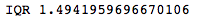
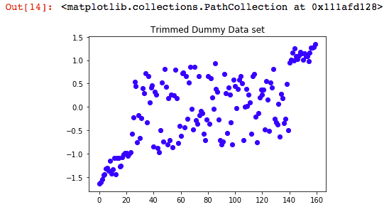
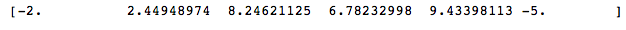
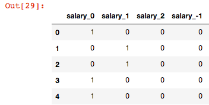

Data Preprocessing
==================

Anyone who is interested in **machine learning** (**ML**) would have
certainly heard that 80% of a data scientist or machine learning
engineer\'s time is spent on preparing the data, and the remaining 20%
is spent on building and evaluating the model. The considerable time
spent preparing the data is considered as an investment to construct a
good model. A simple model this is made using an excellent dataset
outpaces a complex model developed using a lousy dataset. In real life,
finding a reliable dataset is very difficult. We have to create and
nurture good data. You must be wondering, how do you create good data?
This is something that we will discover in this lab. We will study
everything that is needed to create an excellent and viable dataset. In
theory, good is relative to what task we have at hand and how we
perceive and consume the data. In this lab, we will walk you through
the following topics:

-   Data transformation
-   Feature selection
-   Dimensionality reduction
-   Feature generation

For each of the topics, we will discuss the variety of things that can
be done over different types of data we encounter in a dataset. We will
also consider a few automated open source feature preparation tools that
come in handy for preparing data in Python.

Let\'s begin with the first topic of data transformation.


Technical requirements
======================

All the code examples can be found in the [Lab 03] folder in
GitHub.


Data transformation
===================

Let\'s assume we are working on an ML model whose task is to predict
employee attrition. Based on our business understanding, we might
include some relevant variables that are necessary to create a good
model. On the other hand, we might choose to discard some features, such
as [EmployeeID], which carry no relevant information.


Identifying the [ID] columns is known as **identifier detection**.
[Identifier] columns don\'t add any information to a model in
pattern detection and prediction. So, [identifier] column
detection functionality can be a part of the [AutoML] package and
we use it based on the algorithm or a task dependency.


Once we have decided on the fields to use, we may explore the data to
transform certain features that aid in the learning process. The
transformation adds some experience to the data, which benefits ML
models. For example, an employee start date of 11-02-2018 doesn\'t
provide any information. However, if we transform this feature to four
attributes---date, day, month, and year, it adds value to the model
building exercise.

The feature transformations also depend much on the type of ML algorithm
used. Broadly, we can classify the supervised models into two
categories---tree-based models and non-tree-based models.


Tree-based models handle the abnormality in most features by themselves.
Non-tree-based models, such as nearest neighbors and linear regression,
improve their predictive power when we do feature transformations.


Enough of the theoretical explanations. Now, let\'s straight away jump
into some of the feature transformations that can be performed over the
various datatypes that we encounter frequently. We will start with
numerical features first.


Numerical data transformation
=============================

The following are some of the most widely-used methods to transform
numerical data:

-   Scaling
-   Missing values
-   Outliers

The techniques shown here can be embedded in functions that can be
directly applied to transform numerical data in an AutoML pipeline.


Scaling
=======

**Standardization** and **normalization** are the two terms for
**scaling** techniques used in the industry. Both these techniques
ensure that the numerical features used in the model are weighted
equally in their representation. Most of the time people use
standardization and normalization interchangeably. Though both of them
are scaling techniques, there is a thin line of difference between the
two.


Standardization assumes the data to be normally distributed. It rescales
the data to mean as zero and standard deviation as one. Normalization is
a scaling technique that assumes no prior distribution of the data. In
this technique, the numerical data is rescaled to a fixed range either:
0 to 1, -1 to +1, and so on.


The following are a few widely used techniques for standardizing or
normalizing data:

-   **Z- score standardization**: Here, the data is rescaled with a mean
    of zero and standard deviation of one if the data follows a Gaussian
    distribution. One of the prior requirements is having the numerical
    data normally distributed. Mathematically, it is denoted as
    
    , where
    
    is the mean of the values and σ is the standard deviation of the
    values.

Scikit-learn provides various methods to standardize and normalize the
data. Let\'s first load the [HR] attrition dataset using the
following code snippet:


``` {.language-markup}
%matplotlib inline
import numpy as np
import pandas as pd
hr_data = pd.read_csv('data/hr.csv', header=0)
print (hr_data.head())
```


The output of the preceding code displays the various attributes that
the dataset has along with a few data points:


Let\'s analyze the distribution of the dataset using the following code:


``` {.language-markup}
hr_data[hr_data.dtypes[(hr_data.dtypes=="float64")|(hr_data.dtypes=="int64")].index.values].hist(figsize=[11,11])
```


The output of the previous code is a few histograms of various numerical
attributes:


As an example, let\'s use [StandardScaler] from the
[sklearn.preprocessing] module to standardize the values of the
[satisfaction\_level] column. Once we import the method, we first
need to create an instance of the [StandardScaler] class. Next, we
need to fit and transform the column that we need to standardize using
the [fit\_transform] method. In the following example, we use the
[satisfaction\_level] attribute to be standardized:


``` {.language-markup}
from sklearn.preprocessing import StandardScaler
scaler = StandardScaler()
hr_data_scaler=scaler.fit_transform(hr_data[['satisfaction_level']])
hr_data_scaler_df = pd.DataFrame(hr_data_scaler)
hr_data_scaler_df.max()
hr_data_scaler_df[hr_data_scaler_df.dtypes[(hr_data_scaler_df.dtypes=="float64")|(hr_data_scaler_df.dtypes=="int64")].index.values].hist(figsize=[11,11])
```


Once we execute the preceding code, we can again view
[satisfication\_level] instances histogram and observe that the
values are standardized between **-2** to **1.5**:


-   **Min-max normalization**: In this technique the minimum value of a
    variable is subtracted from its actual value over the difference of
    its maximum and minimum values. Mathematically, it is represented by
    the following:


The [MinMaxScaler] method is available in scikit-learn\'s
[preprocessing] module. In this example, we normalize four
attributes of the [HR] attrition
dataset---[average\_monthly\_hours], [last\_evaluation],
[number\_project], and [satisfaction\_level]. We follow the
similar process that we followed for [StandardScaler]. We need
first to import [MinMaxScaler] from the
[sklearn.preprocessing] module and create an instance of the
[MinMaxScaler] class.

Next, we need to fit and transform the columns using the
[fit\_transform] method:


``` {.language-markup}
from sklearn.preprocessing import MinMaxScaler
minmax=MinMaxScaler()
hr_data_minmax=minmax.fit_transform(hr_data[[ 'average_montly_hours',
 'last_evaluation', 'number_project', 'satisfaction_level']])
hr_data_minmax_df = pd.DataFrame(hr_data_minmax)
hr_data_minmax_df.min()
hr_data_minmax_df.max()
hr_data_minmax_df[hr_data_minmax_df.dtypes[(hr_data_minmax_df.dtypes=="float64")|(hr_data_minmax_df.dtypes=="int64")].index.values].hist(figsize=[11,11])
```


The following histograms depict that the four attributes that were
transformed are having the values distributed between **0** and **1**:


Missing values
==============

We often come across datasets where not all of the values are available
for specific variables/attributes. This can happen for several reasons,
such as ignored questions in a survey, typing errors, a device
malfunctioning, and so on. Encountering these missing values is expected
in a data mining project, and dealing with these values is essential.

Missing value imputation occupies most of a data scientist\'s time.
There are various ways through which we can impute missing values. The
deciding factor is what to use when attributing these kind of
unavailable values. The process on deciding what and when to use for
imputing missing values is a talent and comes from experience in working
with data. Sometimes it is better to remove these values directly and,
for some assignments, it is better to use advanced mining techniques to
impute the values.

So, the two most significant questions arise:

-   When do you use which imputation method?
-   What is the best way to impute a value?

We think it comes from the experience of handling missing values; the
best way to start is by doing a comparative study by applying different
imputation methods on the data and then selecting the appropriate
technique to assign the null values with the least-biased estimate.

Generally, when we encounter a missing value, we try to examine why a
value is missing in the first place. Is it because of some issues while
collecting the data, or is the culprit the data source itself? It is
better to fix the problem from the root, rather than straight away
imputing the value. This is an ideal case, and, most of the time, it is
not possible. For example, if we are working on a survey dataset and a
few respondents have chosen not to reveal specific information, in such
cases imputing the values might be inevitable.

So, before we start imputing the values, we can use the following
guidelines:

-   Investigate the missing data
-   Analyze the missing data
-   Decide the best strategy that yields least-biased estimates

We can remember this as an **IAD** rule (that is investigate, analyze,
and decide) for missing value imputation. The following are some of the
available ways that we can deal with the missing values:

1.  **Remove or delete the data**: When very few data points are
    missing, we can ignore the data and analyze those cases separately.
    This method is known as **list wise deletion**. However, this is not
    advisable when there are too many missing values as we might lose
    some of the valuable information in the data. Pairwise deletion is
    another technique, where we can delete only the missing values. This
    indicates that we analyze all cases where only data of interest is
    present. That is a safe strategy, but, using this method, we might
    get different results from each sample every time even if there is a
    small change in the data.

We will again use the [HR] attrition dataset to demonstrate the
missing value treatment. Let\'s first load the dataset and view the
number of nulls in the dataset:


``` {.language-markup}
import numpy as np
import pandas as pd
hr_data = pd.read_csv('data/hr.csv', header=0)
print (hr_data.head())
print('Nulls in the data set' ,hr_data.isnull().sum())
```


As we can see from the following output, the dataset is relatively clean
with just [promotion\_last\_5years] having some missing values.
So, we will synthetically ingest a few missing values into some columns:


We use the following code snippet to replace a few values in columns
[promotion\_last\_5years], [average\_montly\_hours], and
[number\_project] with null values:


``` {.language-markup}
#As there are no null introduce some nulls by replacing 0 in promotion_last_5years with NaN
hr_data[['promotion_last_5years']] = hr_data[[ 'promotion_last_5years']].replace(0, np.NaN)
#As there are no null introduce some nulls by replacing 262 in promotion_last_5years with NaN
hr_data[['average_montly_hours']] = hr_data[[ 'average_montly_hours']].replace(262, np.NaN)
#Replace 2 in number_project with NaN
hr_data[['number_project']] = hr_data[[ 'number_project']].replace(2, np.NaN)
print('Nulls in the data set', hr_data.isnull().sum())
```


After this exercise, there are some null values inserted for those three
columns, as we can view from the following results:


Before we remove the rows, let\'s first create a copy of the
[hr\_data], so that we don\'t replace the original dataset, which
is going to be used to demonstrate the other missing value imputation
methods. Next, we drop the rows with missing values using the
[dropna] method:


``` {.language-markup}
#Remove rows
hr_data_1 = hr_data.copy()
print('Shape of the data set before removing nulls ', hr_data_1.shape)
# drop rows with missing values
hr_data_1.dropna(inplace=True)
# summarize the number of rows and columns in the dataset
print('Shape of the data set after removing nulls ',hr_data_1.shape)
```


We can observe that the number of rows after this exercise is reduced to
[278] from [14999]. Deleting rows has to be used carefully.
As [promotion\_last\_5years] had around 14,680 missing values,
14,680 records were removed completely:


2.  **Use a global constant to fill in the missing value**: We can use a
    global constant, such as NA or -999, to separate the missing value
    from the rest of the dataset. Also, there are empty values which
    don\'t have any values, but they form an inherent part of the
    dataset. Those values are deliberately kept as blanks. When the
    empty values cannot be separated from the missing values, using a
    global constant is a safe strategy.

We can use the [fillna] method to replace missing values with a
constant value such as [-999]. The following snippet demonstrates
the use of this method:


``` {.language-markup}
#Mark global constant for missing values
hr_data_3 = hr_data.copy()
# fill missing values with -999
hr_data_3.fillna(-999, inplace=True)
# count the number of NaN values in each column
print(hr_data_3.isnull().sum())
print(hr_data_3.head())
```


We can view from the following results that all missing values are
replaced with [-999] values:


3.  **Replace missing values with the attribute mean/median**: This is
    the most liked method by data scientists and machine learning
    engineers. We can replace missing values with either the mean or
    median for numerical values and mode for categorical values. The
    disadvantage of this method is that it might decrease the
    variability in the attribute, which would, in turn, weaken the
    correlation estimates. If we are dealing with a supervised
    classification model, we can also replace the missing values with
    group mean or median for numerical values and grouped mode for
    categorical values. In these grouped mean/median methods, the
    attribute values are grouped by target values, and the missing
    values in that group are replaced with the group\'s mean/ median.

We can use the same [fillna] method with the mean function as a
parameter to replace missing values with mean values. The following code
demonstrates its usage:


``` {.language-markup}
#Replace mean for missing values
hr_data_2 = hr_data.copy()
# fill missing values with mean column values
hr_data_2.fillna(hr_data_2.mean(), inplace=True)
# count the number of NaN values in each column
print(hr_data_2.isnull().sum())
print(hr_data_2.head())
```


We can see from the following output that the missing values are
replaced with the mean of each attribute:


4.  **Using an indicator variable**: We can also generate a binary
    variable indicating whether there are missing values or not in a
    record. We can stretch this to multiple attributes where we can
    create binary indicator variables for each attribute. We can also
    impute missing values and build the binary indicator variables that
    will denote whether it is a real or imputed variable. Results are
    not biased if a value is missing because of a genuine skip.

As we did to demonstrate other imputation methods, let\'s first copy the
original data and make new columns that indicate the attributes and
values that are imputed. The following code first creates new columns,
appending [\_was\_missing], to the original column names for those
attributes that had missing values.

Next, the missing values are replaced with a global constant
[-999]. Though we used the global constant imputation method, you
can use any of the imputation methods to impute the missing values:


``` {.language-markup}
# make copy to avoid changing original data (when Imputing)
hr_data_4 = hr_data.copy()
# make new columns indicating what is imputed
cols_with_missing = (col for col in hr_data_4.columns 
 if hr_data_4[col].isnull().any())
for col in cols_with_missing:
 hr_data_4[col + '_was_missing'] = hr_data_4[col].isnull()
hr_data_4.fillna(-999, inplace=True)
hr_data_4.head()
```


We can see from the following result that new columns are created,
indicating the presence and absence of missing values in the attributes:


5.  **Use a data mining algorithm to predict the most probable value**:
    We can apply ML algorithms, such as KNN, linear regression, random
    forest or decision trees techniques, to predict the most likely
    value of the missing attribute. One of the disadvantages of this
    method is that it might overfit the data if there is a plan to use
    the same algorithm for the same dataset for another task such as
    prediction or classification.

In Python, [fancyimpute] is a library that provides the advanced
data mining options to impute missing values. This is something that we
use most often and so we thought to demonstrate this package. There
might be some other libraries in Python that can also do a similar task.
First, we need to install the [fancyimpute] library using the
following command. This has to be executed from the Command Prompt:


``` {.language-markup}
pip install fancyimpute
```


Once installed, we can return to the Jupyter notebook and import the
[KNN] method from the [fancyimpute] library. The KNN
imputation method is only going to work for numeric values. So, we first
select only numeric columns from the [hr\_data] set. Next, a KNN
model with *k* equals to [3] is created and the missing values are
replaced for numeric attributes:


``` {.language-markup}
from fancyimpute import KNN

hr_data_5 = hr_data.copy()
hr_numeric = hr_data_5.select_dtypes(include=[np.float])
hr_numeric = pd.DataFrame(KNN(3).complete(hr_numeric))
hr_numeric.columns = hr_numeric.columns
hr_numeric.index = hr_numeric.index
hr_numeric.head()
```


The [fancyimpute] library uses TensorFlow backend and it takes
some time to execute. Once the execution is complete, we can scroll down
to see the imputation results, as shown in the following result
screenshot:


Outliers
========

Outliers are extreme values that don\'t conform to the overall data
pattern. They usually lie far away from the other observations and
distort the overall distribution of the data. Including them in the
model building process might lead to wrong results. It is very much
essential to treat them appropriately. Outliers can be of two
types---univariate and multivariate.


Detecting and treating univariate outliers
==========================================

As the names imply, univariate outliers are based on a single attribute
in a dataset. Univariate outliers are discovered using box plots and by
seeing the distribution of the values of an attribute. However, when we
build AutoML pipelines, we don\'t have the privilege to visualize the
data distribution. Instead, the AutoML system should be able to detect
the outliers and treat them by itself.

So, we can deploy any of the following three methods for automated
univariate outlier detection and treatment:

-   Interquartile range and filtering
-   Winsorizing
-   Trimming

Let\'s create a dummy outlier dataset to demonstrate the outlier
detection and treatment method:


``` {.language-markup}
%matplotlib inline
import numpy as np
import matplotlib.pyplot as plt
number_of_samples = 200
outlier_perc = 0.1
number_of_outliers = number_of_samples - int ( (1-outlier_perc) * number_of_samples )
# Normal Data
normal_data = np.random.randn(int ( (1-outlier_perc) * number_of_samples ),1)
# Inject Outlier data
outliers = np.random.uniform(low=-9,high=9,size=(number_of_outliers,1))
# Final data set
final_data = np.r_[normal_data,outliers]
```


Let\'s plot the newly created dataset using the following code:


``` {.language-markup}
#Check data
plt.cla()
plt.figure(1)
plt.title("Dummy Data set")
plt.scatter(range(len(final_data)),final_data,c='b')
```


We can see from the following plot that there are a few outliers at the
end of the dataset:


We can also generate a box plot to observe the outliers using the
following code. The box plot, also known as **box and whisker**, is a
way of representing the distribution of data based on the five-number
summary: minimum value, first quartile, median, third quartile, and
maximum value. Anything that lies below the minimum and above the
maximum mark is acknowledged as an outlier:


``` {.language-markup}
## Detect Outlier###
plt.boxplot(final_data)
```


From the resulting box plot, we can observe that there are some values
present beyond the maximum and minimum mark. So, we can assume that we
were successfully able to create some outliers:


One way to remove outliers is to filter the values that lie above the
maximum and below the minimum marks. To accomplish this task, first we
need to calculate the **inter-quartile range** (**IQR**).


Inter-quartile range
====================

The inter-quartile range is a measure of variability or spread in the
dataset. It is calculated by dividing a dataset into quartiles.
Quartiles divide the dataset into four halves based on the five number
summary that we studied earlier---minimum, first quartile, second
quartile, third quartile, and maximum. The second quartile is the median
value of the rank-ordered dataset; the first quartile is the middle
value of the first half of the rank-ordered dataset, and the third
quartile is the middle value of the second half of the rank-ordered
dataset.

The inter-quartile range is the difference between the third quartile
([quartile75] or [Q3]) and the first quartile
([quartile25] or [Q1]).

We calculate the [IQR] in Python using the following code:


``` {.language-markup}
## IQR Method Outlier Detection and Removal(filter) ##
quartile75, quartile25 = np.percentile(final_data, [75 ,25])
## Inter Quartile Range ##
IQR = quartile75 - quartile25
print("IQR",IQR)
```


We can view from the following code that the [IQR] for the dataset
is [1.49]:





Filtering values
================

We can filter the values that lie above the maximum value and below the
minimum value. The minimum value can be calculated by using the formula:
[quartile25 - (IQR \* 1.5)] and maximum value as [quartile75 +
(IQR\*1.5)].


The method to calculate maximum and minimum values is based on Turkey
Fences, which was developed by John Turkey. The value [1.5]
indicates about 1% of measurements as outliers and is synonymous with
the 3σ principle, which is practiced as a bound in many statistical
tests. We can use any value other than [1.5], which is at our
discretion. However, the bound may increase or decrease the number of
outliers in the dataset.


We utilize the following Python code to calculate the [Max] and
[Min] values of a dataset:


``` {.language-markup}
## Calculate Min and Max values ##
min_value = quartile25 - (IQR*1.5)
max_value = quartile75 + (IQR*1.5)
print("Max", max_value)
print("Min", min_value)
```


We notice the following output after executing the preceding code. The
maximum and minimum values are [2.94] and [-3.03],
respectively:


Next, we filter the values that are below the [min\_value] and
above the [max\_value] using the following code:


``` {.language-markup}
filtered_values = final_data.copy()
filtered_values[ filtered_values< min_value] = np.nan
filtered_values[ filtered_values > max_value] = np.nan
#Check filtered data
plt.cla()
plt.figure(1)
plt.title("IQR Filtered Dummy Data set")
plt.scatter(range(len(filtered_values)),filtered_values,c='b')
```


After the code execution is finished successfully, we can see that the
outliers are eliminated, and the dataset appears far better than the
previous dataset:


Winsorizing
===========

Winsorizing is the method to replace extreme values with smaller
absolute values. It orders the non-null values in numeric columns,
computes the tail values, and then substitutes the tail values by the
defined parameter.

We can use the [winsorize] method from the SciPy package to deal
with outliers. SciPy is a Python library that is a collection of open
source Python contributions on the scientific and technical computing
space. It has an extensive collection of statistical computation
modules, linear algebra, optimization, signal and image processing
modules, and many more modules.

Once we import the [winsorize] method, we are required to pass the
[data] and the [limit] parameters to the function. The
computations and substitution of tail values are made by this method,
and resulting outlier free data is generated:


``` {.language-markup}
##### Winsorization ####
from scipy.stats.mstats import winsorize
import statsmodels.api as sm
limit = 0.15
winsorized_data = winsorize(final_data,limits=limit)
#Check winsorized data
plt.cla()
plt.figure(1)
plt.title("Winsorized Dummy Data set")
plt.scatter(range(len(winsorized_data)),winsorized_data,c='b')
```


We can observe from the following plot that the extreme values are
winsorized and the data appears outlier free:


Trimming
========

Trimming is the same as winsorizing, except the tail values are just
cropped out.

The [trimboth] method in the [stats] library slices off the
dataset from both ends of the data. The [final\_data] and the
limit of [0.1] are passed as parameters to the function to trim
10% of data from both ends:


``` {.language-markup}
### Trimming Outliers ###
from scipy import stats
trimmed_data = stats.trimboth(final_data, 0.1)
#Check trimmed data
plt.cla()
plt.figure(1)
plt.title("Trimmed Dummy Data set")
plt.scatter(range(len(trimmed_data)),trimmed_data,c='b')
```


We can observe from the following resultant plot that the extreme values
are clipped and do not exist in the dataset anymore:





Detecting and treating multivariate outliers
============================================

A multivariate outlier is a blend of extreme scores on at least two
variables. Univariate outlier detection methods are suited well to
dealing with single-dimension data, but when we get past single
dimension, it becomes challenging to detect outliers using those
methods. Multivariate outlier detection methods are also a form of
anomaly detection methods. Techniques such as one class SVM, **Local
Outlier Factor** (**LOF**), and [IsolationForest] are useful ways
to detect multivariate outliers.

We describe multivariate outlier detection on the [HR] attrition
dataset using the following [IsolationForest] code. We need to
import the [IsolationForest] from the [sklearn.ensemble]
package. Next, we load the data, transform the categorical variables to
one-hot encoded variables, and invoke the [IsolationForest] method
with the number of estimators:


``` {.language-markup}
##Isolation forest
import numpy as np
import pandas as pd
from sklearn.ensemble import IsolationForest
hr_data = pd.read_csv('data/hr.csv', header=0)
print('Total number of records ',hr_data.shape)
hr_data = hr_data.dropna()
data_trnsf = pd.get_dummies(hr_data, columns =['salary', 'sales'])
data_trnsf.columns
clf = IsolationForest(n_estimators=100)
```


Then, we fit the [IsolationForest] instance ([clf]) to the
data and predict the outliers using the [predict] method. The
outliers are denoted by [-1] and non-outliers (also known as
**novel data**) by [1]:


``` {.language-markup}
clf.fit(data_trnsf)
y_pred_train = clf.predict(data_trnsf)
data_trnsf['outlier'] = y_pred_train
print('Number of outliers ',data_trnsf.loc[data_trnsf['outlier'] == -1].shape)
print('Number of non outliers ',data_trnsf.loc[data_trnsf['outlier'] == 1].shape)
```


We can see from the following output that the model was able to identify
around [1500] outliers from the dataset of [14999] records:


Binning
=======

Binning is a process of grouping the continuous numerical values into
smaller numbers of buckets or bins. It is an important technique that
discretizes continuous data values. Many algorithms such as Naive Bayes
and Apriori work well with discrete datasets, and so it is necessary to
convert continuous data to discrete values.

There are various types of binning methodologies:

-   **Equiwidth binning**: The equiwidth bins are determined by
    partitioning the data into *k* intervals of equal size:


Where *w* is width of the bins, *maxval* is the maximum value in the
data, *minval* is the minimum value in the data, and *k* is the desired
number of bins

The interval boundaries are formed as follows:


-   **Equifrequency binning**: The equifrequency bins are determined by
    dividing the data into *k* groups, where each group includes the
    same number of values.

In both of the methods, the value of *k* is determined based on our
requirements and also by trial and error processes.

Apart from these two methods, we can also explicitly mention the cut
points to create bins. This is extremely helpful when we know the data
and want it binned in a certain format. The following code is a function
that performs binning based on the predefined cut points:


``` {.language-markup}
#Bin Values:
def bins(column, cutpoints, labels=None):
 #Define min and max values:
 min_val = column.min()
 max_val = column.max()
 print('Minimum value ',min_val)
 print(' Maximum Value ',max_val)
 break_points = [min_val] + cut_points + [max_val]
 if not labels:
   labels = range(len(cut_points)+1)
 #Create bins using the cut function in pandas
 column_bin = pd.cut(column,bins=break_points,labels=labels,include_lowest=True)
 return column_bin
```


The following code bins the satisfaction level of employees into three
categories---[low], [medium], and [high]. Anything
beneath [0.3] is considered as [low] satisfaction, a higher
than [0.6] score is considered a highly-satisfied employee score,
and between these two values is considered as [medium]:


``` {.language-markup}
import pandas as pd
hr_data = pd.read_csv('data/hr.csv', header=0)
hr_data.head()
hr_data = hr_data.dropna()
print(hr_data.shape)
print(list(hr_data.columns))
#Binning satisfaction level:
cut_points = [0.3,0.6]
labels = ["low","medium","high"]
hr_data["satisfaction_level"] = bins(hr_data["satisfaction_level"], cut_points, labels)
print('\n####The number of values in each bin are:###\n\n',pd.value_counts(hr_data["satisfaction_level"], sort=False))
```


Once we execute the preceding code, we can observe from the following
results that the three bins were created for the
[satisfaction\_level] attribute, with [1941] values in the
[low] bin, [4788] in the [medium] bin, and
[8270] in the [high] bin:


Log and power transformations
=============================

The log and power transformation often helps the non-tree-based models
by making highly-skewed distributions less skewed. This preprocessing
technique helps meet the assumptions of linear regression models and
assumptions of inferential statistics. Some examples of this type of
transformation includes---log transformation, square root
transformation, and log-log transformation.

The following is a demonstration of square root transformation using a
dummy dataset:


``` {.language-markup}
import numpy as np
values = np.array([-4, 6, 68, 46, 89, -25])
# Square root transformation #
sqrt_trnsf_values = np.sqrt(np.abs(values)) * np.sign(values)
print(sqrt_trnsf_values)
```


The following is the output of the preceding square root transformation:





Next, let us try out a log transformation using another dummy dataset:


``` {.language-markup}
values = np.array([10, 60, 80, 200])
#log transformation #
log_trnsf_values = np.log(1+values)
print(log_trnsf_values)
```


The log transformation on the dummy dataset yields the following result:


Now that we have a fair idea about different preprocessing methods for
numerical data, let\'s see what there is in store for the categorical
data.


Categorical data transformation
===============================

Categorical data in nature is non-parametric. This means that it
doesn\'t follow any data distributions. However, for using those
variables in a parametric model they need to be transformed using
various encoding methods, missing values are to be replaced, and we can
reduce the number of categories using binning techniques.


Encoding
========

In many practical ML activities, a dataset will contain categorical
variables. It is far more appropriate in an enterprise context, where
most of the attributes are categorical. These variables have distinct
discrete values. For example, the size of an organization can be
[Small], [Medium], or [Large], or geographic regions
can be such as [Americas], [Asia Pacific], and
[Europe]. Many ML algorithms, especially tree-based models, can
handle this type of data directly.

However, many algorithms do not accept the data directly. Therefore, it
is needed to encode these attributes into numerical values for further
processing. There are various methods to encode the categorical data.
Some extensively used methods are described in the following section:

-   **Label encoding**: As the name implies, label encoding converts
    categorical labels into numerical labels. Label encoding is better
    suited for the ordinal categorical data. The labels are always in
    between 0 and n-1, where n is the number of classes.
-   **One-hot encoding**: This is also known as dummy coding. In this
    method, dummy columns are generated for each class of a categorical
    attribute/predictor. For each dummy predictor, the presence of a
    value is represented by 1, and its absence is represented by 0.
-   **Frequency-based encoding**: In this method, first the frequency is
    calculated for each class. Then the relative frequency for each
    class out of the total classes is calculated. This relative
    frequency is assigned as the encoded values for the attribute\'s
    levels.
-   **Target mean encoding**: In this method, each class of the
    categorical predictors is encoded as a function of the mean of the
    target. This method can only be used in a supervised learning
    problem where there is a target feature.
-   **Binary encoding**: The classes are first transformed to the
    numerical values. Then these numerical values are changed to their
    similar binary strings. This is later split into separate columns.
    Each binary digit becomes an independent column.
-   **Hash encoding**: This method is also commonly known as feature
    hashing. Most of us would be aware of a hash function that is used
    to map data to a number. This method may assign different classes to
    the same bucket, but is useful when there are hundreds of categories
    or classes present for an input feature.

Most of these techniques, along with many others, are also implemented
in Python and are available in the package [category\_encoders].
You can install the [category\_encoders] library using the
following command:


``` {.language-markup}
pip install category_encoders
```


Next, we import the [category\_encoders] library as [ce] (a
short code that supports using it easily in code). We load the
[HR] attrition dataset and one-hot encode the [salary]
attribute:


``` {.language-markup}
import pandas as pd
import category_encoders as ce
hr_data = pd.read_csv('data/hr.csv', header=0)
hr_data.head()
hr_data = hr_data.dropna()
print(hr_data.shape)
print(list(hr_data.columns))
onehot_encoder = ce.OneHotEncoder(cols=['salary'])
onehot_df = onehot_encoder.fit_transform(hr_data)
onehot_df.head()
```


We can observe how easy it was to transform the categorical attribute to
its corresponding one-hot encoded attributes using the
[category\_encoders] library:





Similarly, we use [OrdinalEncoder] to label encode the
[salary] data:


``` {.language-markup}
ordinal_encoder = ce.OrdinalEncoder(cols=['salary'])
ordinal_df = ordinal_encoder.fit_transform(hr_data)
ordinal_df.head(10)
ordinal_df['salary'].value_counts()
```


The preceding code maps the low, medium, and high salary brackets to
three numerical values, [0], [1], and [2]:


Similarly, you can try out the other categorical encoding methods from
[CategoryEncoders], using the following code snippets, and observe
the results:


``` {.language-markup}
binary_encoder = ce.BinaryEncoder(cols=['salary'])
df_binary = binary_encoder.fit_transform(hr_data)
df_binary.head()

poly_encoder = ce.PolynomialEncoder(cols=['salary'])
df_poly = poly_encoder.fit_transform(hr_data)
df_poly.head()

helmert_encoder = ce.HelmertEncoder(cols=['salary'])
helmert_df = helmert_encoder.fit_transform(hr_data)
helmert_df.head()
```


The next topic for discussion is the method to deal with missing values
for categorical attributes.


Missing values for categorical data transformation
==================================================

The techniques to assess the missing values remain the same for
categorical variables as well. However, some of the imputation
techniques are different, and some methods are similar to the numerical
missing value treatment methods that were discussed. We will demonstrate
the Python code for the techniques that are specific to only categorical
missing value treatment:

-   **Remove or delete the data**: The process to decide whether to
    remove the data points that are missing for categorical variables
    remains the same as we discussed for numerical missing value
    treatment.
-   **Replace missing values with the mode**: As categorical data is
    non-parametric, unlike numerical data they don\'t have a mean or
    median. So, the easiest way to replace missing categorical values is
    using the mode. The mode is the highest occurring class of a
    categorical variable. For example, let\'s assume we have a predictor
    of three classes: red, green, and blue. Red occurs highest in the
    dataset with a frequency of 30, followed by green with 20, and blue
    with 10. Then, missing values can be replaced using red as this has
    the highest occurrence of the predictor.

We will again utilize the [HR] attrition dataset to explain the
missing value treatment for the categorical attributes. Let\'s first
load the dataset and observe the number of nulls in the dataset:


``` {.language-markup}
import numpy as np
import pandas as pd
hr_data = pd.read_csv('data/hr.csv', header=0)
print('Nulls in the data set' ,hr_data.isnull().sum())
```


We learn from the following output that the dataset has no missing data
from the categorical attributes [sales] and [salary]. So, we
will synthetically ingest a few missing values to those features:


We use the following code snippet to replace null for the [sales]
value in the [sales] attribute and low with nulls for the
[salary] attribute:


``` {.language-markup}
#As there are no null introduce some nulls by replacing sales in sales column with NaN
hr_data[['sales']] = hr_data[[ 'sales']].replace('sales', np.NaN)
#As there are no null introduce some nulls by replacing low in salary column with NaN
hr_data[['salary']] = hr_data[[ 'salary']].replace('low', np.NaN)
print('New nulls in the data set' ,hr_data.isnull().sum())
```


Once we have executed the code, we can find some nulls in the
[salary] and [sales] attribute, as shown in the following
output:


Now, we can replace these nulls with the mode of each column. As we did
for numerical missing value imputation, even here we first create a copy
of the [hr\_data] so that we don\'t replace the original dataset.
Next, we fill the rows with the mode values using the [fillna]
method, as described in the following code snippet:


``` {.language-markup}
#Replace mode for missing values
hr_data_1 = hr_data.copy()
# fill missing values with mode column values
for column in hr_data_1.columns:
 hr_data_1[column].fillna(hr_data_1[column].mode()[0], inplace=True)
# count the number of NaN values in each column
print(hr_data_1.isnull().sum())
print(hr_data_1.head())
```


We can see from the following output that the missing values in the
[sales] column are replaced with [technical] and
[medium] in the [salary] column:


-   **Use a global constant to fill in the missing value**: Similar to
    that of numerical missing value treatment, we can use a global
    constant such as [AAAA] or [NA] to differentiate the
    missing values from the rest of the dataset:


``` {.language-markup}
#Mark global constant for missing values
hr_data_2 = hr_data.copy()
# fill missing values with global constant values
hr_data_2.fillna('AAA', inplace=True)
# count the number of NaN values in each column
print(hr_data_2.isnull().sum())
print(hr_data_2.head())
```


The output of the preceding code yields the following results with
missing values replaced with [AAA]:


-   **Using an indicator variable**: Similar to that which we discussed
    for numerical variables, we can have an indicator variable for
    identifying the values that were imputed for missing categorical
    data as well.
-   **Use a data mining algorithm to predict the most probable value**:
    As we did for numerical attributes, we can also use data mining
    algorithms, such as decision trees, random forest, or KNN methods,
    to predict the most likely value of a missing value. The same
    [fancyimpute] library can be used for this task as well.

We have discussed the ways to deal with data preprocessing for
structured data. In this digital age, we are capturing a lot of
unstructured data, from various sources. In the following section,
let\'s understand the methods to preprocess text data to make it ready
for models to consume.


Text preprocessing
==================

It is necessary to reduce the size of the feature space of text data by
removing unnecessary text that adds noise to the text during analysis.
There are a series of steps that are usually performed to preprocess the
text data. However, not all steps are required for each task and they
are used whenever necessary. For example, if every word in a text data
item is already in lower case, there is no need to modify the case of
the text to make it uniform.

There are three main elements of a text preprocessing task:

-   Tokenization
-   Normalization
-   Substitution

We will be using the [nltk] library for demonstrating the
different text preprocessing methods. Install the [nltk] library
by issuing the following command in the Command Prompt:


``` {.language-markup}
pip install nltk
```


Once installation is complete, run the following code snippet in the
Python environment:


``` {.language-markup}
##Run this cell only once##
import nltk
nltk.download()
```


You will get a NLTK Downloader popup. Select [all]{.packt_screen} from
the [Identifier]{.packt_screen} section and wait for installation to be
completed.

In this section, we will study some of the preprocessing steps that are
employed to preprocess text to produce a normalized form:

1.  Tokenization---this is a method to split the text into smaller
    chunks, such as sentences or words. Also, some text mining tasks
    such as preparation of Word2Vec model prefer the text to be in a
    paragraph or sentence style. So, we can use NLTK\'s
    [sent\_tokenizer] to convert text to sentences. First, we read
    the text file from the [data] folder using the following code
    snippet:


``` {.language-markup}
import pandas as pd
import category_encoders as ce
text_file = open('data/example_text.txt', 'rt')
text = text_file.read()
text_file.close()
```


2.  Next, to tokenize the text to sentences, we import the
    [sent\_tokenize] method from the [nltk] library and pass
    the text as a parameter:


``` {.language-markup}
## Sentence tokenization ##
from nltk import sent_tokenize
sentence = sent_tokenize(text)
print(sentence[0])
```


The preceding code yields the following output:


3.  Similarly, some modeling methods, such as a bag-of-words model, need
    the text to be in an individual word format. For this case, we can
    use NLTK\'s [word\_tokenizer] method to transform text into
    words, as shown in the following code snippet:


``` {.language-markup}
## Word tokenization ##
from nltk import word_tokenize
words = word_tokenize(text)
print(words[:50])
```


4.  The following output displays [50] tokenized words from the
    text. We can see some non-alphabetical characters such as
    punctuation marks being tokenized. This adds no value to an
    analytical exercise, so, we need to remove these variables:


5.  Non-alphabetical characters such as punctuation don\'t add any value
    while preparing a bag-of-words model, so various punctuation and
    symbols such as [.],[\"],[+], and [\~] can
    be removed.

There are various methods using which we can remove the non-alphabetical
characters. Now we will illustrate one of the methods in Python:


``` {.language-markup}
# Remove punctuations and keep only alphabets
words_cleaned = [word for word in words if word.isalpha()]
print(words_cleaned[:50])
```


6.  We can see from the following tokens that the undesired symbols such
    as [(] are removed from the list of tokens. However, there are
    some common words such as [at] and [of] that add no
    value to the analysis and can be removed using the [stop word
    removal] method:


7.  Stop words are short function words that are used commonly while
    writing a text document. They might be fillers or prepositions. NLTK
    provides a standard English stop word collection that can be used to
    filter the stop words in our text. Also, sometimes, stop words
    specific to certain domains can be used to eliminate informal words.
    We can always create a list of words from our text that we feel are
    not relevant to our analysis.

For removing the stop words, first we import the [stopwords]
method from the [ntlk.corpus] library. Then we invoke the
[english] stop word dictionary from the [stopwords.words]
method and remove any common words that are found in the list of tokens:


``` {.language-markup}
# remove the stop words
from nltk.corpus import stopwords
stop_words = set(stopwords.words('english'))
words_1 = [word for word in words_cleaned if not word in stop_words]
print(words_1[:50])
```


8.  We can see from the following output that the previously appearing
    words such as [at] and [the] are removed from the list
    of tokens. However, a few similar words such as [Data] and
    [data] are appearing as separate words in the list of tokens.
    We need to convert these words into a similar case now:


9.  Case folding is a method to convert all words into a similar case to
    make the words case insensitive. It usually involves converting all
    uppercase letters to lowercase letters.

We can use the [lower] function to convert all uppercase letters
to lower case, as shown in the following code snippet:


``` {.language-markup}
# Case folding
words_lower = [words_1.lower() for words_1 in words_1]
print(words_lower[:50])
```


We can see from the following output that words such as [Data] no
longer appear in the list and are converted to all lowercase letters:


Stemming is the process of reducing the words to their base or root
form. For example, *worked* and *working* is stemmed to *work*. This
transform is useful as it brings all the similar words to a base form
that aids in better sentiment analysis, document classification, and
much more.

We import [PorterStemmer] from the [nltk.stem.porter]
library and instance the [PorterStemmer] class. Next, the
[words\_lower] token list is passed onto the [porter.stem]
class to reduce each word to its root form:


``` {.language-markup}
#Stemming
from nltk.stem.porter import PorterStemmer
porter = PorterStemmer()
stemmed_words = [porter.stem(word) for word in words_lower]
print(stemmed_words[:50])
```


The preceding code produces the following stemmed list of tokens:


Not all features or attributes are important for an ML model. In the
following sections, we will learn some of the methods to reduce the
number of features while working on an ML pipeline.


Feature selection
=================

An ML model uses some critical features to learn patterns in data. All
other features add noise to the model, which may lead to a drop in the
model\'s accuracy and overfit the model to the data as well. So,
selecting the right features is essential. Also, working a reduced set
of important features reduces the model training time.

The following are some of the ways to select the right features prior
creating a model:

-   We can identify the correlated variables and remove any one of the
    highly-correlated values
-   Remove the features with low variance
-   Measure information gain for the available set of features and
    choose the top *N* features accordingly

Also, after creating a baseline model, we can use some of the below
methods to select the right features:

-   Use linear regression and select variables based on *p* values
-   Use stepwise selection for linear regression and select the
    important variables
-   Use random forest and select the top *N* important variables

In the following sections, we will see some of the ways available in
scikit-learn to reduce the number of features available in a dataset.


Excluding features with low variance
====================================

Features without much variance or variability in the data do not provide
any information to an ML model for learning the patterns. For example, a
feature with only 5 as a value for every record in a dataset is a
constant and is an unimportant feature to be used. Removing this feature
is essential.

We can use the [VarianceThreshold] method from scikit-learn\'s
[featureselection] package to remove all features whose variance
doesn\'t meet certain criteria or threshold. The
`sklearn.feature_selection`{.literal} module implements feature
selection algorithms. It currently includes univariate filter selection
methods and the recursive feature elimination algorithm. The following
is an example to illustrate this method:


``` {.language-markup}
%matplotlib inline
import pandas as pd
import numpy as np
from sklearn.feature_selection import SelectKBest
from sklearn.feature_selection import chi2
hr_data = pd.read_csv('data/hr.csv', header=0)
hr_data.head()
hr_data = hr_data.dropna()
data_trnsf = pd.get_dummies(hr_data, columns =['salary', 'sales'])
data_trnsf.columns
```


The output of the preceding code is as follows:


Next, we assign [left] as a target variable and other attributes
as the independent attributes, as shown in the following code:


``` {.language-markup}
X = data_trnsf.drop('left', axis=1)
X.columns
Y = data_trnsf.left# feature extraction
```


Now that we are ready with the data, we select features based on the
[VarianceThreshold] method. First, we import the
[VarianceThreshold] method from scikit-learn\'s
[feature\_selection] module. Then we set the threshold as
[0.2] in the [VarianceThreshold] method. This means that if
there is less than 20% variance in data for an attribute, it can be
discarded and will not be selected as a feature. We execute the
following code snippet to observe the reduced set of features:


``` {.language-markup}
#Variance Threshold
from sklearn.feature_selection import VarianceThreshold
# Set threshold to 0.2
select_features = VarianceThreshold(threshold = 0.2)
select_features.fit_transform(X)
# Subset features
X_subset = select_features.transform(X)
print('Number of features:', X.shape[1])
print('Reduced number of features:',X_subset.shape[1])
```


From the following output, we can determine that five out of [20]
attributes passed the variance threshold test and showed variability,
which was more than 20% variance:


In the next section, we will study the univariate feature selection
method, which is based on certain statistical tests to determine the
important features.


Univariate feature selection
============================

In this method, a statistical test is applied to each feature
individually. We retain only the best features according to the test
outcome scores.

The following example illustrates the chi-squared statistical test to
select the best features from the [HR] attrition dataset:


``` {.language-markup}
#Chi2 Selector

from sklearn.feature_selection import SelectKBest
from sklearn.feature_selection import chi2

chi2_model = SelectKBest(score_func=chi2, k=4)
X_best_feat = chi2_model.fit_transform(X, Y)
# selected features
print('Number of features:', X.shape[1])
print('Reduced number of features:',X_best_feat.shape[1])
```


We can see from the following output that [4] best features were
selected. We can change the number of best features to be considered by
changing the [k] value:


The following section demonstrates the recursive feature elimination
method.


Recursive feature elimination
=============================

Recursive feature elimination is based on the idea of recursively
constructing a model by removing the features, building the model with
the remaining features, and computing the model\'s accuracy. This
process is repeated until all features in the dataset are exhausted. It
is a greedy optimization method to find the best performing subset of
features and then rank them according to when they were eliminated.

In the following example code, the [HR] attrition dataset is used
to illustrate the use of **recursive feature elimination** (**RFE**).
The stability of the [RFE] method is heavily dependent on the type
of algorithm used. For our demonstration, we have used the
[LogisticRegression] method:


``` {.language-markup}
#Recursive Feature Elimination
from sklearn.feature_selection import RFE
from sklearn.linear_model import LogisticRegression

# create a base classifier used to evaluate a subset of attributes
logistic_model = LogisticRegression()

# create the RFE model and select 4 attributes
rfe = RFE(logistic_model, 4)
rfe = rfe.fit(X, Y)

# Ranking of the attributes
print(sorted(zip(map(lambda x: round(x, 4), rfe.ranking_),X)))
```


The following output displays the features sorted by their ranks:


Random forests are often used in ML pipeline for feature selection. So,
it is crucial that we get to know this technique.


Feature selection using random forest
=====================================

The tree-based feature selection strategies used by random forests
naturally rank by how well they improve the purity of the node. First,
we need to construct a random forest model. We have already discussed
the process to create a random forest model in Lab 2,
*Introduction to Machine Learning using Python*:


``` {.language-markup}
# Feature Importance
from sklearn.ensemble import RandomForestClassifier
# fit a RandomForest model to the data
model = RandomForestClassifier()
model.fit(X, Y)
# display the relative importance of each attribute
print(model.feature_importances_)
print(sorted(zip(map(lambda x: round(x, 4), model.feature_importances_),X)))
```


Once the model is constructed successfully, the model\'s
[feature\_importance\_ attribute] is used to visualize the
imported features sorted by their rank, as shown in the following
results:


We discussed in this section the different methods to select a subset of
features using different feature selection methods. Next, we are going
to see the feature selection methods by using dimensionality reduction
methods.


Feature selection using dimensionality reduction
================================================

Dimensionality reduction methods reduce dimensionality by making new
synthetic features from a combination of the original features. They are
potent techniques and they preserve the variability of the data. One
downside of these techniques is the difficulty in interpreting the
attributes as they are prepared by combining elements of various
attributes.


Principal Component Analysis
============================

**Principal Component Analysis** (**PCA**) transforms the data in the
high-dimensional space to a space of fewer dimensions. Let\'s consider
visualization of a 100-dimensional dataset. It is barely possible to
efficiently show the shape of such high-dimensional data distribution.
PCA provides an efficient way to reduce the dimensionality by forming
various principal components that explain the variability of the data in
a reduced dimensional space.

Mathematically, given a set of variables, *X~1~, X~2~,\...., X~p~*,
where there are *p* original variables. In PCA we are looking for a set
of new variables, *Z~1~, Z~2~,\....,Z~p~*, that are weighted averages of
the original variables (after subtracting their mean):


Where each pair of *Z*\'s has correlation =0

The resulting *Z*\'s are ordered by their variance, with *Z~1~* having
the largest variance and *Z~p~* having the smallest variance.


Always, the first component extracted in a PCA accounts for a maximum
amount of total variance in the observed variables. The second component
extracted will account for a maximal amount of variance in the dataset
that was not accounted for by the first component and it is also
uncorrelated with the first component. If we compute the correlation
between the first component and second component the correlation would
be zero.


We use the [HR] attrition data to demonstrate the use of PCA.
First, we load the [numpy] and [pandas] library to the
environment and load the [HR] dataset:


``` {.language-markup}
import numpy as np
import pandas as pd
hr_data = pd.read_csv('data/hr.csv', header=0)
print (hr_data.head())
```


The following is the output of the preceding code, which displays the
first five rows of each attribute in the dataset:


PCA is well suited for numeric attributes and works well when the
attributes are standardized. So, we import [StandardScaler] from
the [sklearn.preprocessing] library. We include only the numeric
attributes for the data preprocessing. Using the [StandardScaler]
method, the numeric attributes of the [HR] dataset are
standardized:


``` {.language-markup}
from sklearn.preprocessing import StandardScaler
hr_numeric = hr_data.select_dtypes(include=[np.float])
hr_numeric_scaled = StandardScaler().fit_transform(hr_numeric)
```


Next, we import the [PCA] method from
[sklearn.decomposition] and pass [n\_components] as
[2]. The [n\_components] parameter defines the number of
principal components to be built. Then, the variance explained by these
two principal components is determined:


``` {.language-markup}
from sklearn.decomposition import PCA
pca = PCA(n_components=2)
principalComponents = pca.fit_transform(hr_numeric_scaled)
principalDf = pd.DataFrame(data = principalComponents,columns = ['principal component 1', 'principal component 2'])
print(pca.explained_variance_ratio_)
```


We can see that the two principal components explain the variability of
the HR dataset\'s numerical attributes:


Sometimes, the raw data that we use doesn\'t have enough information
that can create a good model. In such cases, we need to create features.
In the following section, we will describe a few different methods to
create features.


Feature generation
==================

Creating new features out of the existing features is an art and it can
be done in many different ways.


The objective of feature creation is to provide ML algorithms with such
predictors that makes it easy for them to understand the patterns and
derive better relationship from the data.


For example, in [HR] attrition problems, the duration of stay of
an employee in an organization is an important attribute. However,
sometimes we don\'t have the duration of stay as a feature in the
dataset, but we have the employee start date. In such cases, we can
create the data for the duration of stay feature by subtracting the
employee start date from the current date.

In the following sections, we will see some of the different ways to
generate new features out of the data. However, this is not an extensive
list, but a few different methods that can be employed to create new
features. One needs to think through the problem statement, explore the
data, and be creative to discover new ways to build features:

-   **Numerical feature generation**: Generating new features out of
    numerical data is somewhat easier than other data types. Even if we
    don\'t understand the meaning of various numerical features, we can
    do various kinds of operations, such as adding two or more numbers,
    computing the relative differences, and multiplying and dividing the
    numbers. After this task, we identify what are the important
    features out of all generated features and discard the others.
    Though it is a resource intensive task, it helps to discover new
    features when we are unaware of direct methods to derive new
    features.

The process of adding and computing differences between a pair of
numerical features is known as **pairwise feature creation**.

There is another method known as [PolynomialFeatures] creation,
where we automatically perform all polynomial combinations of the
features. It helps to map complex relationships between the features
that can suggest some unique states.

We can generate polynomial features using scikit-learn\'s
[PolynomialFeatures] method. Let\'s first create dummy data, as
shown in the following code snippet:


``` {.language-markup}
#Import PolynomialFeatures
from sklearn.preprocessing import PolynomialFeatures
#Create matrix and vectors
var1 = [[0.45, 0.72], [0.12, 0.24]]
```


Next, generate polynomial features by first invoking the
[PolynomialFeatures] with a parameter degree. The function will
generate features with degrees less than or equal to the specified
degree:


``` {.language-markup}
# Generate Polynomial Features 
ploy_features = PolynomialFeatures(degree=2)
var1_ = ploy_features.fit_transform(var1)
print(var1_)
```


After the code execution is completed, it generates new features, as
shown in the following screenshot:


-   **Categorical feature creation**: There are limited ways to create
    new features out of the categorical data. However, we can compute
    the frequency of each categorical attribute or combine different
    variables to build new features.
-   **Temporal feature creation**: If we encounter a date/time feature,
    we can derive various new features, such as the following:
    -   Day of the week
    -   Day of the month
    -   Day of the quarter
    -   Day of the year
    -   Hour of the day
    -   Second of the day
    -   Week of the day
    -   Week of the year
    -   Month of the year

Creating these features out of a single data/time feature will assist
the ML algorithm to better learn the temporal patterns in data.


Summary
=======

In this lab, we learned about various data transformations and
preprocessing methods that are very much relevant in a machine learning
pipeline. Preparing the attributes, cleaning the data, and making sure
that the data is error free ensures that ML models learn the data
correctly. Making the data noise free and generating good features
assists a ML model in discovering the patterns in data efficiently.

