Automated Algorithm Selection
=============================

This lab offers a glimpse into the vast landscape of **machine
learning** (**ML**) algorithms. A bird\'s-eye view will show you the
kind of learning problems that you can tackle with ML, which you have
already learned. Let\'s briefly review them.

If examples/observations in your dataset have associated labels, then
these labels can provide guidance to algorithms during model training.
Having this guidance or supervision, you will use supervised or
semi-supervised learning algorithms. If you don\'t have labels, you will
use unsupervised learning algorithms.

There are other cases that require different approaches, such as
reinforcement learning, but, in this lab, the main focus will be on
supervised and unsupervised algorithms.

The next frontier in ML pipelines is automation. When you first think
about automating ML pipelines, the core elements are feature
transformation, model selection, and hyperparameter optimization.
However, there are some other points that you need to consider for your
specific problem and you will examine the following points throughout
this lab:

-   Computational complexity
-   Differences in training and scoring time
-   Linearity versus non-linearity
-   Algorithm-specific feature transformations

Understanding these will help you to understand which algorithms may
suit your needs for a given problem. By the end of this lab:

-   You will have learned the basics of automated supervised learning
    and unsupervised learning
-   You will have learned the main aspects to consider when working with
    ML pipelines
-   You will have practiced your skills on various use cases and built
    supervised and unsupervised ML pipelines


Technical requirements
======================

Check the [requirements.txt] file for libraries to be installed to
run code examples in GitHub for this lab.

All the code examples can be found in the [Lab 04] folder in
GitHub.


Computational complexity
========================

Computational efficiency and complexity are important aspects of
choosing ML algorithms, since they will dictate the resources needed for
model training and scoring in terms of time and memory requirements.

For example, a compute-intensive algorithm will require a longer time to
train and optimize its hyperparameters. You will usually distribute the
workload among available CPUs or GPUs to reduce the amount of time spent
to acceptable levels.

In this section, some algorithms will be examined in terms of these
constraints but, before getting into deeper details of ML algorithms,
you need to know the basics of the complexity of an algorithm.


The complexity of an algorithm will be based on its input size. For ML
algorithms, this could be the number of elements and features. You will
usually count the number of operations needed to complete the task in
the worst-case scenario and that will be your algorithm\'s complexity.


Big O notation
==============

You have probably heard of big O notation. It has different classes for
indicating complexity such as linear---[O(n)],
logarithmic---[O(log n)], quadratic---[O(n2)],
cubic---[O(n3)], and similar classes. The reason you use big O is
because the runtime of algorithms is highly dependent on the hardware
and you need a systematic way of measuring the performance of an
algorithm based on the size of its input. Big O looks at the steps of an
algorithm and figures out the worst-case scenario as mentioned.

For example, if [n] is the number of elements that you would like
to append to a list, its complexity is [O(n)], because the number
of appended operations depends on the [n]. The following code
block will help you to plot how different complexities grow as a
function of their input size:


``` {.language-markup}
# Importing necessary libraries
import pandas as pd
import numpy as np
import matplotlib.pyplot as plt
import seaborn as sns

# Setting the style of the plot
plt.style.use('seaborn-whitegrid')

# Creating an array of input sizes
n = 10
x = np.arange(1, n)

# Creating a pandas data frame for popular complexity classes
df = pd.DataFrame({'x': x,
                   'O(1)': 0,
                   'O(n)': x,
                   'O(log_n)': np.log(x),
                   'O(n_log_n)': n * np.log(x),
                   'O(n2)': np.power(x, 2), # Quadratic
                   'O(n3)': np.power(x, 3)}) # Cubic

# Creating labels
labels = ['$O(1) - Constant$',
          '$O(\log{}n) - Logarithmic$',
          '$O(n) - Linear$',
          '$O(n^2) - Quadratic$',
          '$O(n^3) - Cubic$',
          '$O(n\log{}n) - N log n$']

# Plotting every column in dataframe except 'x'
for i, col in enumerate(df.columns.drop('x')):
    print(labels[i], col)
    plt.plot(df[col], label=labels[i])

# Adding a legend
plt.legend()

# Limiting the y-axis
plt.ylim(0,50)

plt.show()
```


We get the following plot as the output of the preceding code:


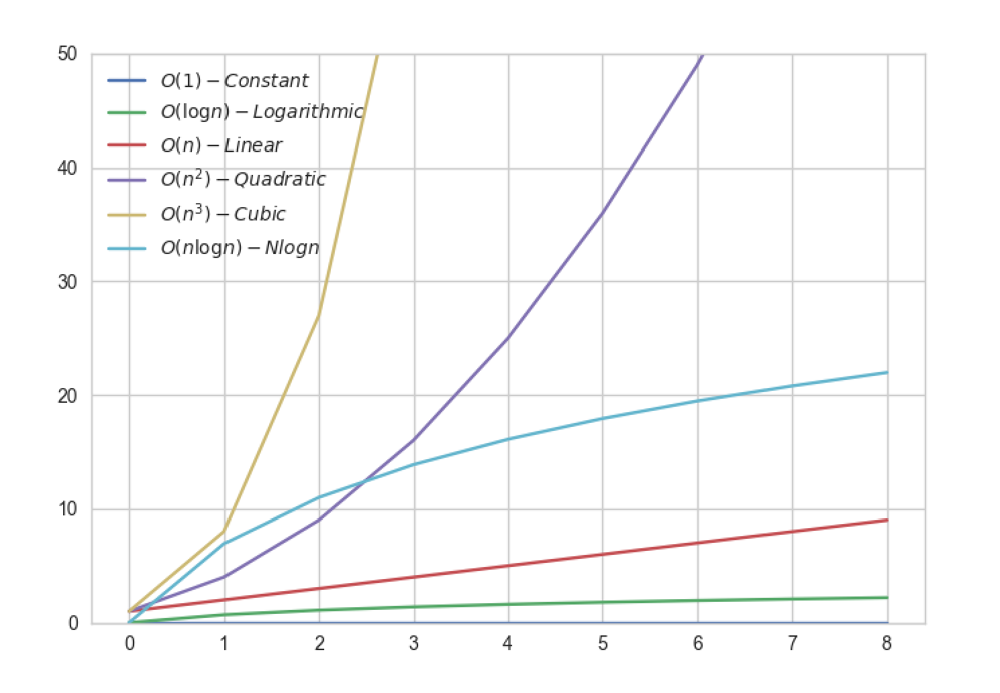


Different complexities grow as a function of their input size


One thing to note here is that there are some crossover points between
different levels of complexities. This shows the role of data size.
It\'s easy to understand the complexity of simple examples, but what
about the complexity of ML algorithms? If the introduction so far has
already piqued your interest, continue reading the next section.


Differences in training and scoring time
========================================

Time spent for training and scoring can make or break a ML project. If
an algorithm takes too long to train on currently available hardware,
updating the model with new data and hyperparameter optimization will be
painful, which may force you to cross that algorithm out from your
candidate list. If an algorithm takes too long to score, then this is
probably a problem in the production environment since your application
may require fast inference times such as milliseconds or microseconds to
get predictions. That\'s why it\'s important to learn the inner workings
of ML algorithms, at least the common ones at first, to sense-check
algorithms suitability.

For example, supervised learning algorithms learn the relationship
between sets of examples and their associated labels the during training
process, where each example consists of a set of features. A training
job will output an ML model upon successful completion, which can be
used to make new predictions. When a model is fed with new examples
without a label, relationships that are mapped between features and the
labels during training are used to predict the label. Time spent for
predicting is usually small, since the learned weights of the model will
be applied to new data.

However, some supervised algorithms skip this training phase and they
score based on all the available examples in the training dataset. Such
algorithms are called **instance-based** or **lazy learners**. For
instance-based algorithms, training simply means storing all feature
vectors and their associated labels in memory, which is whole training
dataset. This practically means that as you increase the size of your
dataset, your model will require more compute and memory resources.


Simple measure of training and scoring time
===========================================

Let's see a quick example of the **k-nearest neighbor** (**k-NN**)
algorithm, which works both for classification and regression problems.
When an algorithm scores a new feature vector, it checks the *k* nearest
neighbors and outputs a result. If it\'s a classification problem, a
prediction is made using a majority vote; if it\'s a regression problem,
then the average of the values is used as a prediction.

Let\'s understand this better by working on an example classification
problem. First, you will create a sample dataset and you will examine
the k-NN algorithm in terms of time spent for training and scoring.

Just to make things easier, the following function will be used to
measure the time spent on a given line:


``` {.language-markup}
from contextlib import contextmanager
from time import time

@contextmanager
def timer():
    s = time()
    yield
    e = time() - s
    print("{0}: {1} ms".format('Elapsed time', e))
```


You can use this function in the following way:


``` {.language-markup}
import numpy as np

with timer():
    X = np.random.rand(1000)
```


It outputs the time spent executing that line:


``` {.language-markup}
Elapsed time: 0.0001399517059326172 ms
```


Now, you can work with [KNeighborsClassifier] of the scikit-learn
library and measure the time spent for training and scoring:


``` {.language-markup}
from sklearn.neighbors import KNeighborsClassifier

# Defining properties of dataset
nT = 100000000 # Total number of values in our dataset
nF = 10 # Number of features
nE = int(nT / nF) # Number of examples

# Creating n x m matrix where n=100 and m=10
X = np.random.rand(nT).reshape(nE, nF)

# This will be a binary classification with labels 0 and 1
y = np.random.randint(2, size=nE)

# Data that we are going to score
scoring_data = np.random.rand(nF).reshape(1,-1)

# Create KNN classifier
knn = KNeighborsClassifier(11, algorithm='brute')

# Measure training time
with timer():
    knn.fit(X, y)

# Measure scoring time
with timer():
    knn.predict(scoring_data)
```


Let\'s see the output:


``` {.language-markup}
Elapsed time: 1.0800271034240723 ms
Elapsed time: 0.43231201171875 ms
```


Just to have an idea about how this compares to other algorithms, you
can try one more classifier, such as logistic regression:


``` {.language-markup}
from sklearn.linear_model import LogisticRegression
log_res = LogisticRegression(C=1e5)

with timer():
    log_res.fit(X, y)

with timer():
    prediction = log_res.predict(scoring_data)
```


The output for logistic regression is as follows:


``` {.language-markup}
Elapsed time: 12.989803075790405 ms
Elapsed time: 0.00024318695068359375 ms
```


It looks quite different! Logistic regression is slower in training and
much faster in scoring. Why is that?

You will learn the answer to that question but, before getting into the
details of the preceding results, let\'s talk a little about code
profiling in Python.


Code profiling in Python
========================

Some applications will require your machine learning models to be
performant in terms of training and scoring time. For example, a
recommender engine might require you to generate recommendations in less
than a second and if you have more than a second latency, profiling is
one way to understand intensive operations. Code profiling will help you
a lot to understand how different parts of your program are executed.
Profiling stats will give metrics, such as the number of calls, the
total time spent to execute a function call including/excluding calls to
its sub-functions, and incremental and total memory usage.

The [cProfile] module in Python will help you to see time
statistics for every function. Here\'s a small example:


``` {.language-markup}
# cProfile
import cProfile

cProfile.run('np.std(np.random.rand(1000000))')
```


In the previous line, standard deviation is calculated for 1,000,000
random samples that are drawn from uniform distribution. The output will
show time statistics for all the function calls to execute a given line:


``` {.language-markup}
23 function calls in 0.025 seconds
   Ordered by: standard name
   ncalls tottime percall cumtime percall filename:lineno(function)
        1 0.001 0.001 0.025 0.025 <string>:1(<module>)
        1 0.000 0.000 0.007 0.007 _methods.py:133(_std)
        1 0.000 0.000 0.000 0.000 _methods.py:43(_count_reduce_items)
        1 0.006 0.006 0.007 0.007 _methods.py:86(_var)
        1 0.001 0.001 0.008 0.008 fromnumeric.py:2912(std)
        2 0.000 0.000 0.000 0.000 numeric.py:534(asanyarray)
        1 0.000 0.000 0.025 0.025 {built-in method builtins.exec}
        2 0.000 0.000 0.000 0.000 {built-in method builtins.hasattr}
        4 0.000 0.000 0.000 0.000 {built-in method builtins.isinstance}
        2 0.000 0.000 0.000 0.000 {built-in method builtins.issubclass}
        1 0.000 0.000 0.000 0.000 {built-in method builtins.max}
        2 0.000 0.000 0.000 0.000 {built-in method numpy.core.multiarray.array}
        1 0.000 0.000 0.000 0.000 {method 'disable' of '_lsprof.Profiler' objects}
        1 0.017 0.017 0.017 0.017 {method 'rand' of 'mtrand.RandomState' objects}
        2 0.001 0.001 0.001 0.001 {method 'reduce' of 'numpy.ufunc' objects}
```


[23] function calls are executed in [0.025] seconds and most
of the time is spent generating random numbers and calculating the
standard deviation, as you would expect.

There is a great library called [snakeviz] that can be used to
visualize [cProfile] output. Create a file named
[profiler\_example\_1.py] and add the following code:


``` {.language-markup}
import numpy as np

np.std(np.random.rand(1000000))
```


In your terminal, navigate to the folder where you have your
[profiler\_example\_1.py] and run the following command:


``` {.language-markup}
python -m cProfile -o profiler_output -s cumulative profiler_example_1.py
```


This will create a file called [profiler\_output] and you can now
use [snakeviz] to create a visualization


Visualizing performance statistics
==================================

Snakeviz is browser based and it will allow you to interact with
performance metrics. [snakeviz] will use the file produced by the
profiler named [profiler\_output] to create visualizations:


``` {.language-markup}
snakeviz profiler_output
```


This command is going to run a small web server on
[127.0.0.1:8080] and it will provide you the address where you can
find your visualization, such as
[http://127.0.0.1:8080/snakeviz/.../2FAutomated\_Machine\_Learning%2FCh4\_Automated\_Algorithm\_Selection%2Fprofiler\_output].

Here, you can see the [Sunburst]{.packt_screen} style chart with various
settings, such as [Depth]{.packt_screen} and [Cutoff]{.packt_screen}:


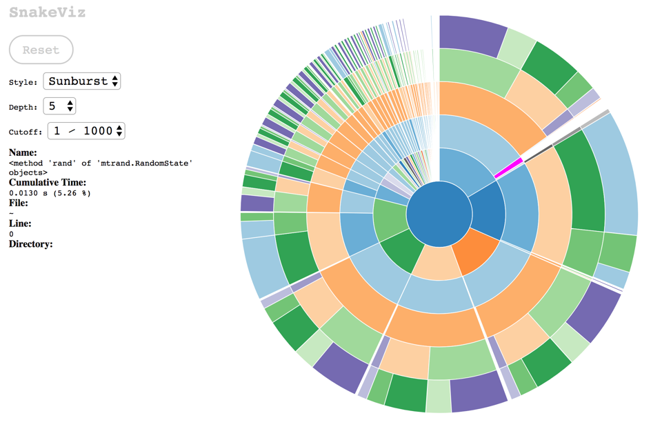


You can hover your mouse over it and it will show you the name of
function, cumulative time, file, line, and directory. You can drill down
to specific regions and see the details.

If you select the [Icicle]{.packt_screen} style, you will have a
different visualization:


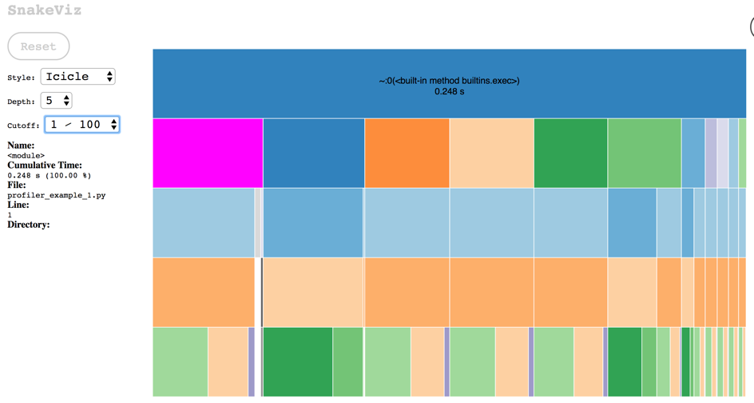


You can play with [Style]{.packt_screen}, [Depth]{.packt_screen}, and
[Cutoff]{.packt_screen} to see which settings work best for you.

If you scroll down to the bottom, there will be a table similar to the
following screenshot:


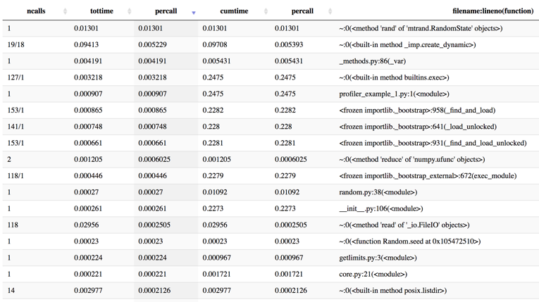


If you sort these values according to the [percall] column, you
will see that the [rand] method of [mtrand.RandomState]
objects and the [\_var] method are among the most time-consuming
calls.

You can examine anything that you run this way and this is a good first
step to better understand and diagnose your code.


Implementing k-NN from scratch
==============================

You have already seen the k-NN algorithm in action; let\'s look at a
very simple implementation. Save the following code block as
[knn\_prediction.py]:


``` {.language-markup}
import numpy as np
import operator

# distance module includes various distance functions
# You will use euclidean distance function to calculate distances between scoring input and training dataset.
from scipy.spatial import distance

# Decorating function with @profile to get run statistics
@profile
def nearest_neighbors_prediction(x, data, labels, k):

    # Euclidean distance will be calculated between example to be predicted and examples in data
    distances = np.array([distance.euclidean(x, i) for i in data])

    label_count = {}
    for i in range(k):
        # Sorting distances starting from closest to our example
        label = labels[distances.argsort()[i]]
        label_count[label] = label_count.get(label, 0) + 1
    votes = sorted(label_count.items(), key=operator.itemgetter(1), reverse=True)

    # Return the majority vote
    return votes[0][0]

# Setting seed to make results reproducible
np.random.seed(23)

# Creating dataset, 20 x 5 matrix which means 20 examples with 5 features for each
data = np.random.rand(100).reshape(20,5)

# Creating labels
labels = np.random.choice(2, 20)

# Scoring input
x = np.random.rand(5)

# Predicting class for scoring input with k=2
pred = nearest_neighbors_prediction(x, data, labels, k=2)
# Output is ‘0’ in my case
```


You will profile this function to see how long it takes for each line to
execute.


Profiling your Python script line by line
=========================================

Go to your Terminal and run the following command:


``` {.language-markup}
$ pip install line_profiler
```


Once installation is finished, you can save the preceding snippet to a
filename [knn\_prediction.py].

As you have noticed, [nearest\_neighbors\_prediction] is decorated
as follows:


``` {.language-markup}
@profile
def nearest_neighbors_prediction(x, data, labels, k):
 …
```


It allows [line\_profiler] to know which function to profile. Run
the following command to save the profile results:


``` {.language-markup}
$ kernprof -l knn_prediction.py
```


The output will be as follows:


``` {.language-markup}
Start
Wrote profile results to knn_prediction.py.lprof
```


You can view the profiler results as follows:


``` {.language-markup}
$ python -m line_profiler knn_prediction.py.lprof
Timer unit: 1e-06 s

Total time: 0.001079 s
File: knn_prediction.py
Function: nearest_neighbors_prediction at line 24

Line # Hits Time Per Hit % Time Line Contents
==============================================================
    24 @profile
    25 def nearest_neighbors_prediction(x, data, labels, k):
    26 
    27 # Euclidean distance will be calculated between example to be predicted and examples in data
    28 1 1043.0 1043.0 96.7 distances = np.array([distance.euclidean(x, i) for i in data])
    29 
    30 1 2.0 2.0 0.2 label_count = {}
    31 3 4.0 1.3 0.4 for i in range(k):
    32 # Sorting distances starting from closest to our example
    33 2 19.0 9.5 1.8 label = labels[distances.argsort()[i]]
    34 2 3.0 1.5 0.3 label_count[label] = label_count.get(label, 0) + 1
    35 1 8.0 8.0 0.7 votes = sorted(label_count.items(), key=operator.itemgetter(1), reverse=True)
    36 
    37 # Return the majority vote
    38 1 0.0 0.0 0.0 return votes[0][0]
```


The most time-consuming part is calculating distances, as you would have
expected.


In terms of big O notation, the complexity of the k-NN algorithm is
[O(nm + kn)], where [n] is the number of examples, [m]
is the number of features, and [k] is the algorithm\'s
hyperparameter. You can think about the reason as an exercise for now.


Every algorithm has similar properties that you should be aware of that
will affect the training and scoring time of algorithms. These
limitations become especially important for production use cases.


Linearity versus non-linearity
==============================

Another consideration is decision boundaries. Some algorithms, such as
logistic regression or **Support Vector Machine** (**SVM**), can learn
linear decision boundaries while others, such as tree-based algorithms,
can learn non-linear decision boundaries. While linear decision
boundaries are relatively easy to calculate and interpret, you should be
aware of errors that linear algorithms will generate in the presence of
non-linear relationships.


Drawing decision boundaries
===========================

The following code snippet will allow you to examine the decision
boundaries of different types of algorithms:


``` {.language-markup}
import matplotlib.cm as cm

# This function will scale training datatset and train given classifier.
# Based on predictions it will draw decision boundaries.

def draw_decision_boundary(clf, X, y, h = .01, figsize=(9,9), boundary_cmap=cm.winter, points_cmap=cm.cool):

    # After you apply StandardScaler, feature means will be removed and all features will have unit variance.
    from sklearn.preprocessing import StandardScaler
    X = StandardScaler().fit_transform(X)

    # Splitting dataset to train and test sets.
    X_train, X_test, y_train, y_test = train_test_split(X, y, test_size=.4, random_state=42)

    # Training given estimator on training dataset by invoking fit function.
    clf.fit(X_train, y_train)

    # Each estimator has a score function.
    # Score will show you estimator's performance by showing metric suitable to given classifier.
    # For example, for linear regression, it will output coefficient of determination R^2 of the prediction.
    # For logistic regression, it will output mean accuracy.

    score = clf.score(X_test, y_test)
    print("Score: %0.3f" % score)

    # Predict function of an estimator, will predict using trained model
    pred = clf.predict(X_test)

    # Figure is a high-level container that contains plot elements
    figure = plt.figure(figsize=figsize)

    # In current figure, subplot will create Axes based on given arguments (nrows, ncols, index)
    ax = plt.subplot(1, 1, 1)

    # Calculating min/max of axes
    x_min, x_max = X[:, 0].min() - 1, X[:, 0].max() + 1
    y_min, y_max = X[:, 1].min() - 1, X[:, 1].max() + 1

    # Meshgrid is usually used to evaluate function on grid.
    # It will allow you to create points to represent the space you operate
    xx, yy = np.meshgrid(np.arange(x_min, x_max, h), np.arange(y_min, y_max, h))

    # Generate predictions for all the point-pair created by meshgrid
    Z = clf.predict(np.c_[xx.ravel(), yy.ravel()])
    Z = Z.reshape(xx.shape)

    # This will draw boundary
    ax.contourf(xx, yy, Z, cmap=boundary_cmap)

    # Plotting training data
    ax.scatter(X_train[:, 0], X_train[:, 1], c=y_train, cmap=points_cmap, edgecolors='k')

    # Potting testing data
    ax.scatter(X_test[:, 0], X_test[:, 1], c=y_test, cmap=points_cmap, alpha=0.6, edgecolors='k')

    # Showing your masterpiece
    figure.show()
```


Decision boundary of logistic regression
========================================

You can start with logistic regression to test this function:


``` {.language-markup}
import numpy as np
import matplotlib.pyplot as plt
from matplotlib import cm

# sklearn.linear_model includes regression models where target variable is a linear combination of input variables
from sklearn.linear_model import LogisticRegression

# make_moons is another useful function to generate sample data
from sklearn.datasets import make_moons
from sklearn.model_selection import train_test_split

X, y = make_moons(n_samples=1000, noise=0.1, random_state=0)

# Plot sample data
plt.scatter(X[:,0], X[:,1], c=y, cmap=cm.cool)
plt.show()
```


We get the following plot:


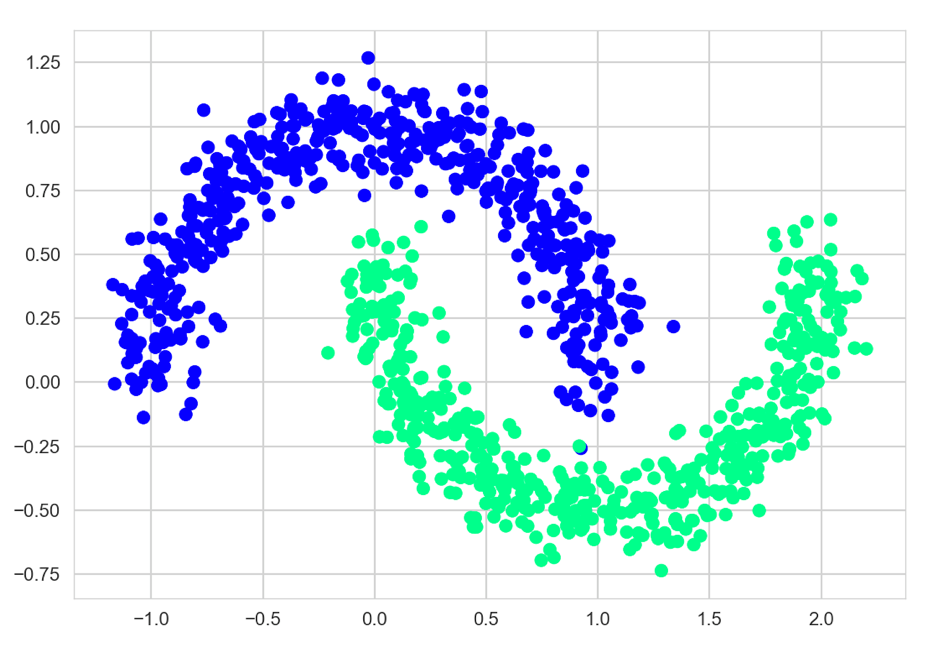


Now, you can use the [draw\_decision\_boundary] function to
visualize the decision boundary for [LogisticRegression]:


``` {.language-markup}
draw_decision_boundary(LogisticRegression(), X, y)
```


It will output the following plot:


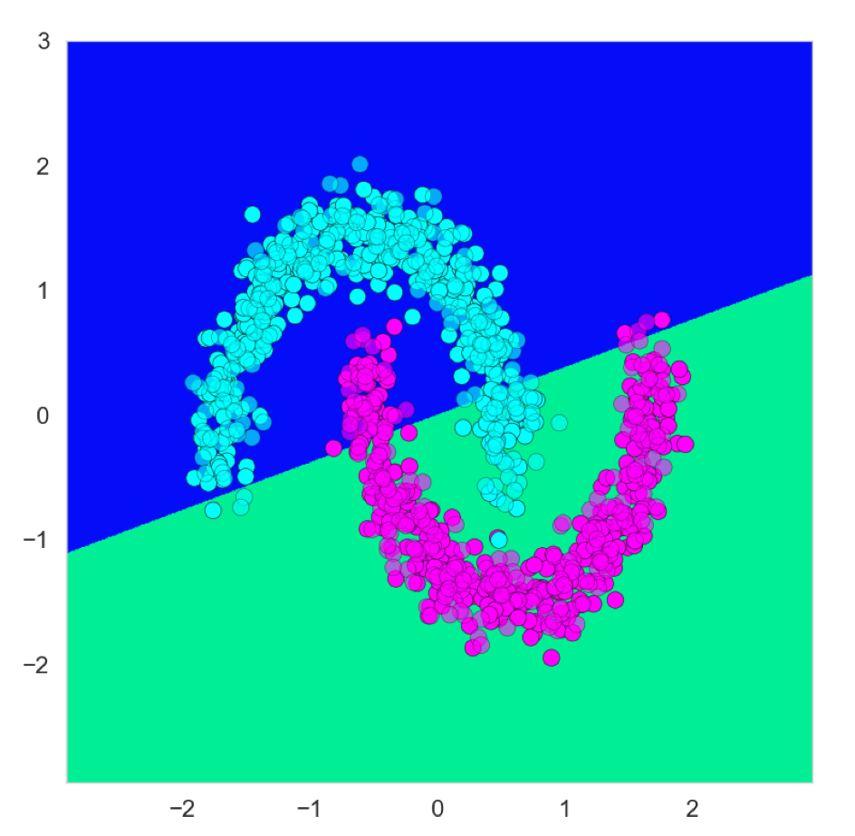


Logistic regression is a member of the generalized linear models and it
produces a linear decision boundary. A linear decision boundary is not
able to separate classes for such datasets. Logistic regression\'s
output is calculated based on the weighted sum of its inputs. Since
output doesn\'t depend on the product or quotient of its parameters, it
will produce a linear decision boundary. There are ways to overcome this
problem, such as regularization and feature mapping, but you can use
other algorithms in such cases that are able to work with non-linear
data.


The decision boundary of random forest
======================================

Random forest is a meta estimator, that will build many different models
and aggregate their predictions to come up with a final prediction.
Random forest is able to produce non-linear decision boundaries, since
there\'s no linear relationship between inputs and outputs. It has many
hyperparameters to play with but for the sake of simplicity, you will
use the default configuration:


``` {.language-markup}
from sklearn.ensemble import RandomForestClassifier

draw_decision_boundary(RandomForestClassifier(), X, y)
```


We get the following plot from the preceding code:


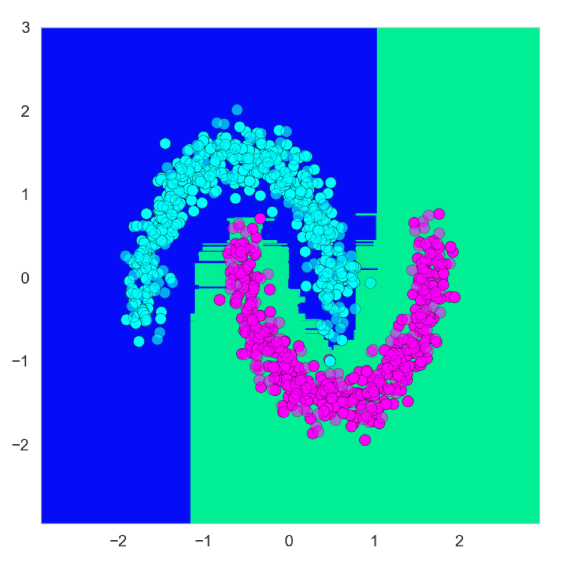


Not looking too bad at all! Every algorithm will provide you with
different decision boundaries, based on their inner workings, and you
should definitely experiment with different estimators to better
understand their behavior.


Commonly used machine learning algorithms
=========================================

As an exercise, the following is a list of commonly used supervised and
unsupervised algorithms; scikit-learn has most of them:

-   Supervised algorithms:
    -   Linear regression
    -   Logistic regression
    -   k-NN
    -   Random forest
    -   Boosting algorithms (GBM, XGBoost, and LightGBM)
    -   SVM
    -   Neural networks

```{=html}

```
-   Unsupervised algorithms:
    -   K-means
    -   Hierarchical clustering
    -   Principal Component Analysis
    -   Mixture models
    -   Autoencoders


Necessary feature transformations
=================================

As you may have noticed, features are scaled in the previous section
before training machine learning algorithms. Feature transformations are
usually necessary for ML algorithms to work properly. For example, as a
rule of thumb, for ML algorithms that use regularization, normalization
is usually applied to features.

The following is a list of use cases where you should transform your
features to prepare your dataset to be ready for ML algorithms:

-   SVM expects its inputs to be in the standard range. You should
    normalize your variables before feeding them into the algorithm.
-   **Principal Component Analysis** (**PCA**) helps you to project your
    features to another space based on variance maximization. You can
    then select the components cover most of the variance in your
    dataset, leaving the rest out to reduce dimensionality. When you are
    working with PCA, you can apply normalization, since some features
    may seem to explain almost all the variance due to differences in
    scale. You can eliminate the differences in scale by normalizing
    your features, as you will see in some examples in the following
    section.
-   If you are working with regularized regression, which is usually the
    case with high-dimensional datasets, you will normalize your
    variables to control the scale, since regularization is not scale
    invariant.
-   To work with the Naive Bayes algorithm, where features and label
    columns are expected to be categorical, you should transform your
    continuous variables to make them discretized by applying binning.
-   In a time series, you usually apply log transformation to deal with
    exponentially increasing trends in order to have a linear trend and
    constant variance.
-   When working with variables that are not numeric, such as
    categorical data, you will encode them into numerical features by
    applying transformations such as one-hot encoding, dummy coding, or
    feature hashing.


Supervised ML
=============

Apart from feature transformations mentioned in the previous section,
each ML algorithm has its own hyperparameter space to be optimized. You
can think of searching the best ML pipeline as going through your
configuration space and trying out your options in a smart way to find
the best performing ML pipeline.

Auto-sklearn is very helpful in achieving that goal and the example that
you have seen in the introductory lab showed you the ease of use of
the library. This section will explain what\'s happening under the hood
to make this implementation successful.

Auto-sklearn uses *meta learning* to select promising data/feature
processors and ML algorithms based on properties of the given dataset.
Please refer to the following links for the list of preprocessing
methods, classifiers, and regressors:

-   Classifiers
    (<https://github.com/automl/auto-sklearn/tree/master/autosklearn/pipeline/components/classification>)
-   Regressors
    (<https://github.com/automl/auto-sklearn/tree/master/autosklearn/pipeline/components/regression>)
-   Preprocessors
    (<https://github.com/automl/auto-sklearn/tree/master/autosklearn/pipeline/components/feature_preprocessing>)

Meta learning mimics the experience of data scientists by analyzing the
performance of ML pipelines across different datasets and matches those
findings with new datasets to make recommendations for initial
configurations.

Once meta learning creates an initial configuration, Bayesian
optimization will deal with tuning the hyperparameters of different
pipelines and top ranking pipelines will be used to create an ensemble
that will likely outperform any of its members and also help to avoid
over-fitting.


Default configuration of auto-sklearn
=====================================

When you create an [AutoSklearnClassifier] object, which you will
do shortly by the way, there are some default configurations that you
need to be aware of; you can see them by running the following code:


``` {.language-markup}
from autosklearn.classification import AutoSklearnClassifier
AutoSklearnClassifier?
```


In Python, adding [?] after a function will output very useful
information, such as the signature, docstring, an explanation of the
parameters, the attributes, and the file location.

If you look at the signature, you will see the default values:


``` {.language-markup}
Init signature: AutoSklearnClassifier(time_left_for_this_task=3600, per_run_time_limit=360, initial_configurations_via_metalearning=25, ensemble_size=50, ensemble_nbest=50, seed=1, ml_memory_limit=3072, include_estimators=None, exclude_estimators=None, include_preprocessors=None, exclude_preprocessors=None, resampling_strategy='holdout', resampling_strategy_arguments=None, tmp_folder=None, output_folder=None, delete_tmp_folder_after_terminate=True, delete_output_folder_after_terminate=True, shared_mode=False, disable_evaluator_output=False, get_smac_object_callback=None, smac_scenario_args=None)
```


For example, [time\_left\_for\_this\_task] is set to 60 minutes.
If you are working on a rather complex dataset, you should set this
parameter to a higher value to increase your chances of finding better
ML pipelines.

Another one is [per\_run\_time\_limit], which is set to six
minutes. Many ML algorithms will have their training time proportional
to input data size, plus the training time will be affected also by the
algorithm\'s complexity. You should set this parameter accordingly.

[ensemble\_size] and [ensemble\_nbest] are ensemble-related
parameters that set size and the number of best models to be included in
the ensemble.

[ml\_memory\_limit] is an important parameter since, if your
algorithm will need more memory, training will be cancelled.

You can include/exclude specific data preprocessors or estimators in
your ML pipeline by providing a list using the following parameters:
[include\_estimators], [exclude\_estimators],
[include\_preprocessors], and [exclude\_preprocessors]

[resampling\_strategy] will give you options to decide how to
handle overfitting.

You can go through the rest of the parameters in the signature and see
if you need to make any specific adjustments to your environment.


Finding the best ML pipeline for product line prediction
========================================================

Let\'s write a small wrapper function first to prepare a dataset by
encoding categorical variables:


``` {.language-markup}
# Importing necessary variables
import numpy as np
import pandas as pd
from autosklearn.classification import AutoSklearnClassifier
from autosklearn.regression import AutoSklearnRegressor
from sklearn.model_selection import train_test_split
from sklearn.metrics import accuracy_score
from sklearn.preprocessing import LabelEncoder
import wget
import pandas as pd

# Machine learning algorithms work with numerical inputs and you need to transform all non-numerical inputs to numerical ones
# Following snippet encode the categorical variables

link_to_data = 'https://apsportal.ibm.com/exchange-api/v1/entries/8044492073eb964f46597b4be06ff5ea/data?accessKey=9561295fa407698694b1e254d0099600'
filename = wget.download(link_to_data)

print(filename)
# GoSales_Tx_NaiveBayes.csv

df = pd.read_csv('GoSales_Tx_NaiveBayes.csv')
df.head()
```


This will output the first five records of the DataFrame:


``` {.language-markup}
# PRODUCT_LINE GENDER AGE MARITAL_STATUS PROFESSION
# 0 Personal Accessories M 27 Single Professional
# 1 Personal Accessories F 39 Married Other
# 2 Mountaineering Equipment F 39 Married Other
# 3 Personal Accessories F 56 Unspecified Hospitality
# 4 Golf Equipment M 45 Married Retired
```


There are four features ([GENDER], [AGE],
[MARITAL\_STATUS], and [PROFESSION]) and one label
([PRODUCT\_LINE]) column in this dataset. Goal is to predict the
product line that customers will be interested in.

You will need to encode textual data both for features and the label.
You can apply [LabelEncoder]:


``` {.language-markup}
df = df.apply(LabelEncoder().fit_transform)
df.head()
```


This will encode the [label] column:


``` {.language-markup}
#   PRODUCT_LINE GENDER AGE MARITAL_STATUS PROFESSION
# 0 4 1 27 1 3
# 1 4 0 39 0 2
# 2 2 0 39 0 2
# 3 4 0 56 2 1
# 4 1 1 45 0 5
```


As you can see, all categorical columns are encoded. Keep in mind that,
in auto-sklearn\'s API, you have the [feat\_type] argument that
allows you to specify columns either as [Categorical] or
[Numerical]:


``` {.language-markup}
feat_type : list, optional (default=None)
```


List of [str] of [len(X.shape\[1\])] describing the
attribute type. Possible types are [Categorical] and
[Numerical]. Categorical attributes will be automatically one-hot
encoded. The values used for a categorical attribute must be integers
obtained, for example, by [sklearn.preprocessing.LabelEncoder].

However, you can also use the [apply] function of the pandas
DataFrame in this example.

The following wrapper functions will process input data and run
experiments using auto-classification or auto-regression algorithms of
auto-sklearn:


``` {.language-markup}
# Function below will encode the target variable if needed
def encode_target_variable(df=None, target_column=None, y=None):

    # Below section will encode target variable if given data is pandas dataframe
    if df is not None:
        df_type = isinstance(df, pd.core.frame.DataFrame)

        # Splitting dataset as train and test data sets
        if df_type:

            # If column data type is not numeric then labels are encoded
            if not np.issubdtype(df[target_column].dtype, np.number):
                le = preprocessing.LabelEncoder()
                df[target_column] = le.fit_transform(df[target_column])
                return df[target_column]

            return df[target_column]
    # Below section will encode numpy array.
    else:

        # numpy array's data type is not numeric then labels are encoded
        if not np.issubdtype(y.dtype, np.number):
            le = preprocessing.LabelEncoder()
            y = le.fit_transform(y)
            return y

        return y


# Create a wrapper function where you can specify the type of learning problem
def supervised_learner(type, X_train, y_train, X_test, y_test):

    if type == 'regression':
        # You can play with time related arguments for discovering more pipelines
        automl = AutoSklearnRegressor(time_left_for_this_task=7200, per_run_time_limit=720)
    else:
        automl = AutoSklearnClassifier(time_left_for_this_task=7200, per_run_time_limit=720)

    # Training estimator based on learner type
    automl.fit(X_train, y_train)

    # Predicting labels on test data
    y_hat = automl.predict(X_test)

    # Calculating accuracy_score
    metric = accuracy_score(y_test, y_hat)

    # Return model, labels and metric
    return automl, y_hat, metric

# In function below, you need to provide numpy array or pandas dataframe together with the name of the target column as arguments
def supervised_automl(data, target_column=None, type=None, y=None):

    # First thing is to check whether data is pandas dataframe
    df_type = isinstance(data, pd.core.frame.DataFrame)

    # Based on data type, you will split dataset as train and test data sets
    if df_type:
        # This is where encode_target_variable function is used before data split
        data[target_column] = encode_target_variable(data, target_column)
        X_train, X_test, y_train, y_test = \
            train_test_split(data.loc[:, data.columns != target_column], data[target_column], random_state=1)
    else:
        y_encoded = encode_target_variable(y=y)
        X_train, X_test, y_train, y_test = train_test_split(X, y_encoded, random_state=1)

    # If learner type is given, then you invoke supervied_learner
    if type != None:
        automl, y_hat, metric = supervised_learner(type, X_train, y_train, X_test, y_test)

    # If type of learning problem is not given, you need to infer it
    # If there are more than 10 unique numerical values, problem will be treated as regression problem,
    # Otherwise, classification problem

    elif len(df[target_column].unique()) > 10:
            print("""There are more than 10 uniques numerical values in target column. 
            Treating it as regression problem.""")
            automl, y_hat, metric = supervised_learner('regression', X_train, y_train, X_test, y_test)
    else:
        automl, y_hat, metric = supervised_learner('classification', X_train, y_train, X_test, y_test)

    # Return model, labels and metric
    return automl, y_hat, metric
```


You can now run it to see the results:


``` {.language-markup}
automl, y_hat, metric = supervised_automl(df, target_column='PRODUCT_LINE')
```


The following output shows the selected model with its parameters:


``` {.language-markup}
automl.get_models_with_weights()
 [(1.0,
  SimpleClassificationPipeline({'balancing:strategy': 'none', 'categorical_encoding:__choice__': 'no_encoding', 'classifier:__choice__': 'gradient_boosting', 'imputation:strategy': 'most_frequent', 'preprocessor:__choice__': 'feature_agglomeration', 'rescaling:__choice__': 'robust_scaler', 'classifier:gradient_boosting:criterion': 'friedman_mse', 'classifier:gradient_boosting:learning_rate': 0.6019977814828193, 'classifier:gradient_boosting:loss': 'deviance', 'classifier:gradient_boosting:max_depth': 5, 'classifier:gradient_boosting:max_features': 0.4884281825655421, 'classifier:gradient_boosting:max_leaf_nodes': 'None', 'classifier:gradient_boosting:min_impurity_decrease': 0.0, 'classifier:gradient_boosting:min_samples_leaf': 20, 'classifier:gradient_boosting:min_samples_split': 7, 'classifier:gradient_boosting:min_weight_fraction_leaf': 0.0, 'classifier:gradient_boosting:n_estimators': 313, 'classifier:gradient_boosting:subsample': 0.3242201709371377, 'preprocessor:feature_agglomeration:affinity': 'cosine', 'preprocessor:feature_agglomeration:linkage': 'complete', 'preprocessor:feature_agglomeration:n_clusters': 383, 'preprocessor:feature_agglomeration:pooling_func': 'mean', 'rescaling:robust_scaler:q_max': 0.75, 'rescaling:robust_scaler:q_min': 0.25},
  dataset_properties={
    'task': 1,
    'sparse': False,
    'multilabel': False,
    'multiclass': False,
    'target_type': 'classification',
    'signed': False}))]
```


You may see that a gradient-boosting algorithm is usually selected, and
this is for a good reason. Currently, in the ML community,
boosting-based algorithms are state-of-the-art and the most popular ones
are **XGBoost**, **LightGBM**, and **CatBoost**.

Auto-sklearn offers support for the [GradientBoostingClassifier]
of sklearn and XGBoost is currently disabled due to integration
problems, but it\'s expected to be added back soon.


Finding the best machine learning pipeline for network anomaly detection
========================================================================

Let\'s run this pipeline on another dataset that is popular in the ML
community. [KDDCUP 99] dataset is tcpdump portions of the 1998
DARPA [Intrusion Detection System Evaluation] dataset and goal is
to detect network intrusions. It includes numerical features hence it
will be easier to set-up our AutoML pipeline:


``` {.language-markup}
# You can import this dataset directly from sklearn
from sklearn.datasets import fetch_kddcup99

# Downloading subset of whole dataset
dataset = fetch_kddcup99(subset='http', shuffle=True, percent10=True)
# Downloading https://ndownloader.figshare.com/files/5976042
# [INFO] [17:43:19:sklearn.datasets.kddcup99] Downloading https://ndownloader.figshare.com/files/5976042

X = dataset.data
y = dataset.target

# 58725 examples with 3 features
X.shape
# (58725, 3)

y.shape
(58725,)

# 5 different classes to represent network anomaly
from pprint import pprint
pprint(np.unique(y))
# array([b'back.', b'ipsweep.', b'normal.', b'phf.', b'satan.'], dtype=object)

automl, y_hat, metric = supervised_automl(X, y=y, type='classification')
```


Unsupervised AutoML
===================

When your dataset doesn\'t have a target variable, you can use
clustering algorithms to explore it, based on different characteristics.
These algorithms group examples together, so that each group will have
examples as similar as possible to each other, but dissimilar to
examples in other groups.

Since you mostly don\'t have labels when you are performing such
analysis, there is a performance metric that you can use to examine the
quality of the resulting separation found by the algorithm.

It is called the **Silhouette Coefficient**. The Silhouette Coefficient
will help you to understand two things:

-   **Cohesion**: Similarity within clusters
-   **Separation**: Dissimilarity among clusters

It will give you a value between 1 and -1, with values close to 1
indicating well-formed clusters.

If you have labels in your training data, you can also use other
metrics, such as homogenity and completeness, which you will see later
in the lab.

Clustering algorithms are used to tackle many different tasks such as
finding similar users, songs, or images, detecting key trends and
changes in patterns, understanding community structures in social
networks.


Commonly used clustering algorithms
===================================

There are two types of commonly used clustering algorithms:
distance-based and probabilistic models. For example, k-means and
**Density-Based Spatial Clustering of Applications with Noise**
(**DBSCAN**) are distance-based algorithms, whereas the Gaussian mixture
model is probabilistic.

Distance-based algorithms may use a variety of distance measures where
Euclidean distance metrics are usually used.

Probabilistic algorithms will assume that there is a generative process
with a mixture of probability distributions with unknown parameters and
the goal is to calculate these parameters from the data.

Since there are many clustering algorithms, picking the right one
depends on the characteristics of your data. For example, k-means will
work with centroids of clusters and this requires clusters in your data
to be evenly sized and convexly shaped. This means that k-means will not
work well on elongated clusters or irregularly shaped manifolds. When
your clusters in your data are not evenly sized or convexly shaped, you
many want to use DBSCAN to cluster areas of any shape.

Knowing a thing or two about your data will bring you closer to finding
the right algorithms, but what if you don\'t know much about your data?
Many times when you are performing exploratory analysis, it might be
hard to get your head around what\'s happening. If you find yourself in
this kind of situation, an automated unsupervised ML pipeline can help
you to understand the characteristics of your data better.

Be careful when you perform this kind of analysis, though; the actions
you will take later will be driven by the results you will see and this
could quickly send you down the wrong path if you are not cautious.


Creating sample datasets with sklearn
=====================================

In [sklearn], there are some useful ways to create sample datasets
for testing algorithms:


``` {.language-markup}
# Importing necessary libraries for visualization
import matplotlib.pyplot as plt
import seaborn as sns

# Set context helps you to adjust things like label size, lines and various elements
# Try "notebook", "talk" or "paper" instead of "poster" to see how it changes
sns.set_context('poster')

# set_color_codes will affect how colors such as 'r', 'b', 'g' will be interpreted
sns.set_color_codes()

# Plot keyword arguments will allow you to set things like size or line width to be used in charts.
plot_kwargs = {'s': 10, 'linewidths': 0.1}

import numpy as np
import pandas as pd

# Pprint will better output your variables in console for readability
from pprint import pprint


# Creating sample dataset using sklearn samples_generator
from sklearn.datasets.samples_generator import make_blobs
from sklearn.preprocessing import StandardScaler

# Make blobs will generate isotropic Gaussian blobs
# You can play with arguments like center of blobs, cluster standard deviation
centers = [[2, 1], [-1.5, -1], [1, -1], [-2, 2]]
cluster_std = [0.1, 0.1, 0.1, 0.1]

# Sample data will help you to see your algorithms behavior
X, y = make_blobs(n_samples=1000,
                  centers=centers,
                  cluster_std=cluster_std,
                  random_state=53)


# Plot generated sample data
plt.scatter(X[:, 0], X[:, 1], **plot_kwargs)
plt.show()
```


We get the following plot from the preceding code:


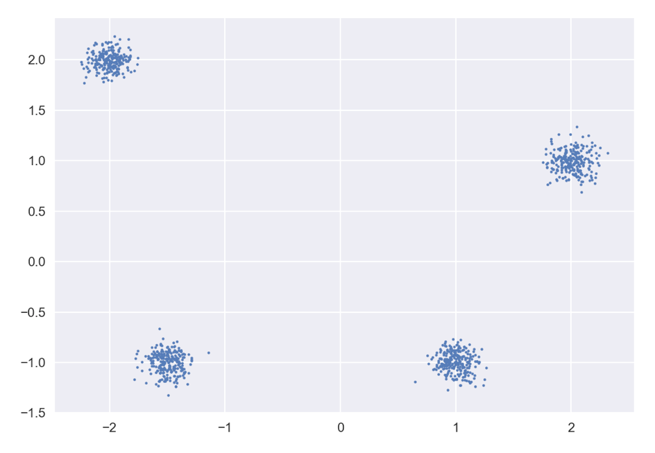


[cluster\_std] will affect the amount of dispersion. Change it to
[\[0.4, 0.5, 0.6, 0.5\]] and try again:


``` {.language-markup}
cluster_std = [0.4, 0.5, 0.6, 0.5] 

X, y = make_blobs(n_samples=1000,
                  centers=centers,
                  cluster_std=cluster_std,
                  random_state=53)

plt.scatter(X[:, 0], X[:, 1], **plot_kwargs)
plt.show()
```


We get the following plot from the preceding code:


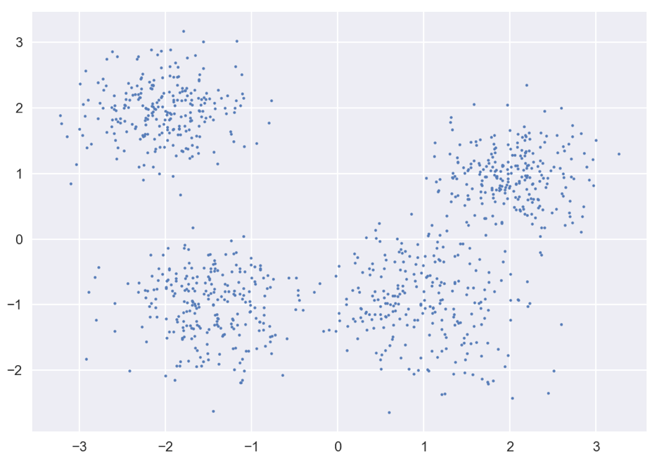


Now it looks more realistic!

Let\'s write a small class with helpful methods to create unsupervised
experiments. First, you will use the [fit\_predict] method to
apply one or more clustering algorithms on the sample dataset:


``` {.language-markup}
class Unsupervised_AutoML:

    def __init__(self, estimators=None, transformers=None):
        self.estimators = estimators
        self.transformers = transformers
        pass
```


[Unsupervised\_AutoML] class will initialize with a set of
estimators and transformers. The second class method will be
[fit\_predict]:


``` {.language-markup}
def fit_predict(self, X, y=None):
    """
    fit_predict will train given estimator(s) and predict cluster membership for each sample
    """

    # This dictionary will hold predictions for each estimator
    predictions = []
    performance_metrics = {}

    for estimator in self.estimators:
        labels = estimator['estimator'](*estimator['args'], **estimator['kwargs']).fit_predict(X)
        estimator['estimator'].n_clusters_ = len(np.unique(labels))
        metrics = self._get_cluster_metrics(estimator['estimator'].__name__, estimator['estimator'].n_clusters_, X, labels, y)
        predictions.append({estimator['estimator'].__name__: labels})
        performance_metrics[estimator['estimator'].__name__] = metrics

    self.predictions = predictions
    self.performance_metrics = performance_metrics

    return predictions, performance_metrics
```


The [fit\_predict] method uses the [\_get\_cluster\_metrics]
method to get the performance metrics, which is defined in the following
code block:


``` {.language-markup}
# Printing cluster metrics for given arguments
def _get_cluster_metrics(self, name, n_clusters_, X, pred_labels, true_labels=None):
    from sklearn.metrics import homogeneity_score, \
        completeness_score, \
        v_measure_score, \
        adjusted_rand_score, \
        adjusted_mutual_info_score, \
        silhouette_score

    print("""################## %s metrics #####################""" % name)
    if len(np.unique(pred_labels)) >= 2:

        silh_co = silhouette_score(X, pred_labels)

        if true_labels is not None:

            h_score = homogeneity_score(true_labels, pred_labels)
            c_score = completeness_score(true_labels, pred_labels)
            vm_score = v_measure_score(true_labels, pred_labels)
            adj_r_score = adjusted_rand_score(true_labels, pred_labels)
            adj_mut_info_score = adjusted_mutual_info_score(true_labels, pred_labels)

            metrics = {"Silhouette Coefficient": silh_co,
                       "Estimated number of clusters": n_clusters_,
                       "Homogeneity": h_score,
                       "Completeness": c_score,
                       "V-measure": vm_score,
                       "Adjusted Rand Index": adj_r_score,
                       "Adjusted Mutual Information": adj_mut_info_score}

            for k, v in metrics.items():
                print("\t%s: %0.3f" % (k, v))

            return metrics

        metrics = {"Silhouette Coefficient": silh_co,
                   "Estimated number of clusters": n_clusters_}

        for k, v in metrics.items():
            print("\t%s: %0.3f" % (k, v))

        return metrics

    else:
        print("\t# of predicted labels is {}, can not produce metrics. \n".format(np.unique(pred_labels)))
```


The [\_get\_cluster\_metrics] method calculates metrics, such as
[homogeneity\_score], [completeness\_score],
[v\_measure\_score], [adjusted\_rand\_score],
[adjusted\_mutual\_info\_score], and [silhouette\_score].
These metrics will help you to assess how well the clusters are
separated and also measure the similarity within and between clusters.


K-means algorithm in action
===========================

You can now apply the [KMeans] algorithm to see how it works:


``` {.language-markup}
from sklearn.cluster import KMeans

estimators = [{'estimator': KMeans, 'args':(), 'kwargs':{'n_clusters': 4}}]

unsupervised_learner = Unsupervised_AutoML(estimators)
```


You can see the [estimators]:


``` {.language-markup}
unsupervised_learner.estimators
```


These will output the following:


``` {.language-markup}
[{'args': (),
 'estimator': sklearn.cluster.k_means_.KMeans,
 'kwargs': {'n_clusters': 4}}]
```


You can now invoke [fit\_predict] to obtain [predictions]
and [performance\_metrics]:


``` {.language-markup}
predictions, performance_metrics = unsupervised_learner.fit_predict(X, y)
```


Metrics will be written to the console:


``` {.language-markup}
################## KMeans metrics #####################
  Silhouette Coefficient: 0.631
  Estimated number of clusters: 4.000
  Homogeneity: 0.951
  Completeness: 0.951
  V-measure: 0.951
  Adjusted Rand Index: 0.966
  Adjusted Mutual Information: 0.950
```


You can always print metrics later:


``` {.language-markup}
pprint(performance_metrics)
```


This will output the name of the estimator and its metrics:


``` {.language-markup}
{'KMeans': {'Silhouette Coefficient': 0.9280431207593165, 'Estimated number of clusters': 4, 'Homogeneity': 1.0, 'Completeness': 1.0, 'V-measure': 1.0, 'Adjusted Rand Index': 1.0, 'Adjusted Mutual Information': 1.0}}
```


Let\'s add another class method to plot the clusters of the given
estimator and predicted labels:


``` {.language-markup}
# plot_clusters will visualize the clusters given predicted labels
def plot_clusters(self, estimator, X, labels, plot_kwargs):

    palette = sns.color_palette('deep', np.unique(labels).max() + 1)
    colors = [palette[x] if x >= 0 else (0.0, 0.0, 0.0) for x in labels]

    plt.scatter(X[:, 0], X[:, 1], c=colors, **plot_kwargs)
    plt.title('{} Clusters'.format(str(estimator.__name__)), fontsize=14)
    plt.show()


```


Let\'s see the usage:


``` {.language-markup}
plot_kwargs = {'s': 12, 'linewidths': 0.1}
unsupervised_learner.plot_clusters(KMeans,
                                   X,
                                   unsupervised_learner.predictions[0]['KMeans'],
                                   plot_kwargs)
```


You get the following plot from the preceding block:


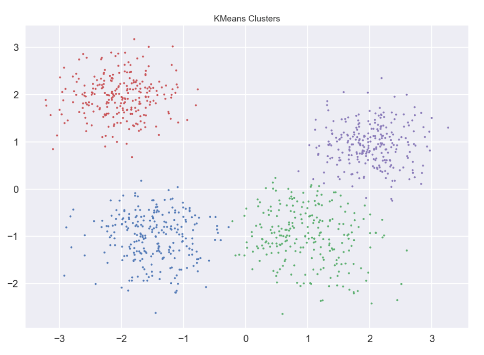


In this example, clusters are evenly sized and clearly separate from
each other but, when you are doing this kind of exploratory analysis,
you should try different hyperparameters and examine the results.

You will write a wrapper function later in this lab to apply a list
of clustering algorithms and their hyperparameters to examine the
results. For now, let\'s see one more example with k-means where it does
not work well.

When clusters in your dataset have different statistical properties,
such as differences in variance, k-means will fail to identify clusters
correctly:


``` {.language-markup}
X, y = make_blobs(n_samples=2000, centers=5, cluster_std=[1.7, 0.6, 0.8, 1.0, 1.2], random_state=220)

# Plot sample data
plt.scatter(X[:, 0], X[:, 1], **plot_kwargs)
plt.show()
```


We get the following plot from the preceding code:


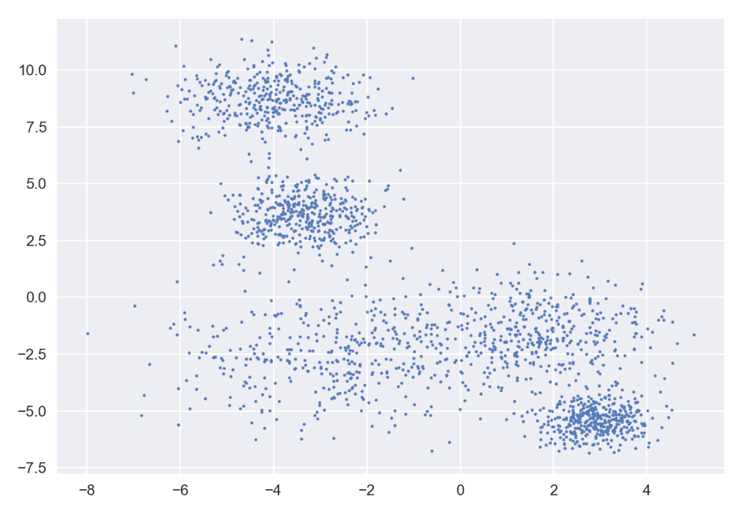


Although this sample dataset is generated with five centers, it\'s not
that obvious and there might be four clusters, as well:


``` {.language-markup}
from sklearn.cluster import KMeans

estimators = [{'estimator': KMeans, 'args':(), 'kwargs':{'n_clusters': 4}}]

unsupervised_learner = Unsupervised_AutoML(estimators)

predictions, performance_metrics = unsupervised_learner.fit_predict(X, y)


```


Metrics in the console are as follows:


``` {.language-markup}
################## KMeans metrics #####################
  Silhouette Coefficient: 0.549
  Estimated number of clusters: 4.000
  Homogeneity: 0.729
  Completeness: 0.873
  V-measure: 0.795
  Adjusted Rand Index: 0.702
  Adjusted Mutual Information: 0.729
```


[KMeans] clusters are plotted as follows:


``` {.language-markup}
plot_kwargs = {'s': 12, 'linewidths': 0.1}
unsupervised_learner.plot_clusters(KMeans,
                                   X,
                                   unsupervised_learner.predictions[0]['KMeans'],
                                   plot_kwargs)
```


We get the following plot from the preceding code:


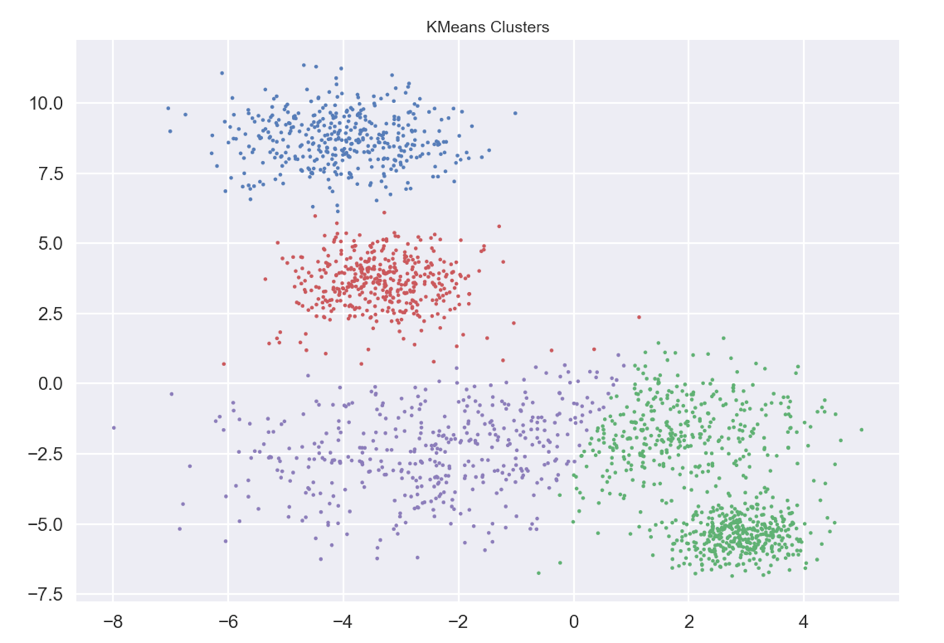


In this example, points between red (dark gray) and bottom-green
clusters (light gray) seem to form one big cluster. K-means is
calculating the centroid based on the mean value of points surrounding
that centroid. Here, you need to have a different approach.


The DBSCAN algorithm in action
==============================

DBSCAN is one of the clustering algorithms that can deal with non-flat
geometry and uneven cluster sizes. Let\'s see what it can do:


``` {.language-markup}
from sklearn.cluster import DBSCAN

estimators = [{'estimator': DBSCAN, 'args':(), 'kwargs':{'eps': 0.5}}]

unsupervised_learner = Unsupervised_AutoML(estimators)

predictions, performance_metrics = unsupervised_learner.fit_predict(X, y)
```


Metrics in the console are as follows:


``` {.language-markup}
################## DBSCAN metrics #####################
  Silhouette Coefficient: 0.231
  Estimated number of clusters: 12.000
  Homogeneity: 0.794
  Completeness: 0.800
  V-measure: 0.797
  Adjusted Rand Index: 0.737
  Adjusted Mutual Information: 0.792
```


[DBSCAN] clusters are plotted as follows:


``` {.language-markup}
plot_kwargs = {'s': 12, 'linewidths': 0.1}
unsupervised_learner.plot_clusters(DBSCAN,
                                   X,
                                   unsupervised_learner.predictions[0]['DBSCAN'],
                                   plot_kwargs)
```


We get the following plot from the preceding code:


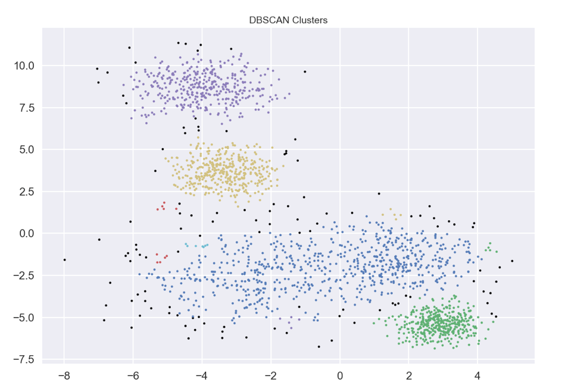


Conflict between red (dark gray) and bottom-green (light gray) clusters
from the k-means case seems to be gone, but what\'s interesting here is
that some small clusters appeared and some points were not assigned to
any cluster based on their distance.

DBSCAN has the [eps(epsilon)] hyperparameter, which is related to
proximity for points to be in same neighborhood; you can play with that
parameter to see how the algorithm behaves.

When you are doing this kind of exploratory analysis where you don\'t
know much about the data, visual clues are always important, because
metrics can mislead you since not every clustering algorithm can be
assessed using similar metrics.


Agglomerative clustering algorithm in action
============================================

Our last try will be with an agglomerative clustering algorithm:


``` {.language-markup}
from sklearn.cluster import AgglomerativeClustering

estimators = [{'estimator': AgglomerativeClustering, 'args':(), 'kwargs':{'n_clusters': 4, 'linkage': 'ward'}}]

unsupervised_learner = Unsupervised_AutoML(estimators)

predictions, performance_metrics = unsupervised_learner.fit_predict(X, y)
```


Metrics in the console are as follows:


``` {.language-markup}
################## AgglomerativeClustering metrics #####################
  Silhouette Coefficient: 0.546
  Estimated number of clusters: 4.000
  Homogeneity: 0.751
  Completeness: 0.905
  V-measure: 0.820
  Adjusted Rand Index: 0.719
  Adjusted Mutual Information: 0.750
```


[AgglomerativeClustering] clusters are plotted as follows:


``` {.language-markup}
plot_kwargs = {'s': 12, 'linewidths': 0.1}
unsupervised_learner.plot_clusters(AgglomerativeClustering,
                                   X,
                                   unsupervised_learner.predictions[0]['AgglomerativeClustering'],
                                   plot_kwargs)
```


We get the following plot from the preceding code:


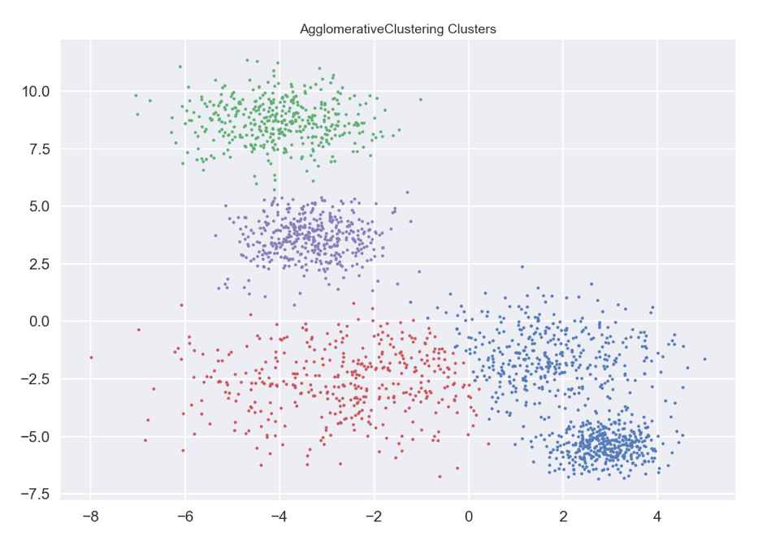


[AgglomerativeClustering] behaved like k-means in this example,
with slight differences.


Simple automation of unsupervised learning
==========================================

You should automate this whole discovery process to try different
clustering algorithms with different hyperparameter settings. The
following code will show you a simple way of doing that:


``` {.language-markup}
# You will create a list of algorithms to test
from sklearn.cluster import MeanShift, estimate_bandwidth, SpectralClustering
from hdbscan import HDBSCAN

# bandwidth estimate for MeanShift algorithm to work properly
bandwidth = estimate_bandwidth(X, quantile=0.3, n_samples=100)

estimators = [{'estimator': KMeans, 'args': (), 'kwargs': {'n_clusters': 5}},
                         {'estimator': DBSCAN, 'args': (), 'kwargs': {'eps': 0.5}},
                         {'estimator': AgglomerativeClustering, 'args': (), 'kwargs': {'n_clusters': 5, 'linkage': 'ward'}},
                         {'estimator': MeanShift, 'args': (), 'kwargs': {'cluster_all': False, "bandwidth": bandwidth, "bin_seeding": True}},
                         {'estimator': SpectralClustering, 'args': (), 'kwargs': {'n_clusters':5}},
                         {'estimator': HDBSCAN, 'args': (), 'kwargs': {'min_cluster_size':15}}]


unsupervised_learner = Unsupervised_AutoML(estimators)

predictions, performance_metrics = unsupervised_learner.fit_predict(X, y)
```


You will see the following metrics in the console:


``` {.language-markup}
################## KMeans metrics #####################
  Silhouette Coefficient: 0.592
  Estimated number of clusters: 5.000
  Homogeneity: 0.881
  Completeness: 0.882
  V-measure: 0.882
  Adjusted Rand Index: 0.886
  Adjusted Mutual Information: 0.881

################## DBSCAN metrics #####################
  Silhouette Coefficient: 0.417
  Estimated number of clusters: 5.000
  ...
################## AgglomerativeClustering metrics #####################
  Silhouette Coefficient: 0.581
  Estimated number of clusters: 5.000
  ...
################## MeanShift metrics #####################
  Silhouette Coefficient: 0.472
  Estimated number of clusters: 3.000
  ...
################## SpectralClustering metrics #####################
  Silhouette Coefficient: 0.420
  Estimated number of clusters: 5.000
  ...
################## HDBSCAN metrics #####################
  Silhouette Coefficient: 0.468
  Estimated number of clusters: 6.000
  ...
```


You can print labels and metrics later, since you have a label and
metrics for each algorithm:


``` {.language-markup}
pprint(predictions)
[{'KMeans': array([3, 1, 4, ..., 0, 1, 2], dtype=int32)},
 {'DBSCAN': array([ 0, 0, 0, ..., 2, -1, 1])},
 {'AgglomerativeClustering': array([2, 4, 0, ..., 3, 2, 1])},
 {'MeanShift': array([0, 0, 0, ..., 1, 0, 1])},
 {'SpectralClustering': array([4, 2, 1, ..., 0, 1, 3], dtype=int32)},
 {'HDBSCAN': array([ 4, 2, 3, ..., 1, -1, 0])}]

pprint(performance_metrics)
{'AgglomerativeClustering': {'Adjusted Mutual Information': 0.8989601162598674,
                             'Adjusted Rand Index': 0.9074196173180163,
                             ...},
 'DBSCAN': {'Adjusted Mutual Information': 0.5694008711591612,
            'Adjusted Rand Index': 0.4685215791890368,
            ...},
 'HDBSCAN': {'Adjusted Mutual Information': 0.7857262723310214,
             'Adjusted Rand Index': 0.7907512089039799,
             ...},
 'KMeans': {'Adjusted Mutual Information': 0.8806038790635883,
            'Adjusted Rand Index': 0.8862210038915361,
            ...},
 'MeanShift': {'Adjusted Mutual Information': 0.45701704058584275,
               'Adjusted Rand Index': 0.4043364504640998,
               ...},
 'SpectralClustering': {'Adjusted Mutual Information': 0.7628653432724043,
                        'Adjusted Rand Index': 0.7111907598912597,
                        ...}}
```


You can visualize the predictions in the same way by using the
[plot\_clusters] method. Let\'s write another class method, that
will plot clusters for all the estimators you have used in your
experiment:


``` {.language-markup}
def plot_all_clusters(self, estimators, labels, X, plot_kwargs):

    fig = plt.figure()

    for i, algorithm in enumerate(labels):

        quotinent = np.divide(len(estimators), 2)

        # Simple logic to decide row and column size of the figure
        if isinstance(quotinent, int):
            dim_1 = 2
            dim_2 = quotinent
        else:
            dim_1 = np.ceil(quotinent)
            dim_2 = 3

        palette = sns.color_palette('deep',
                                    np.unique(algorithm[estimators[i]['estimator'].__name__]).max() + 1)
        colors = [palette[x] if x >= 0 else (0.0, 0.0, 0.0) for x in
                  algorithm[estimators[i]['estimator'].__name__]]

        plt.subplot(dim_1, dim_2, i + 1)
        plt.scatter(X[:, 0], X[:, 1], c=colors, **plot_kwargs)
        plt.title('{} Clusters'.format(str(estimators[i]['estimator'].__name__)), fontsize=8)

    plt.show()
```


Let\'s see the usage:


``` {.language-markup}
plot_kwargs = {'s': 12, 'linewidths': 0.1}
unsupervised_learner.plot_all_clusters(estimators, unsupervised_learner.predictions, X, plot_kwargs)
```


We get the following plot from the preceding code block:


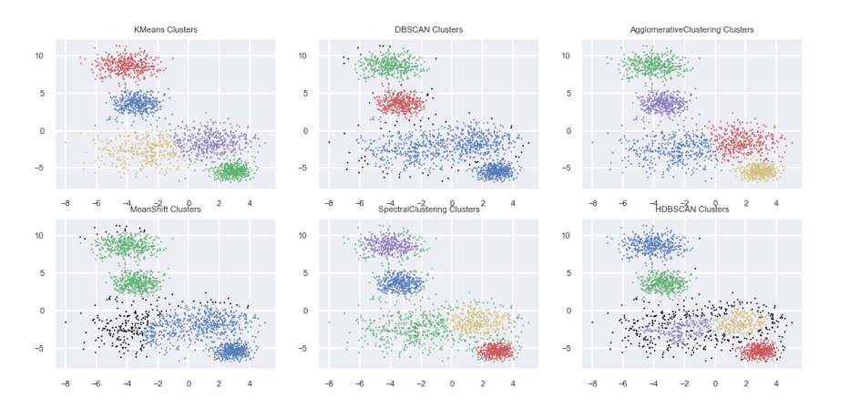


Top row, starting from left: KMeans, DBSCAN, AgglomerativeClustering


Bottom row, starting from left: MeanShift, SpectralClustering, HDBSCAN


Visualizing high-dimensional datasets
=====================================

What about visually inspecting datasets that have more than three
dimensions? In order to visually inspect your dataset, you need to have
a maximum of three dimensions; if not, you need to use specific methods
to reduce dimensionality. This is usually achieved by applying a
**Principal Component Analysis** (**PCA**) or t-SNE algorithm.

The following code will load the [Breast Cancer Wisconsin
Diagnostic] dataset, which is commonly used in ML tutorials:


``` {.language-markup}
# Wisconsin Breast Cancer Diagnostic Dataset
from sklearn.datasets import load_breast_cancer
import pandas as pd

data = load_breast_cancer()
X = data.data

df = pd.DataFrame(data.data, columns=data.feature_names)
df.head()
```


Output in the console is as follows:


``` {.language-markup}
   mean radius mean texture mean perimeter mean area mean smoothness \
0 17.99 10.38 122.80 1001.0 0.11840 
1 20.57 17.77 132.90 1326.0 0.08474 
2 19.69 21.25 130.00 1203.0 0.10960 
3 11.42 20.38 77.58 386.1 0.14250 
4 20.29 14.34 135.10 1297.0 0.10030 

...

   mean fractal dimension ... worst radius \
0 0.07871 ... 25.38 
1 0.05667 ... 24.99 
2 0.05999 ... 23.57 
3 0.09744 ... 14.91 
4 0.05883 ... 22.54 

...

   worst fractal dimension 
0 0.11890 
1 0.08902 
2 0.08758 
3 0.17300 
4 0.07678 
```


You have thirty different features to use to understand the different
characteristics of a tumor in the given patient.

[df.describe()] will show you descriptive statistics for each
feature:


``` {.language-markup}
df.describe()

       mean radius mean texture mean perimeter mean area \
count 569.000000 569.000000 569.000000 569.000000 
mean 14.127292 19.289649 91.969033 654.889104 
std 3.524049 4.301036 24.298981 351.914129 
min 6.981000 9.710000 43.790000 143.500000 
25% 11.700000 16.170000 75.170000 420.300000 
50% 13.370000 18.840000 86.240000 551.100000 
75% 15.780000 21.800000 104.100000 782.700000 
max 28.110000 39.280000 188.500000 2501.000000 

...

       mean symmetry mean fractal dimension ... \
count 569.000000 569.000000 ... 
mean 0.181162 0.062798 ... 
std 0.027414 0.007060 ... 
min 0.106000 0.049960 ... 
25% 0.161900 0.057700 ... 
50% 0.179200 0.061540 ... 
75% 0.195700 0.066120 ... 
max 0.304000 0.097440 ... 

...

       worst concave points worst symmetry worst fractal dimension 
count 569.000000 569.000000 569.000000 
mean 0.114606 0.290076 0.083946 
std 0.065732 0.061867 0.018061 
min 0.000000 0.156500 0.055040 
25% 0.064930 0.250400 0.071460 
50% 0.099930 0.282200 0.080040 
75% 0.161400 0.317900 0.092080 
max 0.291000 0.663800 0.207500 
[8 rows x 30 columns]
```


Let\'s see the results before and after scaling. The following code
snippet will fit the PCA to the original data.


Principal Component Analysis in action
======================================

The following code block shows you how to apply PCA with two components
and visualize the results:


``` {.language-markup}
# PCA
from sklearn.decomposition import PCA

pca = PCA(n_components=2, whiten=True)
pca = pca.fit_transform(df)

plt.scatter(pca[:, 0], pca[:, 1], c=data.target, cmap="RdBu_r", edgecolor="Red", alpha=0.35)
plt.colorbar()
plt.title('PCA, n_components=2')
plt.show()
```


We get the following plot from the preceding code:


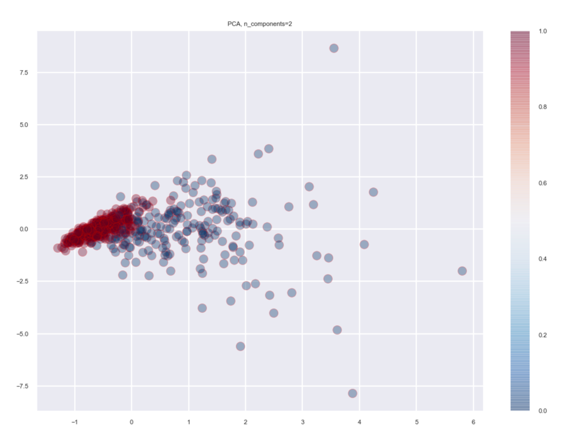


Plot of PCA, n\_components=2


Here, you can see the red class (dark gray) is very condensed into one
particular area and it\'s hard to separate classes. Differences in
variances distort our view and scaling can help:


``` {.language-markup}
# Preprocess data.
scaler = StandardScaler()
scaler.fit(df)
preprocessed_data = scaler.transform(df)
scaled_features_df = pd.DataFrame(preprocessed_data, index=df.index, columns=df.columns)
```


After preprocessing data by applying [StandardScaler], the dataset
has unit variance:


``` {.language-markup}
scaled_features_df.describe()

        mean radius mean texture mean perimeter mean area \
count 5.690000e+02 5.690000e+02 5.690000e+02 5.690000e+02 
mean -3.162867e-15 -6.530609e-15 -7.078891e-16 -8.799835e-16 
std 1.000880e+00 1.000880e+00 1.000880e+00 1.000880e+00 
min -2.029648e+00 -2.229249e+00 -1.984504e+00 -1.454443e+00 
25% -6.893853e-01 -7.259631e-01 -6.919555e-01 -6.671955e-01 
50% -2.150816e-01 -1.046362e-01 -2.359800e-01 -2.951869e-01 
75% 4.693926e-01 5.841756e-01 4.996769e-01 3.635073e-01 
max 3.971288e+00 4.651889e+00 3.976130e+00 5.250529e+00 

...
 
       mean symmetry mean fractal dimension ... \
count 5.690000e+02 5.690000e+02 ... 
mean -1.971670e-15 -1.453631e-15 ... 
std 1.000880e+00 1.000880e+00 ... 
min -2.744117e+00 -1.819865e+00 ... 
25% -7.032397e-01 -7.226392e-01 ... 
50% -7.162650e-02 -1.782793e-01 ... 
75% 5.307792e-01 4.709834e-01 ... 
max 4.484751e+00 4.910919e+00 ... 

...

       worst concave points worst symmetry worst fractal dimension 
count 5.690000e+02 5.690000e+02 5.690000e+02 
mean -1.412656e-16 -2.289567e-15 2.575171e-15 
std 1.000880e+00 1.000880e+00 1.000880e+00 
min -1.745063e+00 -2.160960e+00 -1.601839e+00 
25% -7.563999e-01 -6.418637e-01 -6.919118e-01 
50% -2.234689e-01 -1.274095e-01 -2.164441e-01 
75% 7.125100e-01 4.501382e-01 4.507624e-01 
max 2.685877e+00 6.046041e+00 6.846856e+00 
[8 rows x 30 columns]
```


Apply PCA to see whether the first two principal components are enough
to separate labels:


``` {.language-markup}
# PCA
from sklearn.decomposition import PCA

pca = PCA(n_components=2, whiten=True)
pca = pca.fit_transform(scaled_features_df)

plt.scatter(pca[:, 0], pca[:, 1], c=data.target, cmap="RdBu_r", edgecolor="Red", alpha=0.35)
plt.colorbar()
plt.title('PCA, n_components=2')
plt.show()
```


We get the following output from the preceding code:


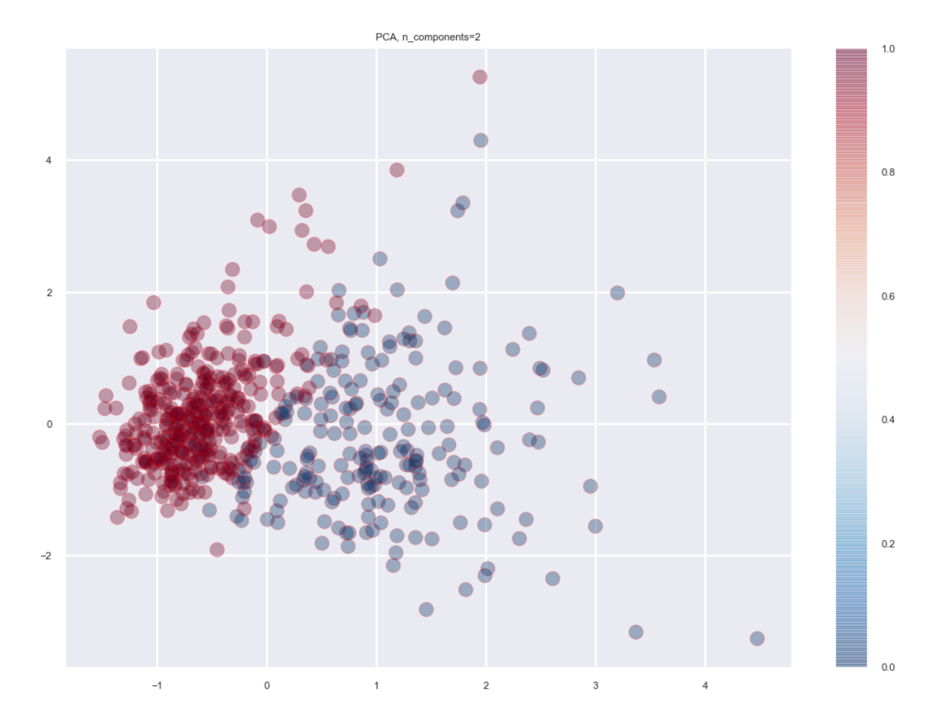


PCA, n\_components=2, after scaling


This seems interesting, as examples with different labels are mostly
separated using the first two principal components.


t-SNE in action
===============

You can also try t-SNE to visualize high-dimensional data. First,
[TSNE] will be applied to the original data:


``` {.language-markup}
# TSNE
from sklearn.manifold import TSNE

tsne = TSNE(verbose=1, perplexity=40, n_iter=4000)
tsne = tsne.fit_transform(df)
```


Output in the console is as follows:


``` {.language-markup}
[t-SNE] Computing 121 nearest neighbors...
[t-SNE] Indexed 569 samples in 0.000s...
[t-SNE] Computed neighbors for 569 samples in 0.010s...
[t-SNE] Computed conditional probabilities for sample 569 / 569
[t-SNE] Mean sigma: 33.679703
[t-SNE] KL divergence after 250 iterations with early exaggeration: 48.886528
[t-SNE] Error after 1600 iterations: 0.210506
```


Plotting the results is as follows:


``` {.language-markup}
plt.scatter(tsne[:, 0], tsne[:, 1], c=data.target, cmap="winter", edgecolor="None", alpha=0.35)
plt.colorbar()
plt.title('t-SNE')
plt.show()
```


We get the following output from the preceding code:


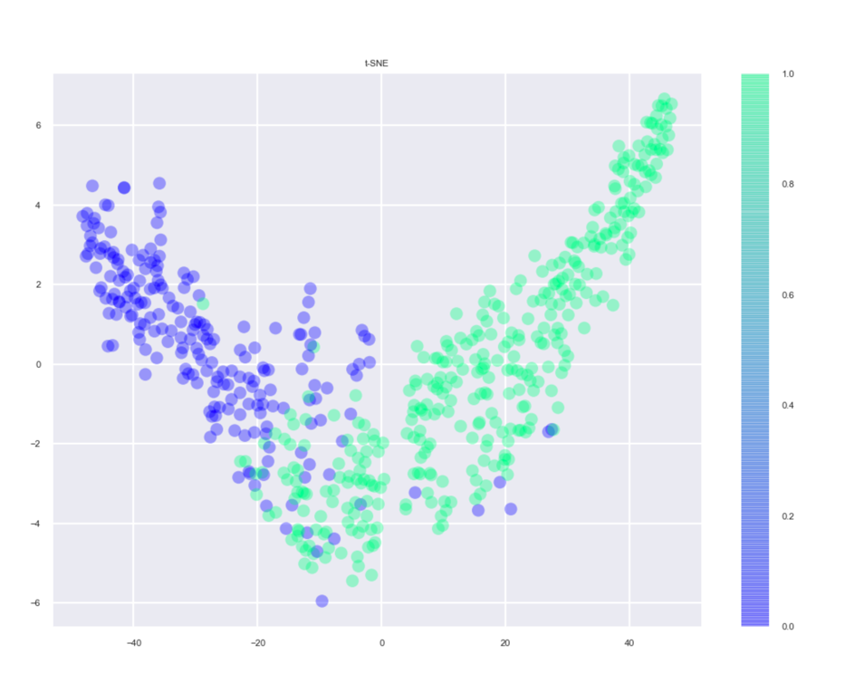


Plot of TSNE


Applying [TSNE] on scaled data is as follows:


``` {.language-markup}
tsne = TSNE(verbose=1, perplexity=40, n_iter=4000)
tsne = tsne.fit_transform(scaled_features_df)
```


Output in the console is as follows:


``` {.language-markup}
[t-SNE] Computing 121 nearest neighbors...
[t-SNE] Indexed 569 samples in 0.001s...
[t-SNE] Computed neighbors for 569 samples in 0.018s...
[t-SNE] Computed conditional probabilities for sample 569 / 569
[t-SNE] Mean sigma: 1.522404
[t-SNE] KL divergence after 250 iterations with early exaggeration: 66.959343
[t-SNE] Error after 1700 iterations: 0.875110
```


Plotting the results is as follows:


``` {.language-markup}
plt.scatter(tsne[:, 0], tsne[:, 1], c=data.target, cmap="winter", edgecolor="None", alpha=0.35)
plt.colorbar()
plt.title('t-SNE')
plt.show()
```


We get the following output from the preceding code:


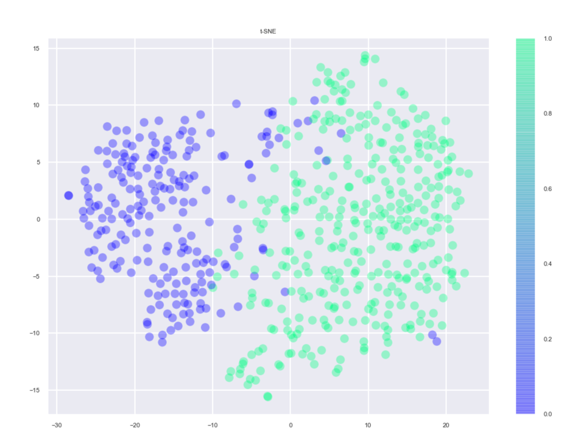


TSNE after scaling


Adding simple components together to improve the pipeline
=========================================================

Let\'s make some adjustments to the [fit\_predict] method to
include a decomposer in your pipeline, so that you can visualize
high-dimensional data if necessary:


``` {.language-markup}
def fit_predict(self, X, y=None, scaler=True, decomposer={'name': PCA, 'args':[], 'kwargs': {'n_components': 2}}):
    """
    fit_predict will train given estimator(s) and predict cluster membership for each sample
    """

    shape = X.shape
    df_type = isinstance(X, pd.core.frame.DataFrame)

    if df_type:
        column_names = X.columns
        index = X.index

    if scaler == True:
        from sklearn.preprocessing import StandardScaler
        scaler = StandardScaler()
        X = scaler.fit_transform(X)

        if df_type:
            X = pd.DataFrame(X, index=index, columns=column_names)

    if decomposer is not None:
        X = decomposer['name'](*decomposer['args'], **decomposer['kwargs']).fit_transform(X)

        if df_type:
            if decomposer['name'].__name__ == 'PCA':
                X = pd.DataFrame(X, index=index, columns=['component_' + str(i + 1) for i in
                                                          range(decomposer['kwargs']['n_components'])])
            else:
                X = pd.DataFrame(X, index=index, columns=['component_1', 'component_2'])

        # if dimensionality reduction is applied, then n_components will be set accordingly in hyperparameter configuration
        for estimator in self.estimators:
            if 'n_clusters' in estimator['kwargs'].keys():
                if decomposer['name'].__name__ == 'PCA':
                    estimator['kwargs']['n_clusters'] = decomposer['kwargs']['n_components']
                else:
                    estimator['kwargs']['n_clusters'] = 2

    # This dictionary will hold predictions for each estimator
    predictions = []
    performance_metrics = {}

    for estimator in self.estimators:
        labels = estimator['estimator'](*estimator['args'], **estimator['kwargs']).fit_predict(X)
        estimator['estimator'].n_clusters_ = len(np.unique(labels))
        metrics = self._get_cluster_metrics(estimator['estimator'].__name__, estimator['estimator'].n_clusters_, X, labels, y)
        predictions.append({estimator['estimator'].__name__: labels})
        performance_metrics[estimator['estimator'].__name__] = metrics

    self.predictions = predictions
    self.performance_metrics = performance_metrics

    return predictions, performance_metrics
```


Now, you can apply [fit\_predict] to your datasets. The following
code block shows you an example of the usage:


``` {.language-markup}
from sklearn.cluster import KMeans, DBSCAN, AgglomerativeClustering, MeanShift, estimate_bandwidth, SpectralClustering
from hdbscan import HDBSCAN

from sklearn.datasets import load_breast_cancer

data = load_breast_cancer()
X = data.data
y = data.target

# Necessary for bandwidth
bandwidth = estimate_bandwidth(X, quantile=0.1, n_samples=100)

estimators = [{'estimator': KMeans, 'args': (), 'kwargs': {'n_clusters': 5}},
                         {'estimator': DBSCAN, 'args': (), 'kwargs': {'eps': 0.3}},
                         {'estimator': AgglomerativeClustering, 'args': (), 'kwargs': {'n_clusters': 5, 'linkage': 'ward'}},
                         {'estimator': MeanShift, 'args': (), 'kwargs': {'cluster_all': False, "bandwidth": bandwidth, "bin_seeding": True}},
                         {'estimator': SpectralClustering, 'args': (), 'kwargs': {'n_clusters':5}},
                         {'estimator': HDBSCAN, 'args': (), 'kwargs': {'min_cluster_size':15}}]

unsupervised_learner = Unsupervised_AutoML(estimators)

predictions, performance_metrics = unsupervised_learner.fit_predict(X, y, decomposer=None)
```


Automated unsupervised learning is a highly experimental process,
especially if you don\'t know much about your data. As an exercise, you
can extend the [Unsupervised\_AutoML] class to try with more than
one hyperparameter set for each algorithm and visualize the results.


Summary
=======

In this lab, you learned about many different aspects when it comes
to choosing a suitable ML pipeline for a given problem.

Computational complexity, differences in training and scoring time,
linearity versus non-linearity, and algorithm, specific feature
transformations are valid considerations and it's useful to look at your
data from these perspectives.

You gained a better understanding of selecting suitable models and how
machine learning pipelines work by practicing various use cases. You are
starting to scratch the surface and this lab was a good starting
point to extend these skills.
