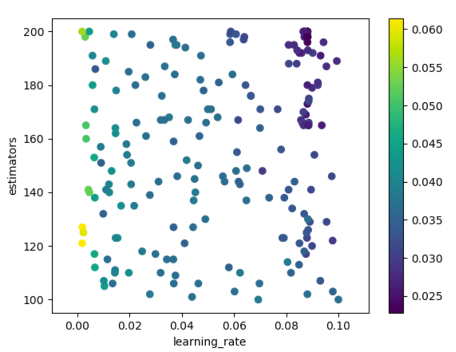

Lab 5: Hyperparameter Optimization
==================================

The following topics will be covered in this lab:

-   Configuration space for ML experiments
-   ML model parameters and hyperparameters
-   What is warm start and how it helps parameter optimization
-   Bayesian-based hyperparameter tuning
-   An example system


#### Pre-reqs:
- Google Chrome (Recommended)

#### Lab Environment
Notebooks are ready to run. All packages have been installed. There is no requirement for any setup.

All notebooks are present in `lab 05` folder.


Hyperparameters
===============

In order to better understand this process, you will start simple with
Branin function which has 3 global minima:


The following code snippet shows you the minimization of the Branin
function:


```
import numpy as np

def branin(x):

    # Branin function has 2 dimensions and it has 3 global mimima
    x1 = x[0]
    x2 = x[1]

    # Global minimum is f(x*)=0.397887 at points (-pi, 12.275), (pi,2.275) and (9.42478, 2.475)

    # Recommended values of a, b, c, r, s and t for Branin function
    a = 1
    b = 5.1 / (4 * np.pi**2)
    c = 5. / np.pi
    r = 6.
    s = 10.
    t = 1 / (8 * np.pi)

    # Calculating separate parts of the function first for verbosity
    p1 = a * (x2 - (b * x1**2) + (c * x1) - r)**2
    p2 = s * (1-t) * np.cos(x1)
    p3 = s

    # Calculating result
    ret = p1 + p2 + p3

    return ret

# minimize function from scipy.optimize will minimize a scalar function with one or more variables
from scipy.optimize import minimize

x = [5.6, 3.2]

res = minimize(branin, x)

print(res)


```


Executing the previous code snippet will result in the following output:


```
fun: 0.3978873577297417
hess_inv: array([[0.10409341, -0.0808961],
[-0.0808961, 0.56160622]])
jac: array([3.57627869e-07, -1.19209290e-07])
message: 'Optimization terminated successfully.'
nfev: 36
nit: 5
njev: 9
status: 0
success: True
x: array([3.14159268, 2.27499994])
```


Optimization is successfully terminated and the global minima can be
found at ([3.14159268], [2.27499994]) of the Branin
function. There are many solvers to use for your optimization problems,
such as **BFGS**, **L-BFGS-B**, and **SLSQP**, and these will have
different characteristics, such as consistency and complexity.
Practicing through examples will get you familiar with some of them and
will open space for further exploration.

Let\'s review the basics of optimization for ML problems. The following
formula shows what most ML problems reduce to:


In this equation, you have loss function and regularization terms to
prevent overfitting. Weights, denoted by *w*, are what you are trying to
learn during the training process and these are previously mentioned
parameters of the learning algorithm. Apart from these parameters, you
generally need to define hyperparameters, such as learning rate and
early stopping condition, which will affect the learning behavior.

Have you also noticed *α* and *β* in the loss function? These are the
parameters that you need to set before training, and they are also
hyperparameters.

Hyperparameters help you to keep a healthy balance between model bias
and model variance.

Let\'s look at a brief example of estimator parameters in
[sklearn]:


```
from sklearn.linear_model import LogisticRegression

log_reg = LogisticRegression()
log_reg.get_params()
```


The output will look as follows:


```
{'C': 1.0,
 'class_weight': None,
 'dual': False,
 'fit_intercept': True,
 'intercept_scaling': 1,
 'max_iter': 100,
 'multi_class': 'ovr',
 'n_jobs': 1,
 'penalty': 'l2',
 'random_state': None,
 'solver': 'liblinear',
 'tol': 0.0001,
 'verbose': 0,
 'warm_start': False}
```


You have 14 hyperparameters here and if you think about the possible
combinations, you will realize how big the search space can be. Your
goal is to get a best cross-validation score out of all the sets of
hyperparameters.

One of the important hyperparameters of [LogisticRegression] is
[C] and it controls the strength of regularization. Value is
inversely affecting the regularization strength, which means higher
values indicate weaker regularization.

Even if you are an expert of the algorithm that you are working with,
setting hyperparameters correctly is experimental and subjective to the
experience of the practitioner. You need to find better ways than your
heuristic approach to find a near-optimal or optimal set of
hyperparameters.

For example, you can use [GridSearchCV] or
[RandomizedSearchCV] to search the hyperparameter space in
[sklearn]:

-   [GridSearchCV] generates candidate sets from given
    hyperparameters and a range of values that they can take. Suppose
    you have the following parameter grid:


```
# Hyperparameters
param_grid = [ {'C': [0.001, 0.01, 0.1, 1, 10, 20, 50, 100],
                'penalty': ['l1', 'l2']} ]
```


Then [GridSearhCV] will generate the following parameters:


```
'params': [{'C': 0.001, 'penalty': 'l1'},
  {'C': 0.001, 'penalty': 'l2'},
  {'C': 0.01, 'penalty': 'l1'},
  {'C': 0.01, 'penalty': 'l2'},
  {'C': 0.1, 'penalty': 'l1'},
  {'C': 0.1, 'penalty': 'l2'},
  {'C': 1, 'penalty': 'l1'},
  {'C': 1, 'penalty': 'l2'},
  {'C': 10, 'penalty': 'l1'},
  {'C': 10, 'penalty': 'l2'},
  {'C': 20, 'penalty': 'l1'},
  {'C': 20, 'penalty': 'l2'},
  {'C': 50, 'penalty': 'l1'},
  {'C': 50, 'penalty': 'l2'},
  {'C': 100, 'penalty': 'l1'},
  {'C': 100, 'penalty': 'l2'}]
```


It will perform an exhaustive search to find a best cross-validation
score.

-   [RandomizedSearchCV] performs its search differently to
    [GridSearchCV]. Instead of searching the hyperparameter space
    exhaustively, it samples parameter settings from specified
    distributions. You should construct your parameter grid in the
    following way:


```
# Hyperparameters
param_grid = {'C': sp_randint(1, 100),
                'penalty': ['l1', 'l2']}
```


Have you noticed [sp\_randint]? It will allow
[RandomizedSearchCV] to draw random variables from uniform
distribution and parameters will be created as follows:


```
'params': [{'C': 6, 'penalty': 'l2'},
  {'C': 97, 'penalty': 'l2'},
  {'C': 92, 'penalty': 'l2'},
  {'C': 62, 'penalty': 'l1'},
  {'C': 63, 'penalty': 'l2'},
  {'C': 5, 'penalty': 'l2'},
  {'C': 7, 'penalty': 'l1'},
  {'C': 45, 'penalty': 'l1'},
  {'C': 77, 'penalty': 'l2'},
  {'C': 12, 'penalty': 'l1'},
  {'C': 72, 'penalty': 'l2'},
  {'C': 28, 'penalty': 'l1'},
  {'C': 7, 'penalty': 'l2'},
  {'C': 65, 'penalty': 'l1'},
  {'C': 32, 'penalty': 'l1'},
  {'C': 84, 'penalty': 'l1'},
  {'C': 27, 'penalty': 'l1'},
  {'C': 12, 'penalty': 'l1'},
  {'C': 21, 'penalty': 'l1'},
  {'C': 65, 'penalty': 'l1'}],
```


Let\'s look at an example of the usage, both for [GridSearchCV]
and [RandomizedSearchCV].

The following snippet shows you [GridSearchCV]:


```
from sklearn.linear_model import LogisticRegression

log_reg = LogisticRegression()

# Hyperparameters
param_grid = {'C': [0.001, 0.01, 0.1, 1, 10, 20, 50, 100],
                'penalty': ['l1', 'l2']}

from sklearn.model_selection import GridSearchCV

n_folds = 5
estimator = GridSearchCV(log_reg,param_grid, cv=n_folds)

from sklearn import datasets
iris = datasets.load_iris()
X = iris.data
Y = iris.target

estimator.fit(X, Y)
```


You will see the following output:


```
GridSearchCV(cv=5, error_score='raise',
       estimator=LogisticRegression(C=1.0, class_weight=None, dual=False, fit_intercept=True,
          intercept_scaling=1, max_iter=100, multi_class='ovr', n_jobs=1,
          penalty='l2', random_state=None, solver='liblinear', tol=0.0001,
          verbose=0, warm_start=False),
       fit_params=None, iid=True, n_jobs=1,
       param_grid=[{'C': [0.001, 0.01, 0.1, 1, 10, 20, 50, 100], 'penalty': ['l1', 'l2']}],
       pre_dispatch='2*n_jobs', refit=True, return_train_score=True,
       scoring=None, verbose=0)
```


Once training is done, you can see the best performing estimator
settings:


```
estimator.best_estimator_
```


The preceding code will generate the following output:


```
LogisticRegression(C=10, class_weight=None, dual=False, fit_intercept=True,
intercept_scaling=1, max_iter=100, multi_class='ovr', n_jobs=1,
penalty='l1', random_state=None, solver='liblinear', tol=0.0001,
verbose=0, warm_start=False)
```


You can also see the best score:


```
estimator.best_score_
```


With the following output:


```
0.98
```


You can also see all results by checking [cv\_results\_]:


```
estimator.cv_results_
```


This will give you various metrics for each training run:


```
{'mean_fit_time': array([0.00039144, 0.00042701, 0.00036378, 0.00043044, 0.00145531,
        0.00046387, 0.00670047, 0.00056334, 0.00890565, 0.00064907,
        0.00916181, 0.00063758, 0.01110044, 0.00076027, 0.01196856,
        0.00084472]),
 'mean_score_time': array([0.00017729, 0.00018134, 0.00016704, 0.00016623, 0.00017071,
        0.00016556, 0.00024438, 0.00017123, 0.00020232, 0.00018559,
        0.00020504, 0.00016532, 0.00024428, 0.00019045, 0.00023465,
        0.00023274]),
 'mean_test_score': array([0.33333333, 0.40666667, 0.33333333, 0.66666667, 0.77333333,
        0.82 , 0.96 , 0.96 , 0.98 , 0.96666667,
        0.96666667, 0.96666667, 0.96666667, 0.97333333, 0.96 ,
        0.98 ]),
 'mean_train_score': array([0.33333333, 0.40166667, 0.33333333, 0.66666667, 0.775 ,
        0.83166667, 0.96333333, 0.96333333, 0.97333333, 0.97333333,
        0.97333333, 0.97666667, 0.975 , 0.97833333, 0.975 ,
        0.98 ]),
 'param_C': masked_array(data=[0.001, 0.001, 0.01, 0.01, 0.1, 0.1, 1, 1, 10, 10, 20,
                    20, 50, 50, 100, 100],
              mask=[False, False, False, False, False, False, False, False,
                    False, False, False, False, False, False, False, False],
        fill_value='?',
             dtype=object),
 'param_penalty': masked_array(data=['l1', 'l2', 'l1', 'l2', 'l1', 'l2', 'l1', 'l2', 'l1',
                    'l2', 'l1', 'l2', 'l1', 'l2', 'l1', 'l2'],
              mask=[False, False, False, False, False, False, False, False,
                    False, False, False, False, False, False, False, False],
        fill_value='?',
             dtype=object),
 'params': [{'C': 0.001, 'penalty': 'l1'},
  {'C': 0.001, 'penalty': 'l2'},
  {'C': 0.01, 'penalty': 'l1'},
  {'C': 0.01, 'penalty': 'l2'},
  {'C': 0.1, 'penalty': 'l1'},
  {'C': 0.1, 'penalty': 'l2'},
  {'C': 1, 'penalty': 'l1'},
  {'C': 1, 'penalty': 'l2'},
  {'C': 10, 'penalty': 'l1'},
  {'C': 10, 'penalty': 'l2'},
  {'C': 20, 'penalty': 'l1'},
  {'C': 20, 'penalty': 'l2'},
  {'C': 50, 'penalty': 'l1'},
  {'C': 50, 'penalty': 'l2'},
  {'C': 100, 'penalty': 'l1'},
  {'C': 100, 'penalty': 'l2'}],
 'rank_test_score': array([15, 14, 15, 13, 12, 11, 8, 8, 1, 4, 4, 4, 4, 3, 8, 1],
       dtype=int32),
 'split0_test_score': array([0.33333333, 0.36666667, 0.33333333, 0.66666667, 0.7 ,
        0.76666667, 1. , 1. , 1. , 1. ,
        1. , 1. , 1. , 1. , 0.96666667,
        1. ]),
 'split0_train_score': array([0.33333333, 0.41666667, 0.33333333, 0.66666667, 0.775 ,
        0.825 , 0.95 , 0.95 , 0.95 , 0.96666667,
        0.95 , 0.975 , 0.95833333, 0.975 , 0.95833333,
        0.975 ]),
 'split1_test_score': array([0.33333333, 0.46666667, 0.33333333, 0.66666667, 0.8 ,
        0.86666667, 0.96666667, 0.96666667, 1. , 1. ,
        0.96666667, 1. , 0.96666667, 1. , 0.96666667,
        1. ]),
 'split1_train_score': array([0.33333333, 0.35833333, 0.33333333, 0.66666667, 0.775 ,
        0.825 , 0.95833333, 0.96666667, 0.975 , 0.96666667,
        0.975 , 0.975 , 0.975 , 0.975 , 0.975 ,
        0.975 ]),
 'split2_test_score': array([0.33333333, 0.36666667, 0.33333333, 0.66666667, 0.8 ,
        0.83333333, 0.93333333, 0.93333333, 0.96666667, 0.93333333,
        0.93333333, 0.93333333, 0.93333333, 0.93333333, 0.93333333,
        0.96666667]),
 'split2_train_score': array([0.33333333, 0.41666667, 0.33333333, 0.66666667, 0.76666667,
        0.83333333, 0.96666667, 0.96666667, 0.975 , 0.975 ,
        0.975 , 0.98333333, 0.975 , 0.98333333, 0.975 ,
        0.98333333]),
 'split3_test_score': array([0.33333333, 0.46666667, 0.33333333, 0.66666667, 0.8 ,
        0.83333333, 0.9 , 0.9 , 0.93333333, 0.9 ,
        0.93333333, 0.9 , 0.93333333, 0.93333333, 0.93333333,
        0.93333333]),
 'split3_train_score': array([0.33333333, 0.39166667, 0.33333333, 0.66666667, 0.775 ,
        0.84166667, 0.975 , 0.975 , 0.99166667, 0.98333333,
        0.99166667, 0.98333333, 0.99166667, 0.98333333, 0.99166667,
        0.99166667]),
 'split4_test_score': array([0.33333333, 0.36666667, 0.33333333, 0.66666667, 0.76666667,
        0.8 , 1. , 1. , 1. , 1. ,
        1. , 1. , 1. , 1. , 1. ,
        1. ]),
 'split4_train_score': array([0.33333333, 0.425 , 0.33333333, 0.66666667, 0.78333333,
        0.83333333, 0.96666667, 0.95833333, 0.975 , 0.975 ,
        0.975 , 0.96666667, 0.975 , 0.975 , 0.975 ,
        0.975 ]),
 'std_fit_time': array([7.66660734e-05, 3.32198455e-05, 1.98168153e-05, 6.91923414e-06,
        4.74922317e-04, 2.65661212e-05, 1.03221712e-03, 3.79795334e-05,
        1.86899641e-03, 8.53752397e-05, 1.93386463e-03, 2.95752073e-05,
        2.91377734e-03, 5.70420424e-05, 3.59721435e-03, 9.67829087e-05]),
 'std_score_time': array([1.28883712e-05, 2.39771817e-05, 4.81959487e-06, 2.47955322e-06,
        1.34236224e-05, 2.41545203e-06, 5.64869920e-05, 8.94803700e-06,
        4.10209125e-05, 3.35513820e-05, 3.04168290e-05, 2.87924369e-06,
        4.91685012e-05, 1.62987656e-05, 4.23611246e-05, 7.26868455e-05]),
 'std_test_score': array([0. , 0.04898979, 0. , 0. , 0.03887301,
        0.03399346, 0.03887301, 0.03887301, 0.02666667, 0.0421637 ,
        0.02981424, 0.0421637 , 0.02981424, 0.03265986, 0.02494438,
        0.02666667]),
 'std_train_score': array([0. , 0.02438123, 0. , 0. , 0.00527046,
        0.0062361 , 0.00849837, 0.00849837, 0.01333333, 0.0062361 ,
        0.01333333, 0.0062361 , 0.01054093, 0.00408248, 0.01054093,
        0.00666667])}
```


Let\'s see how it works for [RandomizedSearchCV]:


```
from sklearn.model_selection import RandomizedSearchCV
from scipy.stats import randint as sp_randint

# Hyperparameters
param_grid = {'C': sp_randint(1, 100),
                'penalty': ['l1', 'l2']}

n_iter_search = 20
n_folds = 5
estimator = RandomizedSearchCV(log_reg, param_distributions=param_grid, n_iter=n_iter_search, cv=n_folds)

estimator.fit(X, Y)
```


The preceding code generates the following output similar to
[GridSearchCV]:


```
RandomizedSearchCV(cv=5, error_score='raise',
          estimator=LogisticRegression(C=1.0, class_weight=None, dual=False, fit_intercept=True,
          intercept_scaling=1, max_iter=100, multi_class='ovr', n_jobs=1,
          penalty='l2', random_state=None, solver='liblinear', tol=0.0001,
          verbose=0, warm_start=False),
          fit_params=None, iid=True, n_iter=20, n_jobs=1,
          param_distributions={'C': <scipy.stats._distn_infrastructure.rv_frozen object at 0x1176d4c88>, 'penalty': ['l1', 'l2']},
          pre_dispatch='2*n_jobs', random_state=None, refit=True,
          return_train_score=True, scoring=None, verbose=0)
```


Let\'s also see [best\_estimator\_]:


```
estimator.best_estimator_
```


The preceding code generates the following output:


```
LogisticRegression(C = 95, class_weight=None, dual=False, fit_intercept=True,
          intercept_scaling=1, max_iter=100, multi_class='ovr', n_jobs=1,
          penalty ='l2', random_state=None, solver='liblinear', tol=0.0001,
          verbose = 0, warm_start=False)
```


The [estimator.best\_score\_] shows the following output:


```
0.98
```


[RandomizedSearchCV] has the same best score but one thing to note
here is that the best performing estimator settings has [C = 95],
a value which is hard to find since people generally try round values
such as 10, 100, or 1000 when constructing the parameter grid manually.

You can similarly check results of cross-validation with
[estimator.cv\_results\_]:


```
{'mean_fit_time': array([0.0091342 , 0.00065241, 0.00873041, 0.00068126, 0.00082703,
        0.01093817, 0.00067267, 0.00961967, 0.00883713, 0.00069351,
        0.01048965, 0.00068388, 0.01074204, 0.0090354 , 0.00983639,
        0.01081419, 0.01014266, 0.00067706, 0.01015086, 0.00067825]),
 'mean_score_time': array([0.00026116, 0.0001647 , 0.00020576, 0.00017738, 0.00022368,
        0.00023923, 0.00016236, 0.00017295, 0.00026078, 0.00021319,
        0.00028219, 0.00018024, 0.00027289, 0.00025878, 0.00020723,
        0.00020337, 0.00023756, 0.00017438, 0.00028505, 0.0001936 ]),
 'mean_test_score': array([0.96666667, 0.97333333, 0.97333333, 0.98 , 0.97333333,
        0.96666667, 0.97333333, 0.96666667, 0.98 , 0.97333333,
        0.96666667, 0.98 , 0.96666667, 0.96666667, 0.96666667,
        0.96666667, 0.96666667, 0.98 , 0.96666667, 0.96666667]),
 'mean_train_score': array([0.97333333, 0.97833333, 0.97333333, 0.98 , 0.97833333,
        0.975 , 0.97833333, 0.975 , 0.97333333, 0.97833333,
        0.975 , 0.98 , 0.975 , 0.97333333, 0.975 ,
        0.975 , 0.975 , 0.97833333, 0.975 , 0.97666667]),
 'param_C': masked_array(data=[20, 53, 5, 95, 50, 71, 41, 43, 8, 30, 70, 91, 53, 15,
                    35, 41, 56, 82, 90, 27],
              mask=[False, False, False, False, False, False, False, False,
                    False, False, False, False, False, False, False, False,
                    False, False, False, False],
        fill_value='?',
             dtype=object),
 'param_penalty': masked_array(data=['l1', 'l2', 'l1', 'l2', 'l2', 'l1', 'l2', 'l1', 'l1',
                    'l2', 'l1', 'l2', 'l1', 'l1', 'l1', 'l1', 'l1', 'l2',
                    'l1', 'l2'],
              mask=[False, False, False, False, False, False, False, False,
                    False, False, False, False, False, False, False, False,
                    False, False, False, False],
        fill_value='?',
             dtype=object),
 'params': [{'C': 20, 'penalty': 'l1'},
  {'C': 53, 'penalty': 'l2'},
  {'C': 5, 'penalty': 'l1'},
  {'C': 95, 'penalty': 'l2'},
  {'C': 50, 'penalty': 'l2'},
  {'C': 71, 'penalty': 'l1'},
  {'C': 41, 'penalty': 'l2'},
  {'C': 43, 'penalty': 'l1'},
  {'C': 8, 'penalty': 'l1'},
  {'C': 30, 'penalty': 'l2'},
  {'C': 70, 'penalty': 'l1'},
  {'C': 91, 'penalty': 'l2'},
  {'C': 53, 'penalty': 'l1'},
  {'C': 15, 'penalty': 'l1'},
  {'C': 35, 'penalty': 'l1'},
  {'C': 41, 'penalty': 'l1'},
  {'C': 56, 'penalty': 'l1'},
  {'C': 82, 'penalty': 'l2'},
  {'C': 90, 'penalty': 'l1'},
  {'C': 27, 'penalty': 'l2'}],
 'rank_test_score': array([10, 5, 5, 1, 5, 10, 5, 10, 1, 5, 10, 1, 10, 10, 10, 10, 10,
         1, 10, 10], dtype=int32),
 'split0_test_score': array([1., 1., 1., 1., 1., 1., 1., 1., 1., 1., 1., 1., 1., 1., 1., 1., 1.,
        1., 1., 1.]),
 'split0_train_score': array([0.95 , 0.975 , 0.95833333, 0.975 , 0.975,
        0.95833333, 0.975 , 0.95833333, 0.95833333, 0.975 ,
        0.95833333, 0.975 , 0.95833333, 0.95 , 0.95833333,
        0.95833333, 0.95833333, 0.975 , 0.95833333, 0.975 ]),
 'split1_test_score': array([0.96666667, 1. , 1. , 1. , 1. ,
        0.96666667, 1. , 0.96666667, 1. , 1. ,
        0.96666667, 1. , 0.96666667, 0.96666667, 0.96666667,
        0.96666667, 0.96666667, 1. , 0.96666667, 1. ]),
 'split1_train_score': array([0.975, 0.975, 0.975, 0.975, 0.975, 0.975, 0.975, 0.975, 0.975,
        0.975, 0.975, 0.975, 0.975, 0.975, 0.975, 0.975, 0.975, 0.975,
        0.975, 0.975]),
 'split2_test_score': array([0.93333333, 0.93333333, 0.93333333, 0.96666667, 0.93333333,
        0.93333333, 0.93333333, 0.93333333, 0.96666667, 0.93333333,
        0.93333333, 0.96666667, 0.93333333, 0.93333333, 0.93333333,
        0.93333333, 0.93333333, 0.96666667, 0.93333333, 0.93333333]),
 'split2_train_score': array([0.975 , 0.98333333, 0.975 , 0.98333333, 0.98333333,
        0.975 , 0.98333333, 0.975 , 0.975 , 0.98333333,
        0.975 , 0.98333333, 0.975 , 0.975 , 0.975 ,
        0.975 , 0.975 , 0.98333333, 0.975 , 0.98333333]),
 'split3_test_score': array([0.93333333, 0.93333333, 0.93333333, 0.93333333, 0.93333333,
        0.93333333, 0.93333333, 0.93333333, 0.93333333, 0.93333333,
        0.93333333, 0.93333333, 0.93333333, 0.93333333, 0.93333333,
        0.93333333, 0.93333333, 0.93333333, 0.93333333, 0.9 ]),
 'split3_train_score': array([0.99166667, 0.98333333, 0.98333333, 0.99166667, 0.98333333,
        0.99166667, 0.98333333, 0.99166667, 0.98333333, 0.98333333,
        0.99166667, 0.99166667, 0.99166667, 0.99166667, 0.99166667,
        0.99166667, 0.99166667, 0.98333333, 0.99166667, 0.98333333]),
 'split4_test_score': array([1., 1., 1., 1., 1., 1., 1., 1., 1., 1., 1., 1., 1., 1., 1., 1., 1.,
        1., 1., 1.]),
 'split4_train_score': array([0.975 , 0.975 , 0.975 , 0.975 , 0.975 ,
        0.975 , 0.975 , 0.975 , 0.975 , 0.975 ,
        0.975 , 0.975 , 0.975 , 0.975 , 0.975 ,
        0.975 , 0.975 , 0.975 , 0.975 , 0.96666667]),
 'std_fit_time': array([2.16497645e-03, 5.39653699e-05, 1.00355397e-03, 4.75298306e-05,
        9.75692490e-05, 2.63689357e-03, 7.04799517e-05, 2.52499464e-03,
        1.92020413e-03, 6.05031761e-05, 1.78589024e-03, 5.85074724e-05,
        2.28621528e-03, 2.19771432e-03, 1.96957384e-03, 3.06769107e-03,
        1.15194163e-03, 2.10475943e-05, 1.33958298e-03, 4.09795418e-05]),
 'std_score_time': array([4.62378644e-05, 1.66142000e-06, 3.40806829e-05, 1.73623737e-05,
        5.26490415e-05, 4.75790783e-05, 1.48510089e-06, 7.53432889e-06,
        3.86445261e-05, 8.16042958e-05, 4.98746594e-05, 1.93474877e-05,
        2.82650630e-05, 2.54787261e-05, 2.55031663e-05, 3.09080976e-05,
        2.99830109e-05, 7.89824294e-06, 2.02431836e-05, 4.25877252e-05]),
 'std_test_score': array([0.02981424, 0.03265986, 0.03265986, 0.02666667, 0.03265986,
        0.02981424, 0.03265986, 0.02981424, 0.02666667, 0.03265986,
        0.02981424, 0.02666667, 0.02981424, 0.02981424, 0.02981424,
        0.02981424, 0.02981424, 0.02666667, 0.02981424, 0.0421637 ]),
 'std_train_score': array([0.01333333, 0.00408248, 0.00816497, 0.00666667, 0.00408248,
        0.01054093, 0.00408248, 0.01054093, 0.00816497, 0.00408248,
        0.01054093, 0.00666667, 0.01054093, 0.01333333, 0.01054093,
        0.01054093, 0.01054093, 0.00408248, 0.01054093, 0.0062361 ])}
```


Cross-validation results may look messy but you can import them to
[pandas] DataFrame:


```
import pandas as pd

df = pd.DataFrame(estimator.cv_results_)

df.head()
```


We can see a couple of records as follows:


```
mean_fit_time mean_score_time mean_test_score mean_train_score param_C \
0 0.009134 0.000261 0.966667 0.973333 20 
1 0.000652 0.000165 0.973333 0.978333 53 
2 0.008730 0.000206 0.973333 0.973333 5 
3 0.000681 0.000177 0.980000 0.980000 95 
4 0.000827 0.000224 0.973333 0.978333 50 
  param_penalty params rank_test_score \
0 l1 {'C': 20, 'penalty': 'l1'} 10 
1 l2 {'C': 53, 'penalty': 'l2'} 5 
2 l1 {'C': 5, 'penalty': 'l1'} 5 
3 l2 {'C': 95, 'penalty': 'l2'} 1 
4 l2 {'C': 50, 'penalty': 'l2'} 5 
   split0_test_score split0_train_score ... split2_test_score \
0 1.0 0.950000 ... 0.933333 
1 1.0 0.975000 ... 0.933333 
2 1.0 0.958333 ... 0.933333 
3 1.0 0.975000 ... 0.966667 
4 1.0 0.975000 ... 0.933333 
   split2_train_score split3_test_score split3_train_score \
0 0.975000 0.933333 0.991667 
1 0.983333 0.933333 0.983333 
2 0.975000 0.933333 0.983333 
3 0.983333 0.933333 0.991667 
4 0.983333 0.933333 0.983333 
   split4_test_score split4_train_score std_fit_time std_score_time \
0 1.0 0.975 0.002165 0.000046 
1 1.0 0.975 0.000054 0.000002 
2 1.0 0.975 0.001004 0.000034 
3 1.0 0.975 0.000048 0.000017 
4 1.0 0.975 0.000098 0.000053 
   std_test_score std_train_score 
0 0.029814 0.013333 
1 0.032660 0.004082 
2 0.032660 0.008165 
3 0.026667 0.006667 
4 0.032660 0.004082 
[5 rows x 22 columns]
```


You can filter DataFrame to see where [mean\_test\_score] is at
its maximum:


```
df[df['mean_test_score'] == df['mean_test_score'].max()]
```


This outputs the following:


```
    mean_fit_time mean_score_time mean_test_score mean_train_score param_C \
3 0.000681 0.000177 0.98 0.980000 95 
8 0.008837 0.000261 0.98 0.973333 8 
11 0.000684 0.000180 0.98 0.980000 91 
17 0.000677 0.000174 0.98 0.978333 82 
   param_penalty params rank_test_score \
3 l2 {'C': 95, 'penalty': 'l2'} 1 
8 l1 {'C': 8, 'penalty': 'l1'} 1 
11 l2 {'C': 91, 'penalty': 'l2'} 1 
17 l2 {'C': 82, 'penalty': 'l2'} 1 
    split0_test_score split0_train_score ... split2_test_score \
3 1.0 0.975000 ... 0.966667 
8 1.0 0.958333 ... 0.966667 
11 1.0 0.975000 ... 0.966667 
17 1.0 0.975000 ... 0.966667 
    split2_train_score split3_test_score split3_train_score \
3 0.983333 0.933333 0.991667 
8 0.975000 0.933333 0.983333 
11 0.983333 0.933333 0.991667 
17 0.983333 0.933333 0.983333 
    split4_test_score split4_train_score std_fit_time std_score_time \
3 1.0 0.975 0.000048 0.000017 
8 1.0 0.975 0.001920 0.000039 
11 1.0 0.975 0.000059 0.000019 
17 1.0 0.975 0.000021 0.000008 
    std_test_score std_train_score 
3 0.026667 0.006667 
8 0.026667 0.008165 
11 0.026667 0.006667 
17 0.026667 0.004082 
[4 rows x 22 columns]
```


As an exercise, you can create a parameter grid for
[GradientBoostingClassifier] with the following hyperparameters,
to experiment with both [GridSearchCV] and
[RandomizedSearchCV]:

-   [learning\_rate] (default=0.1)---Boosting learning rate
-   [n\_estimators] (default=100)---Number of boosted trees to fit
-   [max\_depth] (default=3)---Maximum tree depth


Warm start
==========

In terms of **Automated ML** (**AutoML**) pipelines, hyperparameter
search space can grow really quickly and an exhaustive search becomes
impracticable with limited time and finite resources. You need smarter
ways to perform this task, especially if you have a large dataset with a
complex model working on it. If you find yourself in this kind of
situation, a [GridSeachCV] instances exhaustive search won\'t be
feasible, or random parameter draws of [RandomizedSearchCV] might
not give you the best results given limited time.

The basic idea of warm start is to use the information gained from
previous training runs to identify smarter starting points for the next
training run.

For example, [LogisticRegression] has a [warm\_start]
parameter, which is set to [False] by default. The following
example shows you the training time the first time, and after the
parameter update when it\'s set to [False]:


```
from sklearn.linear_model import LogisticRegression

log_reg = LogisticRegression(C=10, tol=0.00001)

from sklearn import datasets
iris = datasets.load_iris()
X = iris.data
Y = iris.target

from time import time
start = time()
log_reg.fit(X, Y)
end = time()
print("Time: {}".format(end - start))
# Time: 0.0009272098541259766

log_reg.set_params(C=20)
# LogisticRegression(C=100, class_weight=None, dual=False, fit_intercept=True,
# intercept_scaling=1, max_iter=100, multi_class='ovr', n_jobs=1,
# penalty='l2', random_state=None, solver='liblinear', tol=0.0001,
# verbose=0, warm_start=False)

start = time()
log_reg.fit(X, Y)
end = time()
print("Time: {}".format(end - start))
# Time: 0.0012941360473632812
```


The default solver for [LogisticRegression] is [liblinear],
which will re-initialize the weights before every new fit, but other
solvers such as [lbfgs], [newton-cg], [sag], and
[saga] can take advantage of the [warm\_start] and reduce
the computational time by using the information from previous fits.

The following code snippet shows you a small example of how it works in
practice:


```
log_reg = LogisticRegression(C=10, solver='sag', warm_start=True, max_iter=10000)

start = time()
log_reg.fit(X, Y)
end = time()
print("Time: {}".format(end - start))
# Time: 0.043714046478271484

log_reg.set_params(C=20)

start = time()
log_reg.fit(X, Y)
end = time()
print("Time: {}".format(end - start))
# Time: 0.020781755447387695
```


Bayesian-based hyperparameter tuning
====================================

There are a couple of approaches to be used when it comes to model-based
hyperparameter tuning and these approaches come together under
**Sequential Model-based Global Optimization** (**SMBO**).

When you think about [GridSearchCV] or [RandomizedSearchCV],
you may rightfully feel that the way they cross validate hyperparameters
is not very smart. Both pre-define sets of hyperparameters to be
validated during training time and are not designed to benefit from the
information that they might get during training. If you could find a way
to learn from previous iterations of hyperparameter validation based on
model performance, then you would have an idea about which
hyperparameter set is likely to give a better performance in the next
iteration.

SMBO approaches emanated from this reasoning and Bayesian-based
hyperparameter optimization is one of these approaches.

**Sequential Model-based Algorithm Configuration** (**SMAC**) is a great
library that uses Bayesian optimization to configure hyperparameters of
a given ML algorithm, and it\'s very easy to use.

The following snippet shows you how to optimize the [branin]
function that you used at the beginning with SMAC:


```
from smac.facade.func_facade import fmin_smac

x, cost, _ = fmin_smac(func=branin, # function
                           x0=[3.2, 4.5], # default configuration
                           bounds=[(-5, 10), (0, 15)], # limits
                           maxfun=500, # maximum number of evaluations
                           rng=3) # random seed


print(x, cost)
# [3.12848204 2.33810374] 0.4015064637498025
```


An example system
=================

In this section, you will write a wrapper function to optimize the
XGBoost algorithm hyperparameters to improve performance on the [Breast
Cancer Wisconsin] dataset:


```
# Importing necessary libraries
import numpy as np
from xgboost import XGBClassifier
from sklearn import datasets
from sklearn.model_selection import cross_val_score

# Importing ConfigSpace and different types of parameters
from smac.configspace import ConfigurationSpace
from ConfigSpace.hyperparameters import CategoricalHyperparameter, \
    UniformFloatHyperparameter, UniformIntegerHyperparameter
from ConfigSpace.conditions import InCondition

# Import SMAC-utilities
from smac.tae.execute_func import ExecuteTAFuncDict
from smac.scenario.scenario import Scenario
from smac.facade.smac_facade import SMAC

# Creating configuration space.
# Configuration space will hold all of your hyperparameters
cs = ConfigurationSpace()

# Defining hyperparameters and range of values that they can take
learning_rate = UniformFloatHyperparameter("learning_rate", 0.001, 0.1, default_value=0.1)
n_estimators = UniformIntegerHyperparameter("n_estimators", 100, 200, default_value=100)

# Adding hyperparameters to configuration space
cs.add_hyperparameters([learning_rate, n_estimators])

# Loading data set
wbc_dataset = datasets.load_breast_cancer()

# Creating function to cross validate XGBoost classifier given the configuration space
def xgboost_from_cfg(cfg):
    """ Creates a XGBoost based on a configuration and evaluates it on the
    Wisconsin Breast Cancer-dataset using cross-validation.

    Parameters:
    -----------
    cfg: Configuration (ConfigSpace.ConfigurationSpace.Configuration)
        Configuration containing the parameters.
        Configurations are indexable!
    Returns:
    --------
    A crossvalidated mean score for the svm on the loaded data-set.
    """

    cfg = {k: cfg[k] for k in cfg if cfg[k]}

    clf = XGBClassifier(**cfg, eval_metric='auc', early_stopping_rounds=50, random_state=42)

    scores = cross_val_score(clf, wbc_dataset.data, wbc_dataset.target, cv=5)

    return 1 - np.mean(scores) # Minimize!


# Creating Scenario object
scenario = Scenario({"run_obj": "quality",
                     "runcount-limit": 200, # maximum function evaluations
                     "cs": cs, # configuration space
                     "deterministic": "true"
                     })


# SMAC object handles bayesian optimization loop
print("Please wait until optimization is finished")
smac = SMAC(scenario=scenario, rng=np.random.RandomState(42),
        tae_runner=xgboost_from_cfg)

incumbent = smac.optimize()

# Let's see the best performing hyperparameter values
print(incumbent)
# Configuration:
# learning_rate, Value: 0.08815217130807515
# n_estimators, Value: 196

# You can see the errpr rate of optimized hyperparameters
inc_value = xgboost_from_cfg(incumbent)

print("Optimized Value: %.2f" % (inc_value))
# 0.02
```


Great! Now you know how to create your configuration space, add your
hyperparameter and define the value ranges for each of them. After
configuration is done, you\'ve seen how to create a scenario object and
use SMAC to optimize hyperparameters of a given estimator.

You can use the SMAC object to get a run history and see the cost of
each configuration:


```
param_1 = []
param_2 = []
costs = []

for k,v in smac.runhistory.config_ids.items():
    param_1.append(k._values['learning_rate'])
    param_2.append(k._values['n_estimators'])
    costs.append(smac.runhistory.cost_per_config[v])

print(len(param_1), len(param_2), len(costs))

import matplotlib.pyplot as plt
import matplotlib.cm as cm

sc = plt.scatter(param_1, param_2, c=costs)
plt.colorbar(sc)
plt.show()
```


The following diagram shows you different values that
[learning\_rate] and [n\_estimators] took during
optimization and their associated cost:





You can see that the best configurations were \~0.09 for
[learning\_rate] and \~200 for [n\_estimators].


Summary
=======

In this lab, you learned about model parameters, hyperparameters,
and configuration space. Let\'s review them quickly:

-   **Model parameters**: You can consider these as parameters to be
    learned during training time
-   **Model hyperparameters**: These are the parameters that you should
    define before the training run starts
-   **Configuration space parameters**: These parameters refer to any
    other parameter used for the environment that hosts your experiment

You have been introduced to common hyperparameter optimization methods,
such as grid search and randomized search. Grid search and randomized
search do not use the information produced from previous training runs
and this is a disadvantage that Bayesian-based optimization methods
address.
