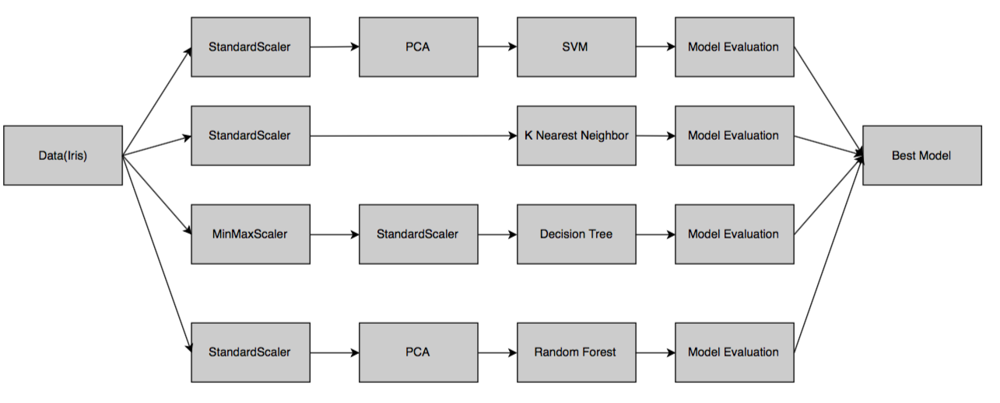

Lab 6: Creating AutoML Pipelines
================================

In this lab, we will work on the following topics:

-   Introduction to ML pipelines
-   Building a simple pipeline
-   Function transformer
-   Building a complex pipeline using weak learners and ensembles


#### Pre-reqs:
- Google Chrome (Recommended)

#### Lab Environment
Notebooks are ready to run. All packages have been installed. There is no requirement for any setup.

All notebooks are present in `lab 06` folder.


Let\'s design a very simple pipeline using scikit-learn.


A simple pipeline
=================

We will first import a dataset known as [Iris], which is already
available in scikit-learn\'s sample dataset library
(<http://scikit-learn.org/stable/auto_examples/datasets/plot_iris_dataset.html>).
The dataset consists of four features and has 150 rows. We will be
developing the following steps in a pipeline to train our model using
the [Iris] dataset. The problem statement is to predict the
species of an [Iris] data using four different features:


In this pipeline, we will use a [MinMaxScaler] method to scale the
input data and logistic regression to predict the species of the
[Iris]. The model will then be evaluated based on the accuracy
measure:

1.  The first step is to import various libraries from scikit-learn that
    will provide methods to accomplish our task. We have learn about all
    this in previous labs. The only addition is the [Pipeline]
    method from [sklearn.pipeline]. This will provide us with
    necessary methods needed to create an ML pipeline:


```
from sklearn.datasets import load_iris
from sklearn.preprocessing import MinMaxScaler
from sklearn.linear_model import LogisticRegression
from sklearn.model_selection import train_test_split
from sklearn.pipeline import Pipeline
```


2.  The next step is to load the [iris] data and split it into
    training and test dataset. In this example, we will use 80% of the
    dataset to train the model and the remaining 20% to test the
    accuracy of the model. We can use the [shape] function to view
    the dimension of the dataset:


```
# Load and split the data
iris = load_iris()
X_train, X_test, y_train, y_test = train_test_split(iris.data, iris.target, test_size=0.2, random_state=42)
X_train.shape
```


3.  The following result shows the training dataset having [4]
    columns and [120] rows, which equates to 80% of the
    [Iris] dataset and is as expected:


4.  Next, we print the dataset to take a glance at the data:


```
print(X_train)
```


The preceding code provides the following output:


5.  The next step is to create a pipeline. The pipeline object is in the
    form of (key, value) pairs. Key is a string that has the name for a
    particular step, and value is the name of the function or actual
    method. In the following code snippet, we have named the
    [MinMaxScaler()] method as [minmax] and
    [LogisticRegression(random\_state=42)] as [lr]:


```
pipe_lr = Pipeline([('minmax', MinMaxScaler()),
 ('lr', LogisticRegression(random_state=42))])
```


6.  Then, we fit the pipeline object---[pipe\_lr]---to the
    training dataset:


```
pipe_lr.fit(X_train, y_train)
```


7.  When we execute the preceding code, we get the following output,
    which shows the final structure of the fitted model that was built:


8.  The last step is to score the model on the [test] dataset
    using the [score] method:


```
score = pipe_lr.score(X_test, y_test)
print('Logistic Regression pipeline test accuracy: %.3f' % score)
```


As we can note from the following results, the accuracy of the model was
[0.900], which is 90%:


In the preceding example, we created a pipeline, which constituted of
two steps, that is, [minmax] scaling and
[LogisticRegression]. When we executed the [fit] method on
the [pipe\_lr] pipeline, the [MinMaxScaler] performed a
[fit] and [transform] method on the input data, and it was
passed on to the estimator, which is a logistic regression model. These
intermediate steps in a pipeline are known as **transformers**, and the
last step is an estimator.

Transformers are used for data preprocessing and has two methods,
[fit] and [transform]. The [fit] method is used to
find parameters from the training data, and the [transform] method
is used to apply the data preprocessing techniques to the dataset.

Estimators are used for creating machine learning model and has two
methods, [fit] and [predict]. The [fit] method is used
to train a ML model, and the [predict] method is used to apply the
trained model on a test or new dataset.

This concept is summarized in the following figure:


We have to call only the pipeline\'s **fit** method to train a model and
call the **predict** method to create predictions. Rest all functions
that is, **Fit** and **Transform** are encapsulated in the pipeline\'s
functionality and executed as shown in the preceding figure.

Sometimes, we will need to write some custom functions to perform custom
transformations. The following section is about function transformer
that can assist us in implementing this custom functionality.


FunctionTransformer
===================

A [FunctionTransformer] is used to define a user-defined function
that consumes the data from the pipeline and returns the result of this
function to the next stage of the pipeline. This is used for stateless
transformations, such as taking the square or log of numbers, defining
custom scaling functions, and so on.

In the following example, we will build a pipeline using the
[CustomLog] function and the predefined preprocessing method
[StandardScaler]:

1.  We import all the required libraries as we did in our previous
    examples. The only addition here is the [FunctionTransformer]
    method from the [sklearn.preprocessing] library. This method
    is used to execute a custom transformer function and stitch it
    together to other stages in a pipeline:


```
import numpy as np
from sklearn.datasets import load_iris
from sklearn.model_selection import train_test_split
from sklearn import preprocessing
from sklearn.pipeline import make_pipeline
from sklearn.preprocessing import FunctionTransformer
from sklearn.preprocessing import StandardScaler

```


2.  In the following code snippet, we will define a custom function,
    which returns the log of a number [X]:


```
def CustomLog(X):
    return np.log(X)
```


3.  Next, we will define a data preprocessing function named
    [PreprocData], which accepts the input data ([X]) and
    target ([Y]) of a dataset. For this example, the [Y] is
    not necessary, as we are not going to build a supervised model and
    just demonstrate a data preprocessing pipeline. However, in the real
    world, we can directly use this function to create a supervised ML
    model.


4.  Here, we use a [make\_pipeline] function to create a pipeline.
    We used the [pipeline] function in our earlier example, where
    we have to define names for the data preprocessing or ML functions.
    The advantage of using a [make\_pipeline] function is that it
    generates the names or keys of a function automatically:


```
def PreprocData(X, Y):
pipe = make_pipeline(
 FunctionTransformer(CustomLog),StandardScaler()
 )
 X_train, X_test, Y_train, Y_test = train_test_split(X, Y)
 pipe.fit(X_train, Y_train)
 return pipe.transform(X_test), Y_test
```


5.  As we are ready with the pipeline, we can load the [Iris]
    dataset. We print the input data [X] to take a look at the
    data:


```
iris = load_iris()
X, Y = iris.data, iris.target
print(X)
```


The preceding code prints the following output:


6.  Next, we will call the [PreprocData] function by passing the
    [iris] data. The result returned is a transformed dataset,
    which has been processed first using our [CustomLog] function
    and then using the [StandardScaler] data preprocessing method:


```
X_transformed, Y_transformed = PreprocData(X, Y)
print(X_transformed)
```


7.  The preceding data transformation task yields the following
    transformed data results:


We will now need to build various complex pipelines for an AutoML
system. In the following section, we will create a sophisticated
pipeline using several data preprocessing steps and ML algorithms.


A complex pipeline
==================

In this section, we will determine the best classifier to predict the
species of an Iris flower using its four different features. We will use
a combination of four different data preprocessing techniques along with
four different ML algorithms for the task. The following is the pipeline
design for the job:





We will proceed as follows:

1.  We start with importing the various libraries and functions that are
    required for the task:


```
from sklearn.datasets import load_iris
from sklearn.preprocessing import StandardScaler
from sklearn.decomposition import PCA
from sklearn.preprocessing import MinMaxScaler
from sklearn.model_selection import train_test_split
from sklearn.neighbors import KNeighborsClassifier
from sklearn.ensemble import RandomForestClassifier
from sklearn import svm
from sklearn import tree
from sklearn.pipeline import Pipeline
```


2.  Next, we load the [Iris] dataset and split it into
    [train] and [test] datasets. The [X\_train] and
    [Y\_train] dataset will be used for training the different
    models, and [X\_test] and [Y\_test] will be used for
    testing the trained model:


```
# Load and split the data
iris = load_iris()
X_train, X_test, y_train, y_test = train_test_split(iris.data, iris.target, test_size=0.2, random_state=42)
```


3.  Next, we will create four different pipelines, one for each model.
    In the pipeline for the SVM model, [pipe\_svm], we will first
    scale the numeric inputs using [StandardScaler] and then
    create the principal components using **Principal Component
    Analysis** (**PCA**). Finally, a **Support Vector Machine**
    (**SVM**) model is built using this preprocessed dataset.
4.  Similarly, we will construct a pipeline to create the KNN model
    named [pipe\_knn]. Only [StandardScaler] is used to
    preprocess the data before executing the
    [KNeighborsClassifier] to create the KNN model.
5.  Then, we create a pipeline for building a decision tree model. We
    use the [StandardScaler] and [MinMaxScaler] methods to
    preprocess the data to be used by the [DecisionTreeClassifier]
    method.
6.  The last model created using a pipeline is the random forest model,
    where only the [StandardScaler] is used to preprocess the data
    to be used by the [RandomForestClassifier] method.

The following is the code snippet for creating these four different
pipelines used to create four different models:


```
# Construct svm pipeline

pipe_svm = Pipeline([('ss1', StandardScaler()),
      ('pca', PCA(n_components=2)),
      ('svm', svm.SVC(random_state=42))])
      
# Construct knn pipeline
pipe_knn = Pipeline([('ss2', StandardScaler()),
      ('knn', KNeighborsClassifier(n_neighbors=6, metric='euclidean'))])

# Construct DT pipeline
pipe_dt = Pipeline([('ss3', StandardScaler()),
      ('minmax', MinMaxScaler()),
      ('dt', tree.DecisionTreeClassifier(random_state=42))])

# Construct Random Forest pipeline
num_trees = 100
max_features = 1
pipe_rf = Pipeline([('ss4', StandardScaler()),
      ('pca', PCA(n_components=2)),
      ('rf', RandomForestClassifier(n_estimators=num_trees, max_features=max_features))])
```


7.  Next, we will need to store the name of pipelines in a dictionary,
    which would be used to display results:


```
pipe_dic = {0: 'K Nearest Neighbours', 1: 'Decision Tree', 2:'Random Forest', 3:'Support Vector Machines'}
```


8.  Then, we will list the four pipelines to execute those pipelines
    iteratively:


```
pipelines = [pipe_knn, pipe_dt,pipe_rf,pipe_svm]
```


9.  Now, we are ready with the complex structure of the whole pipeline.
    The only things that remain are to fit the data to the pipeline,
    evaluate the results, and select the best model.

In the following code snippet, we fit each of the four pipelines
iteratively to the training dataset:


```
# Fit the pipelines
for pipe in pipelines:
  pipe.fit(X_train, y_train)
```


10. Once the model fitting is executed successfully, we will examine the
    accuracy of the four models using the following code snippet:


```
# Compare accuracies
for idx, val in enumerate(pipelines):
  print('%s pipeline test accuracy: %.3f' % (pipe_dic[idx], val.score(X_test, y_test)))
```


11. We can note from the following results that the k-nearest neighbors
    and decision tree models lead the pack with a perfect accuracy of
    100%. This is too good to believe and might be a result of using a
    small data set and/or overfitting:


12. We can use any one of the two winning models, **k-nearest
    neighbors** (**KNN**) or decision tree model, for deployment. We can
    accomplish this using the following code snippet:


```
best_accuracy = 0
best_classifier = 0
best_pipeline = ''
for idx, val in enumerate(pipelines):
 if val.score(X_test, y_test) > best_accuracy:
 best_accuracy = val.score(X_test, y_test)
 best_pipeline = val
 best_classifier = idx
print('%s Classifier has the best accuracy of %.2f' % (pipe_dic[best_classifier],best_accuracy))
```


13. As the accuracies were similar for k-nearest neighbor and decision
    tree, KNN was chosen to be the best model, as it was the first model
    in the pipeline. However, at this stage, we can also use some
    business rules or access the execution cost to decide the best
    model:


Summary
=======

This lab was a sketch of building pipelines for ML systems---it is
just the tip of the iceberg. Building pipelines is very complicated.
However, once developed, it makes the life of a developer more
comfortable. It reduces the complexity of formulating different models
and thus becomes an essential concept, which is required to create an
AutoML system. The concepts that we described in this lab give you a
foundation for creating pipelines. You must have understood when you
built the pipelines in this lab how well-structured the model
building process became with the use of pipelines.

