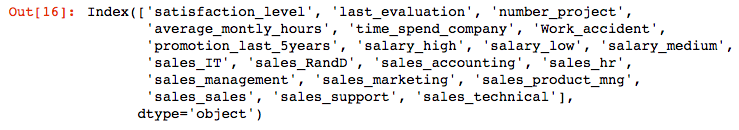
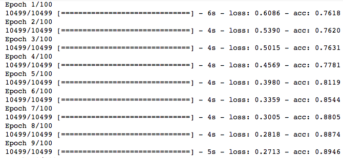
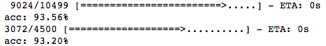
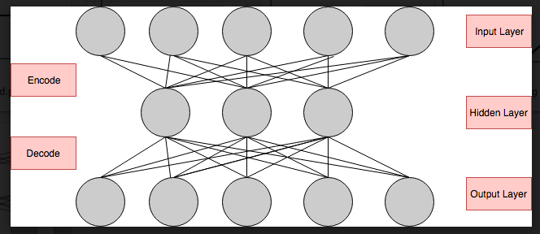
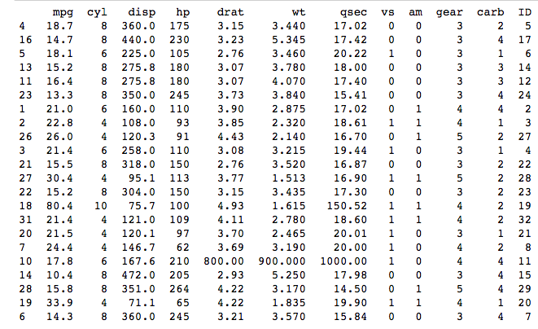
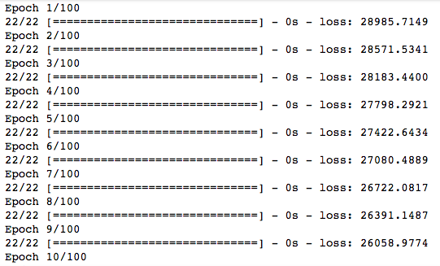
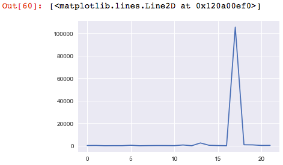
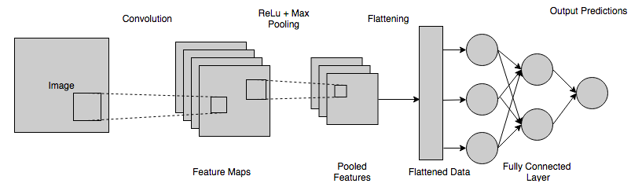
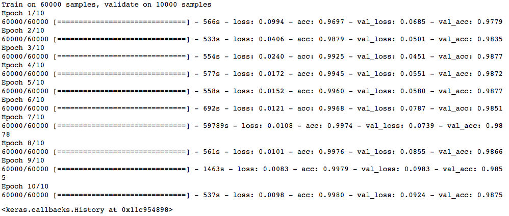
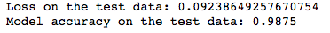

Lab 7: Dive into Deep Learning
==============================

In this lab, we will learn about:

-   Feed-forward neural networks
-   Autoencoders
-   Deep convolutional networks

In this lab, we will try to touch on some basic concepts of DL
illustratively. Our focus here is not to discourage you from DL with
equations, mathematical formulas, and derivatives. Though they are
essential concepts, they can be overwhelming. Instead, we will walk you
through the concepts in an illustrative way and help you to write your
very first DL codes.


#### Pre-reqs:
- Google Chrome (Recommended)

#### Lab Environment
Notebooks are ready to run. All packages have been installed. There is no requirement for any setup.

All notebooks are present in `lab 07` folder.


A feed-forward neural network using Keras
=========================================

Keras is a DL library, originally built on Python, that runs over
TensorFlow or Theano. It was developed to make DL implementations
faster:

1.  We start by importing the [numpy] and [pandas] library for data manipulation.


```
import numpy as np
import pandas as pd
```


2.   Also, we set a [seed] that allows us to reproduce the script\'s results:


```
numpy.random.seed(8)
```


3.  Next, the sequential model and dense layers are imported from
    [keras.models] and [keras.layers] respectively. Keras
    models are defined as a sequence of layers. The sequential construct
    allows the user to configure and add layers. The dense layer allows
    a user to build a fully connected network:


```
from tensorflow.keras.models import Sequential
from tensorflow.keras.layers import Dense
```


4.  The [HR] attrition dataset is then loaded, which has 14,999
    rows and 10 columns. The [salary] and [sales] attributes
    are one-hot encoded to be used by Keras for building a DL model:


```
#load hrdataset
hr_data = pd.read_csv('data/hr.csv', header=0)
# split into input (X) and output (Y) variables
data_trnsf = pd.get_dummies(hr_data, columns =['salary', 'sales'])
data_trnsf.columns
X = data_trnsf.drop('left', axis=1)
X.columns
```


The following is the output from the preceding code:





5.  The dataset is then split with a ratio of 70:30 to train and test
    the model:


```
from sklearn.model_selection import train_test_split
 
X_train, X_test, Y_train, Y_test = train_test_split(X, data_trnsf.left, test_size=0.3, random_state=42)
```


6.  Next, we start creating a fully connected neural network by defining
    a sequential model using three layers. The first layer is the input
    layer. In this layer, we define the the number of input features
    using the [input\_dim] argument, the number of neurons, and
    the activation function. We set the [input\_dim] argument to
    [20] for the 20 input features we have in our preprocessed
    dataset [X\_train]. The number of neurons in the first layer
    is specified to be [12]. The target is to predict the employee
    attrition which is a binary classification problem. So, we use the
    rectifier [activation] function in the first two layers to
    introduce non-linearity into the model and activate the neurons. The
    second layer, which is the hidden layer, is configured with
    [10] neurons. The third layer, which is the output layer, has
    one neuron with a [sigmoid] activation function. This ensures
    that the output is between 0 and 1 for the binary classification
    task:


```
# create model
model = Sequential()
model.add(Dense(12, input_dim=20, activation='relu'))
model.add(Dense(10, activation='relu'))
model.add(Dense(1, activation='sigmoid'))
```


7.  Once we configure the model, the next step is to compile the model.
    During the compilation, we specify the [loss] function, the
    [optimizer], and the [metrics]. Since we are dealing
    with a two class problem, we specify the [loss] function as
    [binary\_crossentropy]. We declare [adam] as the
    optimizer to be used for this exercise. The choice of the
    optimization algorithm is crucial for the model\'s excellent
    performance. The [adam] optimizer is an extension to a
    stochastic gradient descent algorithm and is a widely used
    optimizer:


```
# Compile model
model.compile(loss='binary_crossentropy', optimizer='adam', metrics=['accuracy'])
```


8.  Next, we fit the model to the training set using the [fit]
    method. An epoch is used to specify the number of forward and
    backward passes. The [batch\_size] parameter is used to
    declare the number of training examples to be used in each epoch. In
    our example, we specify the number of [epochs] to be
    [100] with a [batch\_size] of [10]:


```
# Fit the model
X_train = np.array(X_train)
model.fit(X_train, Y_train, epochs=100, batch_size=10)
```


9.  Once we execute the preceding code snippet, the execution starts and
    we can see the progress, as in the following screenshot. The
    processing stops once it reaches the number of epochs that is
    specified in the model\'s [fit] method:





10. The final step is to evaluate the model. We specified accuracy
    earlier in the evaluation metrics. At the final step, we retrieve
    the model\'s accuracy using the following code snippet:


```
# evaluate the model
scores = model.evaluate(X_train, Y_train)
print("%s: %.4f%%" % (model.metrics_names[1], scores[1]*100))

X_test = np.array(X_test)
 
scores = model.evaluate(X_test, Y_test)
print("%s: %.4f%%" % (model.metrics_names[1], scores[1]*100))
```


The following result shows the model accuracy to be [93.56%] and
test accuracy to be [93.20%], which is a pretty good result. We
might get slightly different results than those depicted as per the
seed:





Data scaling is often required to obtain good results from neural
networks.


In the following section we discuss autoencoders, which is an
unsupervised DL technique and widely used for non-linear dimensionality
reduction.


Autoencoders
============

An autoencoder is a type of DL which can be used for unsupervised
learning. It is similar to other dimensionality reduction techniques
such as **Principal Component Analysis** (**PCA**) which we studied
earlier. However, PCA projects data from higher dimensions to lower
dimensions using linear transformation, but autoencoders use non-linear
transformations.

In an autoencoder, there are two parts to its structure:

-   **Encoder**: This part compresses the input into a fewer number of
    elements or bits. The input is compressed to the maximum point,
    which is known as **latent space** or **bottleneck**. These
    compressed bits are known as **encoded bits**.
-   **Decoder**: The decoder tries to reconstruct the input based on the
    encoded bits. If the decoder can reproduce the exact input from the
    encoded bits, then we can say that there was a perfect encoding.
    However, it is an ideal case scenario and does not always happen.
    The reconstruction error provides a way to measure the
    reconstruction effort of the decoder and judge the accuracy of the
    autoencoder.

Now that we have a bit of understanding of the structure of an
autoencoder, let\'s visualize it using the following figure:





There are different types of autoencoders, such as:

-   **Vanilla autoencoder**: It has two layers of neural network
    architecture, with one hidden layer.
-   **Sparse autoencoder**: It is used to learn the sparse
    representation of data. Here, a constraint is imposed on its loss
    function to constraint the reconstruction of an autoencoder.
-   **Denoising autoencoder**: In these autoencoders, partially
    corrupted inputs are introduced. This is done to prevent the
    autoencoder from simply learning the structure of inputs and forces
    the network to discover more robust features to learn the input
    patterns.

Anomaly detection is one of the most widely used use cases for
autoencoders. It is a process to detect the unknown from the knowns. In
an anomaly detection exercise, the input data always has one class which
is *known*. As an autoencoder learns the pattern of the data by
reconstructing the input data, it tends to discover the unknown patterns
which might be the anomalies in the data:

1.  As we did for the previous example, here we import the required
    libraries using the following code snippet:


```
%matplotlib inline
import numpy as np
import pandas as pd
import matplotlib.pyplot as plt
from sklearn.model_selection import train_test_split
from tensorflow.keras.models import Model, load_model
from tensorflow.keras.layers import Input, Dense
np.random.seed(8)
```


2.  Next, the dataset used for building the anomaly detector using an
    autoencoder is loaded. The data used for the demo was extracted from
    the 1974 Motor Trend US magazine; it comprises fuel consumption and
    10 aspects of automobile design and performance for 32 automobiles
    (1973--74 models). The dataset was modified a bit to introduce some
    data anomalies:


```
# load autodesign
auto_data = pd.read_csv('data/auto_design.csv')
# split into input (X) and output (Y) variables
X =auto_data.drop('Unnamed: 0', 1)
from sklearn.model_selection import train_test_split
X_train, X_test = train_test_split(X, test_size=0.3, random_state=42)
```


```
print(X_train)
X_train.shape
```


We get the following output for the preceding code:





3.  Next, the input dimension is defined. As there are 12 different
    input features, and as we plan to use all the features in the
    autoencoder, we define the number of input neurons to be [12].
    This is embedded in an input layer, as shown in the following code
    snippet:


```
input_dim = X_train.shape[1]
encoding_dim = 12
input_layer = Input(shape=(input_dim, ))
```


4.  Next, we create an encoder and decoder. The ReLU function, which is
    a non-linear activation function, is used in the encoder. The
    encoded layer is passed on to the decoder, where it tries to
    reconstruct the input data pattern:


```
encoded = Dense(encoding_dim, activation='relu')(input_layer)
decoded = Dense(12, activation='linear')(encoded)
```


5.  The following model maps the input to its reconstruction, which is
    done in the decoder layer, [decoded]. Next, the
    [optimizer] and [loss] function is defined using the
    [compile] method. The [adadelta] optimizer uses
    exponentially-decaying gradient averages and is a highly-adaptive
    learning rate method. The reconstruction is a linear process and is
    defined in the decoder using the linear activation function. The
    [loss] is defined as [mse], which is mean squared error:


```
autoencoder = Model(input_layer, decoded)
autoencoder.compile(optimizer='adadelta', loss='mse')
```


6.  Next, the training data, [X\_train], is fitted into the
    autoencoder. Let\'s train our autoencoder for [100] epochs
    with a [batch\_size] of [4] and observe if it reaches a
    stable train or test loss value:


```
X_train = np.array(X_train)
autoencoder.fit(X_train, X_train,epochs=100,batch_size=4)
```


7.  Once we execute the preceding code snippet, the execution starts,
    and we can see the progress in the following screenshot. The
    processing stops once it reaches the number of epochs that is
    specified in the model\'s [fit] method:





8.  Once the model is fitted, we predict the input values by passing the
    same [X\_train] dataset to the autoencoder\'s [predict]
    method. Next, we calculate the [mse] values to know whether
    the autoencoder was able to reconstruct the dataset correctly and
    how much the reconstruction error was:


```
predictions = autoencoder.predict(X_train)
mse = np.mean(np.power(X_train - predictions, 2), axis=1)
```


9.  We can plot the [mse] to view the reconstruction error and the
    index of input data which it was not able to reconstruct properly:


```
plt.plot(mse)
```


10. We can observe from the following plot that the autoencoder was not
    able to reconstruct the 16^th^ record of the dataset properly. The
    reconstruction error is too high for that record and it is an
    anomaly. The 13^th^ record also has a small reconstruction error,
    which might be an anomaly as well:





In the following section, we will focus on **Convolutional Neural
Networks** (**CNN**), which are extensively used for image processing
and image recognition.


Convolutional Neural Networks
=============================

This section will focus on the CNN\'s architecture. Though CNN is a
topic that might not be covered fully in a single lab, we will focus
on the important elements that a CNN has for you to get started with
CNNs easily. During our discussion, we will use the Keras package to
create a CNN using the sample [MNIST] dataset that the package
has.

The question that comes to mind when we hear the term CNN is, *why CNN?*
We will try to answer this question with a short explanation.


Why CNN?
========

We discussed feed-forward neural networks in an earlier section. Though
they are powerful, one of their main disadvantages is that an FNN
ignores the structure of the input data. All data feed to the network
has to be first converted into a 1D numerical array. However, for
higher-dimensional arrays such as in an image, it gets difficult to deal
with such conversion. It is essential to preserve the structure of
images, as there is a lot of hidden information stored inside the, this
is where a CNN comes into the picture. A CNN considers the structure of
the images while processing them.

The next question that we have is the difficult term-convolution. What
is it?


What is convolution?
====================

Convolution is a special kind of mathematical operation that involves
the multiplication of two functions, [f] and [g], to produce
a new modified function ( [f \* g]). For example, the convolution
between an image (let\'s say function [f]) with a filter function,
[g], will produce a new version of the image.

We just discussed filters, so let\'s try to understand what filters are.


What are filters?
=================

A CNN uses filters to identify features in an image, such as edges,
lines, or arches. They search for certain important patterns or features
in an image. Filters are designed to search for certain characteristics
in an image and detect whether or not the image contains those
characteristics. A filter is applied at different positions in an image,
until it covers the whole image. Filters form a critical element in a
convolution layer, an important step in a CNN.

There are mainly four different layers in a CNN:

-   Convolution layer
-   ReLU layer
-   Pooling layer
-   Fully connected layer

Let\'s discuss the convolution layer, which is the first stage in a CNN.


The convolution layer
=====================

This is the layer where the convolution operation takes place between
the input image and the filters that we just discussed. This step is
carried out to reduce the overall size of the image, so that it is
easier to process the image in the next layers. Let\'s understand the
function of this layer with a simple question, *how do we identify a dog
or a cat?* It comes naturally to us within a second when we see them. We
don\'t analyze all their features to determine whether a dog is a dog or
a cat is a cat.

We recognize the important features, such as their eyes, ear, or tail,
and then identify the creature. This is what is also done in a
convolution layer. In this layer, the important features are identified
and the rest are all ignored. The filters are moved across the image to
detect the essential features in the image. The process of moving the
filters are called **strides**.

The results of the convolution layer are then passed through a
non-linear activation function, such as the ReLU function.


The ReLU layer
==============

This additional step is applied to the convoluted layer to introduce
non-linearity in the convoluted feature map. We learned about the ReLU
function in the earlier section. The images have a highly non-linear
pattern. When we apply convolution, there is a risk that it might become
linear as there are linear operations like multiplication and
summations. So, a non-linear activation function, such as ReLU, is used
to preserve the non-linearity in the images.

The next stage in a CNN is the pooling layer.


The pooling layer
=================

The pooling layer further reduces the size of the feature representation
by applying a pooling function. There are different kinds of pooling
functions, such as [average], [min], and [max]. Max
pooling is widely used as it tends to keep the [max] values of a
feature map for each stride. This is similar to the convolution layer
where we have a sliding window and the window slides over the feature
map to find the [max] value within each stride. The window size in
a pooling layer is typically less than that used in the convolution
layer.

The pooled feature map is then flattened to a 1D representation to be
used in a fully connected layer.


The fully connected layer
=========================

There can be multiple convolution, ReLU, and pooling operations in a
CNN. However, there is always a last single stage which is a fully
connected layer. The fully connected layer is the feed-forward neural
network that we discussed earlier. The purpose of this step is to make
different predictions on the [image] dataset, such as classifying
images.

The following diagram illustrates the final picture of a CNN\'s basic
architecture:





Now that we understand some basics about CNNs, let\'s create a CNN using
Keras. We will use the [MNIST] dataset that is present in Keras
itself. The [MNIST] dataset is a well-known dataset of written
digits. The dataset is already segregated into a train and test set. It
has around 70,000 images. Each image has a gray scale dimension of 28 \*
28.

The full code for this section can be found in the course\'s code
repository. We will demonstrate the vital code sections.

We start building a Keras DL model, by defining a sequential model:

1.  As discussed, the sequential methods enable us to add one layer over
    the others that are executed in sequence. The first layer that is
    added is the convolution layer defined by the [Conv2D] method.
    As the [MNIST] dataset consists of 2D images, we add a 2D
    convolution layer. The [kernel\_size] parameter is used to
    define the size of the filter, and the strides are for defining the
    moving window.
2.  There is no different ReLU layer in Keras. However, we can define
    the activation function in the convolution layer itself. The
    activation function we choose for this task is ReLU.
3.  The third step is to add a max pooling layer using the
    [MaxPooling2D] method. The [pool\_size] is defined to be
    2 \* 2 and the stride for the pooling layer is 2 \* 2.
4.  The fourth step of flattening the data is done by adding a
    [Flatten2D] method. The last layer, which is the fully
    connected layer, is defined similarly to the feed-forward neural
    network:


```
#Model Definition
cnn_model = Sequential()
cnn_model.add(Conv2D(32, kernel_size=(5, 5), strides=(1, 1),activation='relu',input_shape=input))
cnn_model.add(MaxPooling2D(pool_size=(2, 2), strides=(2, 2)))
cnn_model.add(Flatten())
cnn_model.add(Dense(1000, activation='relu'))
cnn_model.add(Dense(num_classes, activation='softmax'))
```


5.  The following code snippet is similar to other Keras codes we have
    seen. We need to first compile the model with the [loss]
    function, [optimizer], and [metrics]. Then, the model is
    fitted with the training set using the [batch\_size] and
    [epochs], which are the important parameters in a model fit
    method:


```
cnn_model.compile(loss=tensorflow.keras.losses.categorical_crossentropy,
 optimizer=tensorflow.keras.optimizers.Adam(),
 metrics=['accuracy'])
 cnn_model.fit(x_train, y_train,
 batch_size=10,
 epochs=10,
 verbose=1,
 validation_data=(x_test, y_test))
```


6.  Once we execute the preceding code, we need to wait for some time
    for the results. It takes a lot of time to complete just 10 epochs
    as the training dataset is huge and images are complex:





7.  When the training is completed, we can evaluate the accuracy of the
    model using the following code snippet:


```
model_score = cnn_model.evaluate(x_test, y_test, verbose=0)
print('Loss on the test data:', model_score[0])
print('Model accuracy on the test data:', model_score[1])
```


The model has an impressive accuracy of [0.9875], which is 98.75%,
on the test data:





Summary
=======

In this lab, we introduced you to the world of neural networks and
deep learning. We discussed different activation functions, the
structure of a neural network, and demonstrated a feed-forward neural
network using Keras.

The objective of this lab was to
provide you with a head start in exploring deep learning, as it is the
next frontier in machine learning automation. We witnessed the power of
autoencoders for dimensionality reduction. Also, the CNNs, with their
robust feature-processing mechanism, are an essential component for
building the automated systems of the future.

