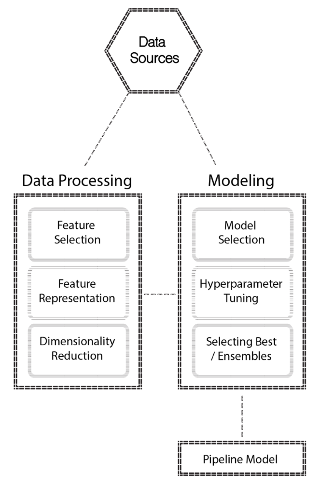
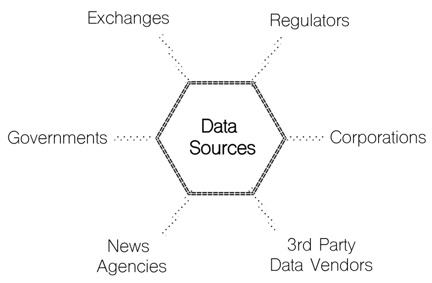
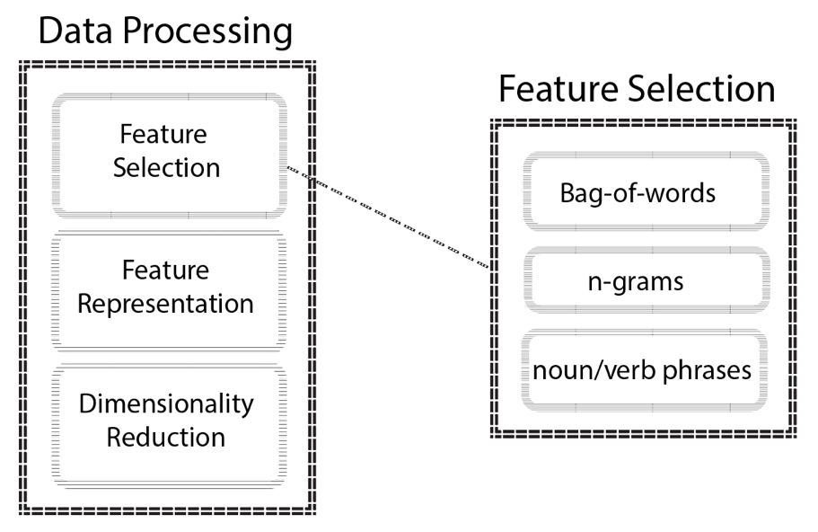
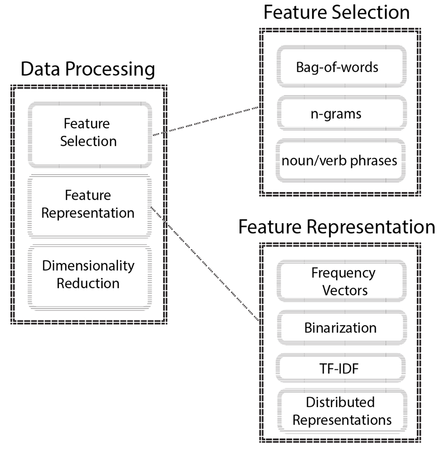
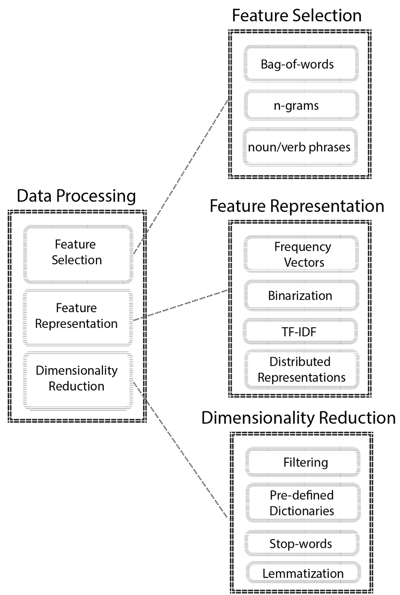
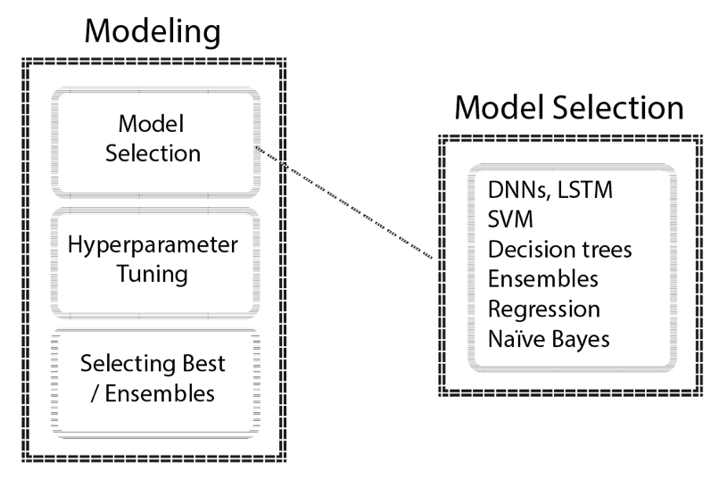
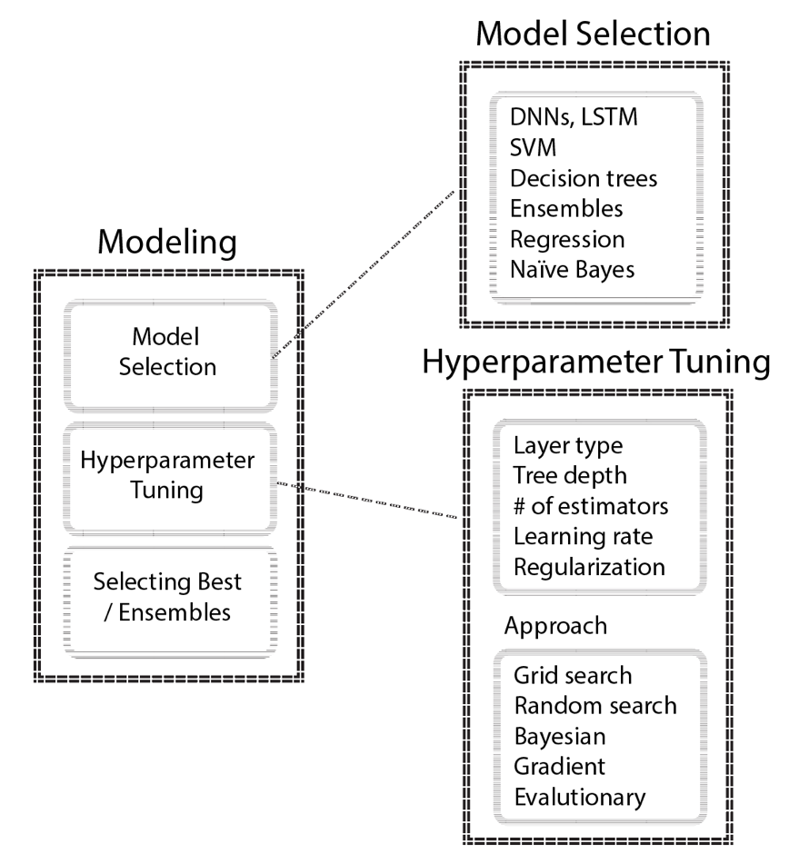

Critical Aspects of ML and Data Science Projects
================================================

If you have made it this far, give yourself a pat on the shoulder. This
is not to think of yourself as a **machine learning** (**ML**) expert,
but rather to acknowledge the work that you have done to learn
**Automated ML** (**AutoML**) workflows. You are now ready to apply
these techniques to solve your problems!

In this lab, you are going to review what you have learned
throughout the labs and put your learning into a broader
perspective.

We will be covering the following topics in our discussion:

-   Machine learning as a search
-   Trade-offs in ML
-   An engagement model for a typical data science project
-   The phases of an engagement model


Machine learning as a search
============================

Throughout the previous labs, you have seen many different
techniques applied to modeling problems and most of those techniques,
although they seem simple, include many parameters that ultimately
affect the outcome of your efforts. Many modeling problems require
AutoML to be represented as a search problem and in the majority of
cases, there are only sub-optimal solutions to be found.

In a broader sense, modeling is just a mapping between your input data
and output data. As a result, you will be able to infer the output where
new input data arrives with unknown output. In order to achieve your
objective, you need to think about your experiment design and configure
your environment accordingly, since you really don\'t know what will be
the best-performing ML pipeline---but let\'s stop for a second and step
back.

Implementing performant systems really starts from some fundamental
choices about the system architecture that will allow you to design and
deliver successful data science solutions. One of the things you should
start thinking about is your system configuration for hardware and
software, such as the type of server, CPU or GPU-specific requirements,
memory and disk requirements, software requirements and similar. As you
will work on larger datasets, your configuration will be more important.
The choices you make at this point will determine the performance of
your data science stack, which will likely contain some of the following
software frameworks and libraries:

-   Specific software distributions such as Anaconda
-   Data-processing frameworks such as Hadoop, Apache Spark, Kafka
-   Task-specific libraries such as scikit-learn, XGBoost,
    TensorFlow/Keras, PyTorch
-   Data management systems such as MongoDB, Neo4j, Apache Cassandra,
    and MySQL

This is not an exhaustive list but, even with such limited scope, this
is a lot of information to digest. You should ideally be familiar with
at least the role each one plays in a typical architecture and, once you
get into building systems, these choices will become clear as you
implement systems for different use cases.

Once you have these pieces in place and working smoothly, you can start
to think about how you will move data around and feed it into your ML
pipeline.

When you are in the data processing and modeling phase, options are vast
and, as mentioned previously, each and every method has its own set of
parameters. The following shows you the typical flow of what you have
practiced so far:





Let\'s consider a text processing pipeline for predicting financial
market movements and see what each of these steps means in such a set
up.

First, you will have various data sources; these may include data coming
from:

-   Financial exchanges
-   Company announcement and filings
-   News agencies that provide general and financial news
-   Macro-economic data from government agencies
-   Regulatory reports
-   Social networks such as Twitter

The following diagram shows couple of different data sources:





When you have such data stored, you need to process this data to be used
in the modeling phase since ML models need numerical vectorized inputs.

The first step is feature selection, and this may include the following
steps:

-   Determine if every word will be considered as a different feature;
    this is commonly known as a **bag-of-words**
-   Determine if noun phrases, verb phrases, or named entities could be
    used as features
-   Categorize words into representative concepts
-   Create n-grams, which are a contiguous sequence of items

The following figure helps us to understand the different feature
selections:





Once you have decided what features you are going to use, you will think
about reducing the number of dimensions to avoid the curse of
dimensionality. This phase may include the following steps:

-   Simple filtering operations, such as only including the top 100
    concepts
-   Setting thresholds to include only words that occur more than the
    given threshold
-   Using pre-defined dictionaries, created by domain experts, to filter
    input data
-   Standard operations, such as removing stop words and lemmatization

The following figure helps you to understand the different approaches
for feature selection and representation:





Dimensionality reduction is also a phase which you could come back to
after feature representation. Once you have numerical feature vectors,
you could apply methods such as **Principal Component Analysis**
(**PCA**) to further reduce dimensionality. Let\'s look at typical
operations for feature representation:

-   Representing the words in a vocabulary as frequency vectors, where
    each word will be assigned to a number of its occurrence
-   Binarizing frequency vectors so that every value will be either 0 or
    1
-   Using **term frequency-inverse document frequency** (**tf-idf**)
    encoding to represent words as their relative importance to the
    whole document in a collection of documents, namely **corpus**
-   Using distributed representations such as Word2Vec or Doc2Vec

As a result, you have the full figure explained as follows:





Once you are done with the data processing part you can start modeling,
and in this case you will have many different algorithms to choose from.
In text mining, the following are the most commonly used algorithms:

-   Deep neural networks, particularly **Long Short-Term Memory**
    (**LSTM**) networks, which are a special type of **recurrent neural
    networks** (**RNNs**)
-   Support Vector Machines
-   Decision trees
-   Ensembles
-   Regression algorithms
-   Naive Bayes

The following figure shows couple of different algorithms which can be
used:





Each algorithm will have its own parameter space, and parameters are
mainly two types:

-   Hyperparameters which are set before training starts
-   Model parameters which are learned during training

The goal is to optimize hyperparameters so that your model parameters
will give you the best generalization performance. Search space is
usually very large and you have seen some methods, such as Bayesian
optimization, which explore the space in efficient ways.

For example, let\'s take a look at only the parameters of the XGBoost
algorithm, which dominates the ML applications.

If you run the following lines, you will see the explanations for model
parameters:


``` {.language-markup}
import xgboost as xgb
classifier = xgb.XGBClassifier()
 
classifier?
```


This gives you the following output:


``` {.language-markup}
Type: XGBClassifier
String form:
XGBClassifier(base_score=0.5, booster='gbtree', colsample_bylevel=1,
 colsample_bytree=1, g <...> reg_alpha=0, reg_lambda=1, scale_pos_weight=1, seed=None,
 silent=True, subsample=1)
File: ~/anaconda/lib/python3.6/site-packages/xgboost/sklearn.py
Docstring: 
Implementation of the scikit-learn API for XGBoost classification.
 Parameters
----------
max_depth : int
 Maximum tree depth for base learners.
learning_rate : float
 Boosting learning rate (xgb's "eta")
n_estimators : int
 Number of boosted trees to fit.
silent : boolean
 Whether to print messages while running boosting.
objective : string or callable
 Specify the learning task and the corresponding learning objective or
 a custom objective function to be used (see note below).
booster: string
 Specify which booster to use: gbtree, gblinear or dart.
nthread : int
 Number of parallel threads used to run xgboost. (Deprecated, please use n_jobs)
n_jobs : int
 Number of parallel threads used to run xgboost. (replaces nthread)
gamma : float
 Minimum loss reduction required to make a further partition on a leaf node of the tree.
min_child_weight : int
 Minimum sum of instance weight(hessian) needed in a child.
max_delta_step : int
 Maximum delta step we allow each tree's weight estimation to be.
subsample : float
 Subsample ratio of the training instance.
colsample_bytree : float
 Subsample ratio of columns when constructing each tree.
colsample_bylevel : float
 Subsample ratio of columns for each split, in each level.
reg_alpha : float (xgb's alpha)
 L1 regularization term on weights
reg_lambda : float (xgb's lambda)
 L2 regularization term on weights
scale_pos_weight : float
 Balancing of positive and negative weights.
base_score:
 The initial prediction score of all instances, global bias.
seed : int
 Random number seed. (Deprecated, please use random_state)
random_state : int
 Random number seed. (replaces seed)
missing : float, optional
 Value in the data which needs to be present as a missing value. If
 None, defaults to np.nan.
**kwargs : dict, optional
 Keyword arguments for XGBoost Booster object. Full documentation of parameters can
 be found here: https://github.com/dmlc/xgboost/blob/master/doc/parameter.md.
 Attempting to set a parameter via the constructor args and **kwargs dict simultaneously
 will result in a TypeError.
 Note:
 **kwargs is unsupported by Sklearn. We do not guarantee that parameters passed via
 this argument will interact properly with Sklearn.
```


To optimize hyperparameters such as XGBoost\'s, you need to select an
approach such as grid search, random search, Bayesian optimization, or
evolutionary optimization. In practice, Bayesian optimization yields
good results for optimizing the hyperparameters of ML algorithms.

The following addition to the flow shows common hyperparameters and
approaches used in optimization:





Ultimately, you can select the best-performing ML pipeline or you can
create your own ensemble to leverage multiple pipelines.

Mastering these pipelines requires you to get familiar with each step
and properly navigate the whole search space to end up with acceptable,
near-optimal solutions.


Trade-offs in machine learning
==============================

There are mainly two aspects to consider:

-   Training time
-   Scoring time

Both will act as constraints as you are developing your pipelines.

Let\'s think about the limitations that training and scoring time bring
to the table. Requirements for training time will usually determine the
algorithms that you will include in your candidate list. For example,
logistic regression and **Support Vector Machines** (**SVMs**) are
fast-to-train algorithms, and this might be important to you, especially
if you are prototyping ideas quickly using big data. They are also fast
when it comes to scoring. There are different implementations for both,
and also different options are available for solvers, which make these
two convenient for many ML use cases.

However, for something like a deep neural network, training and scoring
time are very limiting constraints as you may not be able to tolerate a
week-long training time or more than a second scoring time. You can
improve training and scoring time by having more powerful hardware
resources, but that may cause your bills to sky rocket, depending on the
complexity of your network. Apart from the selection of algorithms,
training time also highly depends on your hyperparameter space as it may
cause it to be much longer.

Another concern is scalability, which is related to your data size, and
you need to ensure that your pipeline\'s scalability matches the speed
of growth of your data. At this point, you should look at factors such
as support for multithreaded, multicore, parallel, or distributed
training.


Engagement model for a typical data science project
===================================================

When you start to learn anything new, or build on your existing
knowledge, it\'s important to understand the background of things and
how the story has evolved over time, knowing that the current trends
were a natural evolution of conventional reporting, **business
intelligence** (**BI**), and analytics. That\'s why the initial labs
walked you through the background and fundamentals of ML pipelines, such
as data preprocessing, automated algorithm selection, and hyperparameter
optimization.

Due to the highly experimental nature of AutoML pipelines, there were
many concepts explained together with their practical examples.

The ideas that advanced analytics and ML use to solve problems are not
necessarily new, but they are only usable now as people have easy access
to cheaper hardware and software resources. More advanced technologies
are at your disposal to address some of the issues that you were not
able to address before.

In this course, you have learned various aspects of developing ML
pipelines. However, in real-world projects, developing ML pipelines is
just one of the variables. Operationalizing ML pipelines is crucially
important since you can only benefit from well-developed pipelines if
you successfully deploy and monitor these pipelines. Many companies have
**Software as a Service** (**SaaS**) offerings for ML, and they aim to
abstract away the low-level complexities of managing ML pipelines in
production environments.

In the following section, we will discuss the different phases of data
science projects so that you can understand exactly where modeling falls
when you are dealing with the successful delivery of end-to-end data
science projects.


The phases of an engagement model
=================================

A very well-known modeling process is CRISP-DM for data mining and
predictive analytics projects, and it involves six steps:

1.  Business understanding
2.  Data understanding
3.  Data preparation
4.  Modeling
5.  Evaluation
6.  Deployment

Each of these phases follows each other, and some of them happen in a
recursive fashion by providing feedback to the preceding phase. The
deployment phase is particularly important in terms of model monitoring
and maintenance, which is the focus of this lab.

Let\'s quickly look at each of these phases and their purpose in the
overall process.


Business understanding
======================

This is the phase where you fully focus on the business objectives in
terms of project goals, scope, resources, limitations, iterations, and
checkpoints.

You try to understand the whole picture in business terms and frame the
problem technically. There might be competing objectives between
different internal stakeholders in your organization, and you should be
aware of them and find the sweet spot. For example, in supply chain
management, product supply organizations try to keep their inventory at
optimum levels, while sales organization would like to build an
excessive inventory for upcoming product launches based on very
optimistic sales forecasts. You should know who will benefit from the ML
and data science capability that you will implement.

In this phase, you are typically trying to address the following items:

-   Getting familiar with current decision making processes and
    splitting them further into separate use cases for different
    scenarios.
-   Having agreed on human resources, identifying the data sources to be
    used (for example data extracts, data lakes, operational DBs, and so
    on).
-   Finding out the assumptions and trying to validate them with
    available data, and separating facts from opinions/intuitions before
    moving on.
-   Agreeing on deliverables and the tools/technologies to be used to
    deliver them throughout the project.
-   Deciding which evaluation metrics/KPIs will be used for both ML
    models and business outcomes. You should always be in line with
    business objectives.
-   Identifying the risks that might cause delays or project failure,
    and making these clear to the stakeholders. The success of a ML
    project is inherently probabilistic, not like the BI work which most
    people are used to work with.


Data understanding
==================

This is the phase where you develop an understanding of the data sources
that you will use throughout the project.

In this phase, you are typically trying to address the following items:

-   Clearing data access and authorization issues.
-   Loading data into a platform of preference for initial analysis.
-   Being aware of sensitive information and performing necessary
    operations, such as anonymizing or deletion of sensitive data.
-   Identifying datasets to be used.
-   Identifying data schema and getting field descriptions.

```{=html}

```
-   Determining the quantity for each dataset and identifying
    discrepancies. For example, you check if the variables that are
    present in different tables have the same datatype, for example, a
    variable could be an integer type in one table and a decimal type in
    another.
-   Exploring sample datasets, such as producing basic including count,
    mean, standard deviation, percentiles, and checking variable
    distributions.
-   Getting familiar with how data is collected to see if there are
    possible measurement errors during data collection.
-   Studying correlations while keeping the stats proverb in
    mind---*correlation does not imply causation*.
-   Detecting noise, such as outliers, and agreeing on how you will
    treat them.
-   Ensuring the sample dataset represents the population by checking
    different properties of the dataset. For example, whether there is
    any skewness towards a different category of data due to the data
    availability.
-   Performing multiple quality checks in a timely manner to ensure data
    quality. For example, you can identify and clarify erroneous and
    missing values, such as a value of 100,000,000,000 in the date
    column, or a value of 25,000 where the mean value is 23.4.
-   Deciding on the amount of data to be used as test data and keeping
    it separate from your training data.

Ultimately, these kind of practices will lead you to create an automated
data preparation flow and data quality reports after a few engagements.


Data preparation
================

This is the phase where you will create your final dataset to be used in
the modeling phase by joining different data sources, cleaning,
formatting, and engineering features.

In this phase, you are typically trying to address the following items:

-   Identifying relevant datasets for model building.
-   Documenting data joins and aggregations to construct the final
    dataset.
-   Writing functions with useful arguments to have flexibility later in
    the project for cleaning and formatting datasets, such as removing
    outliers by x%, or imputing missing values with mean, median, or
    most frequent.
-   Treating outliers accordingly.
-   Playing with feature engineering methods.

```{=html}

```
-   Selecting the features. In general, there are three main methods for
    feature selection:
    -   Filter methods
    -   Wrapper methods
    -   Embedded methods
-   Determining feature importance, listing reasons for
    including/excluding features.
-   Agreeing on the data transformation pipelines to be constructed.
-   Writing custom transformers for specific operations, such as
    extracting paragraphs, sentences, and words from a given corpus by
    extending Apache Spark\'s or scikit-learn\'s transformer class, and
    similar for the estimators.
-   Properly versioning datasets and writing additional commentary,
    explaining the steps involved with preparation.


Modeling
========

This is the phase where you consider your options for modeling the final
dataset that you have created in the previous phases.

In this phase, you are typically trying to address the following items:

-   Determining the type of ML problem, such as supervised,
    semi-supervised, unsupervised, and reinforcement learning.
-   Shortlisting ML models which would fit the bill.
-   Agreeing on evaluation metrics and paying attention to important
    points, such as class imbalance as it tricks metrics such as
    accuracy. If the dataset is imbalanced, you can refer to sampling
    techniques to obtain a balanced dataset.
-   Identifying the level of tolerance for false negatives and false
    positives.
-   Thinking about how you would properly set up the cross-validation.
-   Analyzing the most important features of performant models.
-   Analyzing the model sensitivity with respect to each feature.
    Different algorithms might rank features differently; this would
    help you to understand how models react if distributional properties
    of features change over time.
-   Fine-tuning models.
-   Determining the type of ML workload that would be suitable for
    deployment, such as online, batch, and streaming deployments.
-   Taking the training and scoring time into consideration as
    computational complexity and data size are usually constraints when
    choosing an algorithm.


Evaluation
==========

This is the phase where you review the process and make sure you have
covered all the planned items.

In this phase, you are typically trying to address the following items:

-   Reviewing all the phases and ensuring that the model pipeline to be
    deployed is properly addressing all the issues and steps performed
    previously
-   Preparing a nice presentation, keeping it clean and simple, *simple*
    but not *simpler*
-   Presenting the outcomes, sticking to the point, explaining how your
    model meets the business objectives
-   Explaining the limitations and in what circumstances it can go south


Deployment
==========

This is the phase where you start to operationalize your ML models.

In this phase, you are typically trying to address the following items:

-   Having a short test drive in production
-   Monitoring the performance
-   Identifying the strategy to improve the model such as re-evaluation,
    a retraining loop, and a redeployment loop, when model performance
    starts to decay
-   Preparing the final report and deliverables

You can definitely extend the list of items that you are going to
address for each phase, but this list should give you an overall idea of
what you need to cover.

There will be numerous times when you will be joining a project team in
the middle of a project\'s timeline. In these kinds of situations, you
usually lack the project background and you need several meetings with
key people to understand what\'s going on. Knowing these phases will
help you to understand the current stage of the project and identify
what has been missed or clarify the next steps.

When you are going through these steps, it\'s important to document your
reasonings and findings for each step. Proper documentation will save
you time when you need to redo some of the steps, as you might not
remember how you performed some of the analysis or the data processing.


Summary
=======

As in other things that you pursue in your life, practice is the only
thing that will help you to improve your skills in developing ML
pipelines. You need to spend a considerable amount of time with many
different techniques and algorithms to deal with various problems and
datasets.

Especially in real-word projects, where you may not come across similar
problems, every project will require you to have a different approach.
You will quickly realize that it\'s not only modeling that matters, but
it\'s rather the understanding of how these technologies integrate with
each other, and play nicely in enterprise software architectures.

By learning AutoML systems, you took a huge step forward and have a
better understanding of AutoML pipelines. You should definitely strive
to learn more about other aspects, such as the domain-specific
applications in the areas of your interest, application architectures,
production environments, and model maintenance techniques.
